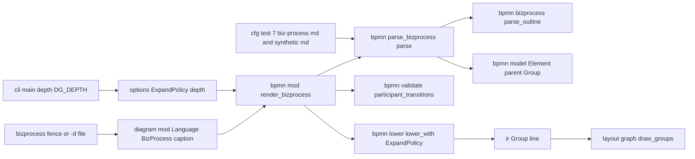
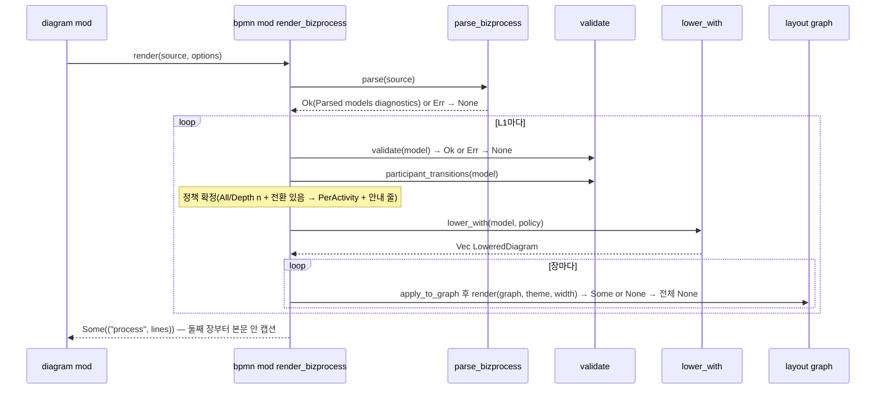

# Design — bizprocess-bpmn

## 정의
`biz-process.md`를 쓰는 사용자가 그 문서를 BPMN 드릴다운 그림으로 보게 하기 위해, 헤딩 계층·괄호 태그·`Logic(AST)`를
읽는 개요 리더(`bpmn::bizprocess`)와 개요를 중첩 정보(`Element.parent`·`Model.groups`)가 있는 `bpmn::Model`로
옮기는 빌더(`bpmn::parse_bizprocess`), 정책(`ExpandPolicy`)에 따라 한 모델을 여러 장의 `ir::Graph`로 내리는
`lower_with`, 그리고 `Language::BizProcess` 배선을 만드는 세 번째(마지막) BPMN 입력 문법 계층이다. 검증·레인
배치·도형 어휘는 그대로 쓰고, XML·YAML 문서의 렌더링은 바이트 단위로 바뀌지 않는다.

## Boundary Commitments

### In-Scope (This Spec Owns)
- **개요 문법**: `bpmn::bizprocess::{Heading, LogicItem, Outcome, Tag, Outline, OutlineError, Diagnostic,
  looks_like_bizprocess, parse_outline}` — 헤딩 레벨·이어지는 줄·게이트 줄·괄호 태그·Logic 항목. BPMN 이름은 모른다
- **개요 → 모델**: `bpmn::parse_bizprocess::{ParseError, Parsed, parse}` — L1~L5·Logic → 요소·흐름·그룹·부모·소속·경계
  이벤트, 합성 id, 참여자 상속·레인
- **모델 중첩 확장**: `bpmn::model`의 `Element.parent`, `Group`, `Model.groups`, 조회 도우미; `bpmn::validate`의 중첩·
  그룹 규칙과 `participant_transitions`; `bpmn::lower`의 `DiagramKind`·`LoweredDiagram`·`lower_with`
- **정책 옵션**: `diagram::options::{ExpandPolicy, parse_expand_policy}`, `DiagramOptions.expand_policy`, 키 `depth`,
  `<!-- dg: … -->` 지시자; `cli --depth`, `DG_DEPTH`
- **파선 그룹 테두리**: `ir::Group.line`, `Graph::set_group_line`, `layout::graph::draw_groups`의 선 종류 사용
- **배선·출력**: `Language::BizProcess`(이름 `bizprocess`, 펜스 `bizprocess`/`biz-process`, `--lang bizprocess`), 판별
  순서, `bpmn::render_bizprocess`(여러 장 본문 + 본문 안 캡션 + 폴백 안내 줄), `diagram::caption` 가시성
- **회귀·강건성 테스트, README 표**

### Out-of-Scope
- **`biz-process.md` 템플릿·`biz-process-rules.md`**: 방법론 트랙 소유 — 이 스펙의 태그 문법은 dg 쪽 잠정 표준(README에만)
- **`.md` 확장자 판별·마크다운 문서 렌더링**: `markdown` 모듈 불변(코드펜스 배선 외 코드 변경 없음)
- **`bpmn::{xml, parse_xml, yaml, parse_yaml, vocabulary}`**: 변경 없음(파서 둘은 `parent: None`·`groups: []`만 채움)
- **`layout::graph` 배치 알고리즘**: `draw_groups` 선 종류 한 줄 외 변경 없음 — 레인 안 상자 중첩이 어긋나면 spike에서
  최소 수정하되 레인 없는 fixture 바이트 동일 유지
- **노드 골라 펼치기·페이저 드릴다운·병렬 표기·다중 풀 협업·진단 UI(폴백 안내 한 줄 제외)·`examples/`**

### Allowed Dependencies
- 외부: 없음(신규 크레이트 없음, `Cargo.toml` 의존성 4개 그대로, Rust 2024 edition)
- 내부 의존 방향: `ir` ← `options` ← `bpmn::model` ← `bpmn::vocabulary` ← `bpmn::validate` ← `bpmn::lower` ←
  `bpmn::bizprocess`(표준 라이브러리만) ← `bpmn::parse_bizprocess`(`bizprocess`·`model`·`vocabulary`) ← `bpmn::mod`
  (`layout::graph`·`options`·`diagram::caption`) ← `diagram::mod` ← `main`/`cli`. `bizprocess`가 `model`·`vocabulary`를
  import하거나 BPMN 이름 리터럴을 가지면 위반; `parse_bizprocess`가 `validate`·`lower`·`layout`을 부르면 위반;
  `options`가 `bpmn`을 알면 위반; `model`·`validate`·`lower`가 `bizprocess`·`parse_bizprocess`를 알면 위반

### Revalidation Triggers
- `render_body`의 반환 계약이 여러 장(`Vec`)을 받게 바뀌면 본문 안 캡션 방식 제거
- `layout::graph`가 그룹의 레인 넘기(블록 부모 둘)를 지원하면 6.8(그룹 생략)·`step` 재귀 재검토
- `biz-process-rules.md`가 `participant:`와 다른 태그 이름·병렬 표기(`PAR:`)를 확정하면 태그 키·5.6 재검토
- `Model`에 노드 id 안정화(문서 안 id)가 들어오면 노드 골라 펼치기 재개
- `validate`가 `parent`를 XML `subProcess` 자식에도 채우게 바뀌면(`bpmn-xml` 4.5) `lower(model)` = `Depth(0)` 전제 재확인

## Architecture

### Boundary Map


### Technology Stack
| Layer | Choice | Role |
|-------|--------|------|
| 리더·빌더·변환·배선 | Rust 1.96, 표준 라이브러리만 | 줄 상태기계, 트리 → 모델, 정책별 그래프 |

### Key Decisions
- **두 단계(개요 → 의미)**: `bizprocess`는 헤딩·태그·Logic 트리만, `parse_bizprocess`가 BPMN을 안다 — 이유: XML·
  YAML과 동형, 태그 상속·L3 하나/둘 판정처럼 형제 전체를 보는 규칙은 트리가 있어야 한 번에 된다
- **레벨은 `L<n>` 토큰만**(2.1): `#` 개수·들여쓰기 무시, `L<n>`과 `:` 사이 낱말 무시 — 이유: 실제 문서는 L2~L5가 전부
  `###`이고 들여쓰기 4칸 이상은 CommonMark 코드블록이라 마크다운 파서로 못 읽는다
- **부모 = 레벨이 더 작은 가장 가까운 열린 헤딩**(2.7): L2 → L4는 L2 직속, 게이트 줄이 L1을 닫는다
- **태그 = 뒤에서부터 파싱되는 괄호 전부**(3.1~3.4): ID 목록(`\d+(\.\d+)*(~\d+(\.\d+)*)?`를 쉼표로) 또는 `키: 값` 목록
  (조각마다 첫 `:`로 나눔). 조각 하나가 ID도 `키:`도 아니면 그 괄호부터 이름(3.3); `키:` 목록 안에 `:` 없는 조각이 있으면
  `CommaInTagValue`(3.5). 값은 `trim`만(3.6) — 이유: 조용히 상속 레인으로 떨어지는 것이 가장 나쁜 실패
- **참여자 상속·레인 하나**(3.7~3.10): 헤딩의 유효 참여자 = 자기 `participant` 태그 또는 가장 가까운 조상의 것. 태그가
  하나라도 있으면 `Participant{id: "pool", name: L1 이름}` + 등장 순서의 `Lane{id: "lane:<역할>", name: 역할}`; 없으면
  `participants` 빔·`container: None`
- **드릴다운 매핑**(4.1~4.6; `bpmn-support/research.md` 결정 그대로):

| 문서 | 모델 | 비고 |
|---|---|---|
| L1 | `Model.title` = 이름; 루트 `Event{Start}`·`Event{End}`(parent `None`) | 태그 있으면 풀(3.10) |
| L2 | `Element{Subprocess, parent: None}` + 안쪽 `Event{Start}`·`Event{End}`(parent = L2) | L3이 하나면 `name = "L2\nL3"`(4.2) |
| L3(둘 이상) | `Group{id, name, parent: Some(L2), members: L4들}` | 흐름 없음(4.3); 하나면 그룹 없음 |
| L4 | L5 있음 → `Subprocess`(parent = L2), 없음 → `Task(None)` | 시작/종료 없음(4.4) |
| L5 | `Task(None)`(parent = L4) | |
| 형제 | `Sequence` 흐름 문서 순서(L2: 시작→…→종료, L4: L2 시작→…→L2 종료, L5: 사슬만) | 4.5 |

- **Logic 매핑**(5.1~5.8; 소유 = 직전 헤딩 T, 모두 parent = T.parent·container = T.container):

| 항목 | 요소·흐름 |
|---|---|
| 첫 `IF`/`ELSE IF`/`ELSE` | `Gateway(Exclusive)` `T#gw`(이름 없음) + `T → T#gw` |
| `IF c THEN a` / `ELSE IF c THEN a` | `Task(None)` `T#then{k}`(이름 a) + `T#gw → T#then{k}` 라벨 c |
| `ELSE a` / `ELSE (m) THEN a` | `T#then{k}` + `Sequence{is_default: true}` 라벨 m 또는 빔 |
| `… THROW e` | `Event{End, Some(Error)}` `T#throw{k}`(이름 e) 갈래 끝 + L2에 `Event{Intermediate, Some(Error)}` `<L2>#error{k}`(attached_to = L2, parent = None, container = L2의 것) |
| `IF` 없는 항목(`항상:` 포함) / `IF`만 있고 `THEN` 없음 | `TextAnnotation` `T#note`(항목마다 한 줄) + `T → T#note` `Association`; 후자는 `Diagnostic` 추가(5.7) |
| 다음 L5 형제 | `T → 다음`(합류 없음, 5.6) |

- **텍스트 정리**(3.1, 5.8): 헤딩 이름·조건·결과·주석 줄 끝의 ID 괄호는 제거, 다른 괄호는 유지
- **정책은 `lower_with` 한 곳**(6.1~6.5): 요소 깊이 d(L2 0·L4 1·L5 2). `Depth(n)`: d ≤ n 가시, d = n인 자식 있는
  Sub-Process는 접힘(`Shape::Subprocess`), d < n은 펼침(`GroupKind::Box` 실선, 제목 = 이름 첫 줄) — 한 장 `Process`.
  `All` = 전부 펼침 한 장. `PerActivity` = `Depth(0)` `Process` + 자식 있는 L2마다 `Activity(이름)`(루트 = L2, 상자 없음,
  자손 전부 펼침) — 단 안에서 참여자가 바뀌는 L4는 접고 `Step(이름)` 장을 재귀로 뒤에 붙임(6.5). `lower(model)` =
  `lower_with(model, Depth(0))[0].graph`(XML·YAML은 전부 d = 0이라 그래프 동일, 7.6)
- **장마다 레인 정리**: 그 장에 가시 요소가 있는 레인만, 선언 순서 유지; 풀은 레인이 하나라도 남으면 유지. `Process`
  장만 `graph.title = Model.title`(2.5), 나머지는 캡션이 이름을 담으므로 빈 제목
- **경계 이벤트 호스트가 펼친 상자면 `group_anchor`**: 접힘이면 노드 → 이벤트, 펼침이면 상자 닻 → 이벤트 점선
- **L3 그룹 상자 = 파선 Box**(4.3, 6.8): 부모 = 감싸는 상자(펼친 L2) 또는 레인/루트; 멤버의 `container`가 둘 이상이면
  그룹 생략(멤버는 각자 레인) — 이유: 블록 트리는 부모 하나
- **`All`/`Depth(n ≥ 1)` 허용 = `validate::participant_transitions(model)`이 빔**(6.3, 6.4): 아니면 `PerActivity`로
  폴백하고 본문 첫 줄에 `※ depth=all 불가(참여자 전환) → activity`(`Depth(n)`이면 `depth=<n>`)
- **여러 장 = 한 본문**(6.1): 첫 장 종류 `"process"`(정적), 둘째 장부터 빈 줄 + `caption("bizprocess", "activity: <이름>")`.
  L1이 둘 이상이면 둘째 L1부터 본문 안 `process` 캡션(2.5). 어느 한 장이 `None`이면 전체 `None`(4.7)
- **판별 순서 = 확장자 → `@start` → mermaid → BPMN → bizprocess → PlantUML**(1.2, 1.4): `looks_like_bizprocess` = 어떤
  줄이든 `trim` 후 `#`+공백을 벗기면 `L1` + 공백으로 시작하고 `:`를 포함 — 이유: PlantUML 포괄 판별 앞이어야 하고,
  mermaid·XML·YAML 소스에는 그런 줄이 없다. `bpmn::kind_of`는 건드리지 않아 `bpmn` 펜스의 `## L1` 본문은 그대로
  코드블록(1.5)
- **`.md`는 판별하지 않음**(1.3): `language_of_path` 불변
- **엄격 구조·관대 텍스트**: L1 없음·L2 없는 L1·태그 쉼표 → `Err` → 코드블록(2.6, 3.5); 이름·조건 본문은 무검사;
  모르는 줄은 무시(2.3). **사람이 확인할 결정(tasks 게이트)**: 5.6(다음 L5가 소유 태스크에서 직접 이어짐)·5.4(경계
  이벤트는 L2에만)

## System Flows

- 첫 장 위 안내 줄(6.4)은 첫 캡션 바로 아래(본문 첫 줄); `render_body`의 폭 검사·꼬리 빈 줄 제거는 그대로

## Components and Interfaces

### bpmn::bizprocess — 개요 리더 (신규)
- Intent: 줄 기반으로 헤딩 트리·괄호 태그·Logic 항목을 읽는다. BPMN 이름 없음
- Requirements: 1.2, 2.1~2.7, 3.1~3.6, 5.7(진단), 7.3
```rust
#[derive(Clone, Debug, PartialEq, Eq)]
pub struct Tag { pub key: String, pub value: String }
#[derive(Clone, Debug, PartialEq, Eq)]
pub enum Outcome { Action(String), Throw(String) }
#[derive(Clone, Debug, PartialEq, Eq)]
pub enum LogicItem {
    /// condition None = ELSE. note = `ELSE (메모)`의 메모.
    Branch { condition: Option<String>, note: Option<String>, outcome: Outcome },
    Note(String),
}
#[derive(Clone, Debug, PartialEq, Eq)]
pub struct Heading {
    pub level: u8,                 // 1..=5
    pub name: String,              // 태그·ID 괄호 제거, 이어지는 줄 합침
    pub tags: Vec<Tag>,            // key:value 태그만(ID 목록은 버림)
    pub logic: Vec<LogicItem>,
    pub children: Vec<Heading>,
    pub line: usize,               // 1부터
}
#[derive(Clone, Debug, PartialEq, Eq)]
pub struct Diagnostic { pub line: usize, pub message: String }
#[derive(Clone, Debug, PartialEq, Eq)]
pub struct Outline { pub processes: Vec<Heading>, pub diagnostics: Vec<Diagnostic> }   // processes = L1들
#[derive(Clone, Debug, PartialEq, Eq)]
pub enum OutlineError {
    NoProcess,                                   // L1 헤딩 없음
    ProcessWithoutActivity { line: usize },      // L2 없는 L1
    CommaInTagValue { line: usize, key: String },
}
impl std::fmt::Display for OutlineError {}
/// 어떤 줄이든 `#`+공백을 벗긴 뒤 `L1` + 공백으로 시작하고 `:`를 포함하면 참. 문서를 파싱하지 않는다.
pub fn looks_like_bizprocess(source: &str) -> bool;
pub fn parse_outline(source: &str) -> Result<Outline, OutlineError>;
/// 헤딩·항목 텍스트 끝의 괄호를 뒤에서부터 벗긴다: (이름, 태그). ID 목록 괄호는 버린다.
pub fn split_trailing_tags(text: &str) -> Result<(String, Vec<Tag>), OutlineError>;
```
- 계약: 줄 분류 = 헤딩(`trim` 후 `#`+ 공백 + `L<n>` … `:`) / 게이트(`#` 뒤 `✅` 또는 `검토 요청` 시작 → 현재 L1 닫고 다음
  L1 헤딩까지 무시) / `Logic(AST):` / 항목(`- `) / 이어지는 줄(직전이 헤딩·항목이고 빈 줄·구조 줄이 아님 → 한 칸 띄워
  합침) / 그 외 무시(2.3). 항목 파싱: 선두 `ELSE IF` → `IF`로 취급, `IF c THEN r`, `ELSE (m) THEN r`, `ELSE r`, 결과가
  `THROW e`로 시작하면 `Throw`; `IF`만 있고 `THEN` 없음 → `Note(전체)` + `Diagnostic`(5.7); 그 외 → `Note`. 부모 결정 =
  레벨이 더 작은 가장 가까운 열린 헤딩(2.7); L1 아래 L2가 없으면 `ProcessWithoutActivity`(2.6). `source.lines()`·
  `char_indices` 슬라이스만, 재귀 없음(명시적 스택)

### bpmn::model — 중첩·그룹 확장 (기존 파일 확장)
- Intent: 펼칠 수 있는 Sub-Process의 소속과 Group 아티팩트를 모델에
- Requirements: 4.1~4.4, 5.4, 6.2
```rust
pub struct Element { /* 기존 필드 */ pub parent: Option<String> }   // 품은 Subprocess 요소 id. None = 프로세스 최상위
/// BPMN Group 아티팩트(흐름 계층 밖). parent = 품은 Subprocess 요소 id 또는 None.
#[derive(Clone, Debug, Default)]
pub struct Group { pub id: String, pub name: String, pub parent: Option<String>, pub members: Vec<String> }
pub struct Model { /* 기존 필드 */ pub groups: Vec<Group> }
impl Model {
    pub fn children_of<'a>(&'a self, parent: &str) -> impl Iterator<Item = &'a Element>;
    pub fn depth_of(&self, id: &str) -> usize;   // parent 사슬 길이(사이클은 validate가 막음 — 여기선 상한 64)
}
```
- 계약: 기존 `Element`·`Model` 리터럴은 `parent: None`·`groups: Vec::new()` 추가만(XML·YAML 파서 포함, 동작 불변)

### bpmn::validate — 중첩·그룹 규칙 + 전환 조회 (기존 파일 확장)
- Intent: 중첩이 BPMN 규칙을 지키는지, 펼치기가 가능한지
- Requirements: 4.3, 5.4, 6.3, 6.4, 6.5
```rust
pub enum ModelError { /* 기존 8종 */
    ParentNotSubprocess(String), ParentCycle(String),
    SequenceFlowCrossesSubprocess(String),      // source.parent != target.parent
    BoundaryParentMismatch(String),             // 경계 이벤트.parent != 호스트.parent
    GroupMemberOutsideParent(String),           // 그룹 id: 멤버.parent != 그룹.parent
    GroupMembersOverlap(String),                // 두 그룹에 든 요소 id
}
/// 안에서 참여자(container)가 바뀌는 Subprocess 요소 id들(자손 중 container가 자기와 다른 것이 있음). 빈 Vec = 어디든 펼칠 수 있음.
pub fn participant_transitions(model: &Model) -> Vec<String>;
```
- 계약: 그룹 id는 `DuplicateId`에, 멤버 참조는 `UnknownReference{owner: 그룹 id}`에 포함. 부모·그룹 없는 모델(XML·
  YAML)은 새 규칙이 전부 통과(기존 테스트 무수정)

### bpmn::lower — 정책별 여러 장 (기존 파일 확장)
- Intent: 하나의 모델을 정책에 따라 1장 또는 여러 장의 `Graph`로
- Requirements: 4.1~4.6, 5.4, 6.1~6.3, 6.5, 6.8, 7.6
```rust
use crate::diagram::options::ExpandPolicy;
#[derive(Clone, Debug, PartialEq, Eq)]
pub enum DiagramKind { Process, Activity(String), Step(String) }
impl DiagramKind { pub fn caption_kind(&self) -> String; }   // "process" | "activity: {name}" | "step: {name}"
pub struct LoweredDiagram { pub kind: DiagramKind, pub graph: Graph }
/// 기존 시그니처 — lower_with(model, Depth(0))의 첫 장. parent 없는 모델은 이 스펙 이전과 같은 Graph.
pub fn lower(model: &Model) -> Graph;
/// 검증된 모델 전제. 정책 허용 여부(participant_transitions)는 호출자가 먼저 정한다.
pub fn lower_with(model: &Model, policy: ExpandPolicy) -> Vec<LoweredDiagram>;
```
- 장 하나의 순서: 방향·제목(`Process`만) → 가시 요소의 `container`가 있는 레인만 `add_lane`(풀 포함) → 펼칠 Sub-Process를
  깊이 순으로 `add_group`(실선, 부모 = 감싸는 상자 또는 레인) → 가시 L3 그룹을 `add_group_with_id` + `set_group_line(Dashed)`
  (멤버 `container` 하나일 때만) → 가시 요소 `intern`(그룹 = 가장 안쪽 상자 또는 L3 그룹 또는 레인) → 빈 그룹 자리표시 →
  양끝 가시인 흐름 `add_edge` → 경계 이벤트 점선(호스트 접힘 → 노드, 펼침 → `group_anchor`). 접힌 Sub-Process 이름의
  둘째 줄(4.2)은 `Shape::Subprocess`의 기존 `section_text`대로 그대로 두 줄

### bpmn::parse_bizprocess — 개요 → 모델 (신규)
- Intent: `Outline`을 §Key Decisions 두 표대로 `Model`(L1마다 하나)에 채운다. 검증은 안 한다
- Requirements: 2.5, 2.7, 3.7~3.10, 4.1~4.6, 5.1~5.8
```rust
#[derive(Clone, Debug, PartialEq, Eq)]
pub enum ParseError { Outline(OutlineError) }
impl std::fmt::Display for ParseError {}
pub struct Parsed { pub models: Vec<Model>, pub diagnostics: Vec<Diagnostic> }
pub fn parse(source: &str) -> Result<Parsed, ParseError>;
```
- id 규약(전부 합성, 문서 순서): 풀 `pool`, 레인 `lane:<역할>`, L2 `a{j}`, L3 그룹 `a{j}.g{k}`, L4 `a{j}.s{k}`, L5
  `a{j}.s{k}.d{m}`, 루트·L2 시작/종료 `#start`/`#end`(L2는 `a{j}#start`), 게이트웨이 `<T>#gw`, 갈래 `<T>#then{k}`,
  오류 종료 `<T>#throw{k}`, 경계 `a{j}#error{k}`, 주석 `<T>#note`, 흐름 `@bizprocess-flow:{n}`. 참여자 상속은 트리를
  내려가며 유효 참여자를 넘김; 레인은 첫 등장 순서

### bpmn::mod — `render_bizprocess` (기존 파일 확장)
- Intent: L1마다 검증 → 정책 확정 → 여러 장 → 한 본문
- Requirements: 1.1, 2.5, 4.7, 6.1~6.5, 7.1~7.5, 7.8
```rust
/// 파싱 실패·검증 실패·어느 한 장이라도 폭 초과 → None. 종류는 항상 "process".
pub fn render_bizprocess(source: &str, theme: &Theme, width: usize, options: DiagramOptions) -> Option<(&'static str, Vec<Line>)>;
#[cfg(test)] pub(crate) mod fixtures {
    pub const BIZPROCESS_REAL: &[(&str, &str)];   // (스펙 이름, include_str!("../../../.kiro/specs/<spec>/biz-process.md")) 7개
    pub const TAGGED_PROCESS_MD: &str = include_str!("fixtures/tagged_process.md");   // 태그·THROW·ELSE IF·L3 둘·L4 Sub-Process·이어지는 줄·괄호 이름
    pub const TRANSITION_IN_STEP_MD: &str = include_str!("fixtures/transition_in_step.md");   // L4 안 참여자 전환(6.5)
}
```
- 계약: 정책 = `options.expand_policy`; `All`/`Depth(n ≥ 1)`이고 `participant_transitions`가 비지 않으면 `PerActivity` +
  안내 줄(6.4). 장 사이 빈 `Line` 하나 + `caption(Language::BizProcess.name(), &kind.caption_kind(), theme, width)`.
  `render_model`은 변경 없음

### diagram::options — 정책 옵션 (기존 파일 확장)
- Intent: 정책 값·키 `depth`·지시자 한 꼴 추가
- Requirements: 6.1~6.4, 6.6
```rust
#[derive(Clone, Copy, Debug, PartialEq, Eq, Default)]
pub enum ExpandPolicy { Depth(usize), #[default] PerActivity, All }
/// "all" | "activity" | 음이 아닌 정수(공백·대소문자 무시). 그 외 None.
pub fn parse_expand_policy(value: &str) -> Option<ExpandPolicy>;
pub struct DiagramOptions { /* 기존 */ pub expand_policy: ExpandPolicy }
// apply: "depth" => parse_expand_policy;  with_source: `<!--` … `dg:` … `-->` 꼴 추가(`%% dg:` 등 기존 꼴 그대로)
```

### ir · layout::graph — 그룹 선 종류 (기존 파일 확장)
- Requirements: 4.3, 7.6
```rust
pub struct Group { /* 기존 */ pub line: LineKind }          // add_group_with_id는 Solid
impl Graph { pub fn set_group_line(&mut self, group: usize, line: LineKind); }
// layout::graph::draw_groups: canvas.rect(…, self.graph.groups[g].line, …) — 레인은 Solid 그대로
```

### diagram::mod · cli · main · README — 배선 (기존 파일 확장)
- Requirements: 1.1~1.5, 6.6, 6.7, 7.8, 7.9
```rust
pub enum Language { Mermaid, PlantUml, Bpmn, BizProcess }   // name() = "bizprocess"
// language_of_fence: "bizprocess" | "biz-process" → BizProcess
// language_of_source: … → bpmn::kind_of → bpmn::bizprocess::looks_like_bizprocess → plantuml::kind_of
// render_body/kind_of: Language::BizProcess => bpmn::render_bizprocess / looks_like_bizprocess.then_some("process")
pub(crate) fn caption(language: &str, kind: &str, theme: &Theme, width: usize) -> Line;   // 가시성만
// cli.rs: LangArg::Bizprocess; `--depth <all|activity|N>`(value_parser = parse_expand_policy, 실패 = clap 오류 → 비제로 종료)
// main.rs: expand_policy = cli.depth.or(DG_DEPTH) 기본 PerActivity
```
- README: 지원 문법 표 `bizprocess` 행(헤딩 규칙·태그·Logic 매핑·정책 요약), 옵션 표 `--depth`·`DG_DEPTH`, `-l` 값
  `mermaid|plantuml|bpmn|bizprocess`(7.9)

## Data Models
`Heading`·`LogicItem`·`Group`·`Element.parent`·`ExpandPolicy`·`DiagramKind`(위 인터페이스)가 전부. 불변식(`validate`가
보장): `parent`는 `Subprocess` 요소·사이클 없음, 시퀀스 흐름 양끝 같은 `parent`, 그룹 멤버는 그룹과 같은 `parent`이고
한 그룹에만, 경계 이벤트는 호스트와 같은 `parent`·`container`. 이 스펙이 더하는 관례: 합성 id 접두 `a`·`lane:`·`pool`·
`#`·`@bizprocess-flow:`, L2 안쪽 시작/종료의 `container` = L2의 것

## Error Handling
- **사용자 입력 오류**: `OutlineError`(L1 없음·L2 없는 L1·태그 값 쉼표) → `ParseError` → `None` → 코드블록(2.6, 3.5, 7.3);
  구조 규칙 위반 → `validate` `Err` → `None`; `--depth` 값 오류 → clap 오류·비제로 종료(6.6); `IF`만 있는 항목·이름만
  다른 역할(공백·대소문자)은 `Diagnostic`(API에만, 5.7)
- **외부 자원 오류**: 해당 없음(입력은 메모리의 `&str`)
- **시스템 오류(패닉)**: 줄·문자 경계는 `lines()`·`char_indices`·`str` 슬라이스만; 헤딩 트리·`parent` 사슬은 명시적
  스택 + 깊이 상한 64; 7개 문서·합성 fixture·손상 입력 × 폭 5종 × 정책 5종 패닉 없음(7.4)
- **기능 강등**: `All`/`Depth(n ≥ 1)` 불가 → `PerActivity` + 안내 줄(6.4); L4 안 전환 → 접힘 + `step` 장(6.5); 멤버 레인이
  갈린 L3 그룹 → 상자 생략(6.8); 어느 한 장 폭 초과 → 기존 규약(반대 방향 → 라벨 축소) 뒤 전체 `None`(4.7); 마크다운의
  나머지는 영향 없음(7.5)

## Testing Strategy
- **Depth**: Complex — 새 문법(줄 상태기계) + 도메인 매핑 규칙 + 모델 중첩 확장 + 정책별 다중 장 + 언어 판별 통합 +
  실제 문서 7개 회귀. 실제 문서는 `include_str!` 원본 경로, 합성 fixture는 `src/diagram/bpmn/fixtures/*.md`, 부정 입력은
  `#[cfg(test)]` 리터럴
- **Unit(L6, `bizprocess::tests`)**: 들여쓰기·`#` 개수·종류 낱말 변형이 같은 트리(2.1); 두 줄 헤딩·두 줄 항목 합침(2.2);
  게이트 두 줄·정의·표·평문 무시(2.3); `Logic(AST):` 항목 5꼴 → `LogicItem`(2.4, 5.7 진단); L1 둘(2.5); L1 없음·L2 없음 →
  오류(2.6); L2 → L4 직속·L5 없는 L4·빈 L2(2.7); `split_trailing_tags` — ID 목록·범위·`키: 값`·괄호 둘·이름 속 괄호
  (`감시 루프(백그라운드)`)·`(표준입력이거나 파일 미지정)`·값 쉼표 오류·공백 trim·대소문자 유지(3.1~3.6);
  `looks_like_bizprocess` — 7개 문서 참, mermaid·PlantUML·XML·YAML·평문·`## 정의`만 거짓(1.2, 1.4)
- **Unit(L6, `parse_bizprocess::tests`)**: 태그 없음 → 참여자 없음(3.9); L1만 태그 → 레인 하나·전부 상속(3.7); L2/L4 태그
  → 상속 경계(3.7); 재등장 → 레인 하나·순서(3.8); 풀 이름 = L1(3.10); L2 `Subprocess`+시작/종료·L3 하나 → 둘째 줄·둘 →
  `Group`·L4 종류·L5 사슬·흐름 순서(4.1~4.5); 게이트웨이·라벨·default·메모(5.1~5.3); THROW → 오류 종료 + L2 경계(5.4);
  주석 한 개 여러 줄·`IF` 없는 THEN(5.5, 5.7); 다음 L5 직접 연결(5.6); ID 괄호 제거(3.1, 5.8); id 규약 고유
- **Unit(L6, `model`·`validate`·`lower`·`options`·`ir` tests)**: `children_of`·`depth_of`; 새 `ModelError` 6종 각 1건 +
  parent 없는 기존 모델 무영향; `participant_transitions` 빔/L2/L4(6.3~6.5); `lower(model) == lower_with(Depth(0))[0]`
  이고 parent 없는 모델은 이 스펙 이전 그래프와 노드·간선·그룹 동일(7.6); `Depth(0/1/2)`·`All`·`PerActivity`의 장 수·
  종류·가시 노드·펼친 상자·파선 그룹·레인 정리·경계 닻(6.1~6.3, 6.5, 6.8, 4.6); `parse_expand_policy` 6.6 값들;
  `with_source` `<!-- dg: depth=all -->`; `set_group_line` + `draw_groups` 파선 글자(`╌`/`╎`) 출력, Solid 그룹 바이트 동일
- **Integration(L5, `bpmn::tests`, `render_bizprocess` + `Line::text`)**: 7개 문서 폭 100 → `Some`, Activity 장 수 = L2
  수, `감시 루프(백그라운드)` 포함, `검토 요청`·`valueChainRef`·`VC-DG-`·ID 괄호 없음(7.1); `dg-watch-mode` → 접힌 상자
  5·`×`·`╱`·조건 라벨(7.2); 합성 fixture → 풀·레인·파선 그룹·`«error»` 경계·`◉`·`step:` 캡션(3.10, 4.3, 5.4, 6.5);
  `--depth 0/1/2/all`·폴백 안내 줄(6.2~6.4); 두 L1 → 두 `process` 캡션·제목(2.5); 손상 입력 → `None`(7.3); 레인 안
  파선 상자 > 실선 상자 > 노드 spike(`layout::graph` 손 그래프)
- **Integration(L4, `diagram::mod`·`markdown`·`options` 테스트)**: 펜스 두 이름·`--lang`·`-d` 판별·`.md` 경로 판별 없음·
  기존 언어 불변·`bpmn` 펜스의 `## L1` 코드블록(1.1~1.5); robustness에 bizprocess 배열(반드시 `None`·패닉만 없음) × 폭
  5종 × 정책 5종(7.3, 7.4); 마크다운 펜스 성공(`◈ bizprocess · process`)·실패(`╭─ bizprocess `) + 앞뒤 문단(7.5);
  `--direction tb`(6.7)
- **Acceptance(L1)**: `cargo test` 전량(기준선 488 + doc 2 무수정 통과 + 신규) + `cargo clippy --all-targets -- -D
  warnings` + `examples/*.md`·XML fixture·YAML fixture 수정 전후 `dg -P --width 100` `diff` 무차이(7.6) + `Cargo.toml`
  4개(7.7) + `dg -d .kiro/specs/dg-watch-mode/biz-process.md`·`cat … | dg -d`·`dg -d -l bizprocess …` 셋 다
  `◈ bizprocess · process` 시작(7.8) + `dg .kiro/specs/dg-watch-mode/biz-process.md -P`가 마크다운 그대로(1.3) + README
  표(7.9) + 7개 문서 `{text}` 육안 확인

## File Structure Plan
```
src/diagram/bpmn/bizprocess.rs             # Tag·Outcome·LogicItem·Heading·Diagnostic·Outline·OutlineError·looks_like_bizprocess·parse_outline·split_trailing_tags·단위 테스트 (신규)
src/diagram/bpmn/parse_bizprocess.rs       # ParseError·Parsed·parse·매핑 두 표·id 규약·단위 테스트 (신규)
src/diagram/bpmn/fixtures/tagged_process.md       # 태그·THROW·ELSE IF·L3 둘·L4 Sub-Process·이어지는 줄·괄호 이름 (신규, 테스트 전용)
src/diagram/bpmn/fixtures/transition_in_step.md   # L4 안 참여자 전환 → step 장 (신규, 테스트 전용)
src/diagram/bpmn/model.rs                  # Element.parent·Group·Model.groups·children_of·depth_of (확장)
src/diagram/bpmn/validate.rs               # ModelError 6종·participant_transitions (확장)
src/diagram/bpmn/lower.rs                  # DiagramKind·LoweredDiagram·lower_with·lower = Depth(0) (확장)
src/diagram/bpmn/mod.rs                    # pub mod bizprocess/parse_bizprocess·render_bizprocess·fixtures·통합 테스트 (확장)
src/diagram/bpmn/parse_xml.rs              # Model{groups: []}·Element{parent: None} 채움 (동작 불변)
src/diagram/bpmn/parse_yaml.rs             # 같음 (동작 불변)
src/diagram/options.rs                     # ExpandPolicy·parse_expand_policy·expand_policy·depth 키·<!-- dg: --> 지시자 (확장)
src/diagram/ir.rs                          # Group.line·set_group_line (확장)
src/diagram/layout/graph.rs                # draw_groups 선 종류 사용·레인 안 상자 spike 테스트 (한 줄 수정 + 테스트)
src/diagram/mod.rs                         # Language::BizProcess·펜스·판별 순서·render 팔·caption pub(crate)·robustness (확장)
src/cli.rs                                 # LangArg::Bizprocess·--depth (확장)
src/main.rs                                # expand_policy(DG_DEPTH) (확장)
src/markdown/mod.rs                        # bizprocess 펜스 성공·실패 테스트 (테스트만)
README.md                                  # bizprocess 행·--depth·-l 값 (문서)
```
