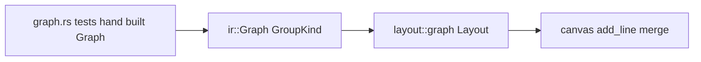

# Design — bpmn-lane-layout

## 정의
기존 `diagram::ir::Group`에 `GroupKind::Lane`을 더하고 `layout::graph`의 블록
배치가 레인 종류 그룹을 "소속 범위 전체를 관통하는 띠"로 그리게 하는 확장이다.

## Boundary Commitments

### In-Scope (This Spec Owns)
- **그룹 종류**: `ir::GroupKind { Box, Lane }`, `Group.kind`, `Graph::add_lane()`
- **레인 기하**: `layout::graph`의 층 범위 강제·교차축 밀착 배치·흐름축 배너·구분선·
  제목 위치(§Key Decisions 표)
- **레인 불변 배치**: 정렬·교환·층 접기·출력 밀기에서 레인 블록 제외
- **회귀 기준**: 레인 없는 그래프의 출력 바이트 동일(요구사항 6.1)

### Out-of-Scope
- **BPMN 도형·표식**: `bpmn-shapes` 소유
- **`bpmn::Model`·validate·lower·`render()` 배선·캡션**: `bpmn-model` 소유
- **XML·`biz-process.md` 파서, 코드펜스 언어, CLI 옵션, 예제 문서**: `bpmn-xml`·
  `bizprocess-bpmn` 소유 — 이 스펙은 손으로 만든 `Graph`로만 검증
- **구성원 없는 레인**: 기존 빈 그룹처럼 등록되지 않아 그려지지 않음. 자리표시 노드
  삽입 여부는 `bpmn-model`이 결정
- **레인을 가리키는 간선(그룹 닻)**: 동작 보장 없음(`bpmn-model`이 필요 시 별도 검토)
- **LR 세로쓰기 제목**: 가로쓰기만

### Allowed Dependencies
- 외부: 없음(신규 크레이트 없음, Rust 2024 edition 그대로)
- 내부 의존 방향: `diagram::ir`(`GroupKind` 추가) → `layout::graph`(소비) ←
  `canvas`(선 비트 합치기 `add_line`, 변경 없음). `layout::graph`가 `ir` 밖의
  BPMN 개념을 아는 것은 설계 위반

### Revalidation Triggers
- `Canvas::add_line()`이 같은 칸의 선 비트를 합치지 않게 바뀌면 형제 -1 간격이
  두 줄로 보인다 — 재검토
- `layout::graph`가 `layer_start`/`top_levels` 대신 다른 흐름축 좌표계로 바뀌면
  배너 오프셋 규칙 재검토
- `bpmn-model`이 레인 자식으로 레인·노드 혼재를 실제로 만들면 순서 고정 규칙 재검토

## Architecture

### Boundary Map


### Technology Stack
| Layer | Choice | Role |
|-------|--------|------|
| 배치·그리기 | Rust 1.96, 기존 `layout::graph` Sugiyama 블록 배치 | 레인 = 블록의 특수 모드 |

### Key Decisions
- **`GroupKind`는 `ir::Group`의 필드**: `Block`에 필드를 안 두고 `graph.groups[g].kind`로
  판정 — 이유: `Block`은 `arrange()`마다 다시 만들어지며 `group: Option<usize>`로
  이미 그룹에 닿는다.
- **유효 층 범위 함수 하나**: `effective_group_ranges()`가 `dummy_group()`과
  `build_blocks()` 양쪽의 단일 출처 — 이유: 지금은 두 곳이 같은 값을 따로 계산한다
  (research.md).
- **레인 자식이 하나라도 있는 블록은 통째로 선언 순서**: `reorder()`·`improve_by_swaps()`
  모두 그 블록을 건너뜀 — 이유: BPMN은 레인·노드를 한 부모에 섞지 않으므로 부분
  고정 로직은 사변적(research.md).
- **배너는 흐름축 접두 공간, 구분선은 기존 테두리 줄 재사용** — 이유·대안은
  research.md. 기하 규칙(용어: 흐름축 along, 교차축 across, 깊이 d = 레인 조상 수):

| 규칙 | 내용 | 요구사항 |
|---|---|---|
| 층 범위 | Lane: 부모의 유효 범위(부모 없음 → `0..layer_count-1`); Box: 구성원 범위. `dummy_group()`·`Block.layer_min/max` 둘 다 이 값 | 1.1~1.4 |
| 교차축 | 부모 Lane의 Lane 자식: pad 0(첫 자식 시작 = 부모 시작, 부모 폭 = 마지막 자식 끝), 형제 Lane 간격 -1(다음 시작 = 앞 끝 − 1). 비레인 자식은 기존 pad 2·`gap_between` | 2.1~2.3 |
| `block_extra` | 부모 Lane의 `block_extra`는 마지막 Lane 자식에게 넘기고 자기 폭에는 더하지 않음 | 2.3 |
| 배너 크기 | `banner_along[d]` = TB: 2(테두리 줄 + 제목 줄); LR: 3 + 깊이 d 레인 제목 폭 최댓값(테두리 칸 + ` 제목 ` ) | 4.1, 4.2, 4.4 |
| 오프셋 | `banner_start(d)` = Σ_{k<d} `banner_along[k]`; `layer_start[0]` = Σ_d `banner_along[d]` | 4.3 |
| 레인 사각형 | 흐름축 시작 = `banner_start(d)`; 끝 = 최상위면 `total_along() − 1`, 부모가 Lane이면 부모의 끝. 교차축은 기존 `start..start+width` | 1.1, 1.3, 2.3 |
| 구분선 | 레인 폭 전체에 흐름축 `layer_start[0] + 2·rank` 위치의 교차선(기존 그룹 내용 상자 윗변) | 4.1, 4.2 |
| 제목 | (흐름축 `banner_start(d)+1`, 교차축 `start+1`)에 가로쓰기. TB는 기존 `truncate(title, width−4)`·`title_min` 규약 그대로, LR은 배너가 최댓값으로 잡혀 자르지 않음. 빈 제목은 쓰지 않음 | 4.5, 4.6 |
| 랭크·레벨 | 부모가 Lane인 Lane 블록은 `group_top()` 랭크·`inner_rank()`의 +1·`route()`의 `top_levels`/`bottom_levels` 어디에도 세지 않음(테두리가 부모와 한 줄). 최상위 Lane은 Box처럼 셈 | 2.3, 4.3 |
| 순서·접기 | `is_movable(Child::Block(b))` = `!is_lane(b)`; Lane 자식 있는 블록은 `reorder`/`improve_by_swaps` 건너뜀 | 2.4, 2.5 |
| 출력 밀기 | `push_outputs_below_groups()`에서 원천 그룹이 Lane이면 건너뜀 | 3.1 |
| 방향 | 변경 없음 — `graph.direction`·`render()`의 재시도 루프 그대로 | 5.1~5.3 |

## Components and Interfaces

### diagram::ir — GroupKind (기존 파일 확장)
- Intent: 그룹이 내용 적응형 상자인지 범위 관통 띠인지 표시
- Requirements: 1.1, 1.2, 6.1
```rust
#[derive(Clone, Copy, Debug, PartialEq, Eq, Default)]
pub enum GroupKind {
    #[default]
    Box,
    /// 소속 범위(다이어그램 전체 또는 부모 레인) 전체를 관통하는 띠.
    Lane,
}
pub struct Group { pub id: String, pub title: String, pub parent: Option<usize>, pub kind: GroupKind }
impl Graph {
    /// 레인 종류 그룹. id = title(기존 `add_group`과 같은 규약).
    pub fn add_lane(&mut self, title: &str, parent: Option<usize>) -> usize;
}
```
- 계약: `add_group`/`add_group_with_id`는 `GroupKind::Box`를 넣는다(기존 파서 5곳
  무변경). `Group` 생성은 `add_group_with_id` 한 곳을 거친다(`add_lane`은 그 위의
  얇은 래퍼 + `kind` 설정).

### diagram::layout::graph — Layout 레인 확장 (기존 파일 확장)
- Intent: §Key Decisions 표의 기하 규칙을 기존 블록 배치에 적용
- Requirements: 1.1~1.4, 2.1~2.5, 3.1~3.3, 4.1~4.6, 5.1~5.3, 6.2
```rust
impl<'a> Layout<'a> {
    /// 블록 0(루트)은 false.
    fn is_lane(&self, block: usize) -> bool;
    /// Lane 조상 수(최상위 Lane = 0). Box 블록에는 호출하지 않는다.
    fn lane_depth(&self, block: usize) -> usize;
    /// 그룹별 유효 층 범위 — Lane은 부모 범위, Box는 구성원 범위. 구성원 없는 그룹은 `(usize::MAX, 0)`.
    fn effective_group_ranges(&self) -> Vec<(usize, usize)>;
    /// 깊이별 배너 크기(흐름축). `route()`에서 계산해 `layer_start[0]`에 더한다.
    fn banner_along(&self) -> Vec<usize>;
    fn banner_start(&self, depth: usize) -> usize;
}
```
- 계약(수정 함수): `group_layer_ranges` → `effective_group_ranges`로 대체,
  `build_blocks`(블록 범위를 그 값으로), `place_block`(자식별 pad·-1·`block_extra`
  전달), `reorder`·`improve_by_swaps`·`is_movable`(레인 제외), `push_outputs_below_groups`
  (Lane 원천 건너뜀), `route`(레벨 집계·`layer_start[0]` 오프셋), `group_top`·
  `group_bottom`·`inner_rank`(레인 규칙), `draw_groups`(레인 사각형 + 구분선),
  `draw_group_titles`(레인은 배너 안). 그 외 함수는 무변경.
- 실패 모드: 레인이 있어도 `Layout::build()`의 반환 계약(`Option<Canvas>`)과
  `render()`의 재시도 루프는 그대로. 새 패닉 경로 없음 — 구성원 없는 레인은
  `registered == false`라 모든 그리기·집계에서 자연히 빠진다.

## Data Models
`GroupKind`·`Group.kind`가 전부(위 인터페이스 블록). 불변식: `Block`은 종류를
저장하지 않고 항상 `graph.groups[g].kind`로 판정한다.

## Error Handling
- **사용자 입력 오류**: 없음(파서 없음). 레인·노드 혼재 블록은 선언 순서로 배치(3.3)
- **외부 자원 오류**: 해당 없음
- **시스템 오류(패닉)**: 3단 중첩·빈 레인·레인 밖 노드·레인 간 되돌아가는 간선을
  단위 테스트로 패닉 없음 확인(6.2). `usize` 뺄셈(-1 간격, `total_along() − 1`)은
  `saturating_sub` — 폭 0 블록은 `place_block`이 만들지 않으므로 실제 도달 불가
- **기능 강등**: 폭 초과 시 기존 `render()` 규약(반대 방향 → 라벨 축소 → `None`)
  그대로(5.3). TB에서 레인 밖 노드로 나가는 간선 라벨이 풀 밖으로 나가면 기존
  `reserve_label_room` 규약대로 풀이 넓어지고 마지막 레인이 따라 넓어진다

## Testing Strategy
- **Depth**: Standard — 신규 파서·화면 없음, 기존 배치기의 기하 규칙 확장. E2E는
  파서가 없어 해당 없음(`bpmn-model`에서 수행)
- **Unit(L6, `layout::graph::tests`, 손으로 만든 `Graph`)**:
  - 회귀 기준(바이트 동일 — 기존 13개 테스트 무수정 통과): `renders_top_down_chain_with_back_edge`,
    `renders_left_right`, `bottom_up_flips_top_down_without_mirroring_text`,
    `right_left_flips_left_right_without_mirroring_text`, `groups_enclose_members`,
    `too_wide_returns_none`, `large_graph_renders_within_a_bounded_time`,
    `crow_one_marker_is_a_single_glyph_not_doubled`, `crow_many_marker_opens_toward_the_node_it_touches`,
    `left_right_tail_label_hugs_its_own_node_not_the_widest_sibling`,
    `left_right_label_does_not_overwrite_a_two_glyph_tail_marker`,
    `left_right_tail_label_hugs_the_border_directly`, `left_right_head_label_hugs_the_border_directly`
    + 그룹을 만드는 파서 테스트(`mermaid::flow`·`mermaid::state`·`plantuml::component`·
    `plantuml::class`) 무수정 통과(6.1, 1.2)
  - 레인 띠 범위: 최상위 레인 A(노드 층 0만)와 레인 B(층 0~2) — TB에서 A의 세로
    테두리가 B와 같은 줄 수만큼 이어짐(1.1, 1.4); 중첩 레인이 부모와 같은 끝 줄(1.3, 2.3)
  - 형제 경계: TB 형제 레인 사이 `│` 한 열, 부모 윗변에 `┬`·아랫변에 `┴`(2.1, 2.2)
  - 순서 고정: A, B, C 선언 + C→A 간선만 있어도 열 순서 A, B, C(2.4)
  - 접기 폴백: 좁은 폭으로 TB 접기가 일어나도 레인 열이 나란히 유지(2.5)
  - 레인 간 흐름: A: a1→a2→a3, a1→b1 — b1이 a2와 같은 줄(3.1); 선이 끊기지 않고
    화살촉이 b1 위에 있음(3.2); 레인 밖 노드 혼재 시 상자 밖 + 패닉 없음(3.3)
  - 배너: TB 제목 줄이 첫 노드 줄보다 위이고 그 줄에 `─`가 없음(4.1); LR 제목 열이
    첫 노드 왼쪽 테두리보다 왼쪽(4.2); 풀 제목 줄/열이 레인 제목보다 앞(4.3); 제목
    길이가 다른 형제의 첫 노드 시작 위치 동일(4.4); TB 긴 제목이 잘리지 않음(4.5);
    빈 제목 레인의 배너 줄이 공백(4.6)
  - 방향: `direction` 미지정 → 레인이 좌우(5.1), `LeftRight` → 위아래(5.2), 폭 8 → `None`(5.3)
  - 패닉 없음: 3단 중첩, 빈 레인, 레인 간 되돌아가는 간선(6.2)
- **Integration**: 없음(이 스펙은 `layout::graph` 단일 모듈 안에서 닫힌다)
- **Acceptance**: `cargo test` 전량 + `cargo clippy --all-targets -- -D warnings` +
  `examples/*.md`를 수정 전후 `dg -P --width 100`으로 렌더링해 `diff` 무차이(6.1
  실물 확인). 레인 그림 자체는 단위 테스트의 `{text}` 출력을 육안 확인(파서가
  없어 바이너리 실행 불가)

## File Structure Plan
```
src/diagram/ir.rs                 # GroupKind, Group.kind, Graph::add_lane (기존 파일 확장)
src/diagram/layout/graph.rs       # Layout 레인 규칙 + #[cfg(test)] 레인 테스트 (기존 파일 확장)
```
