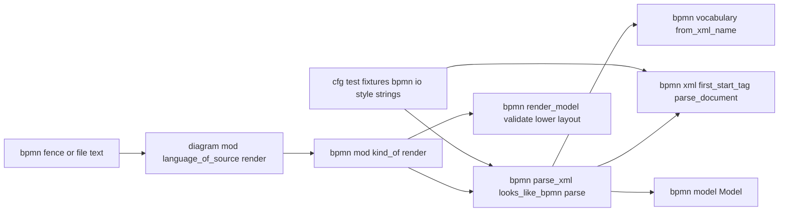
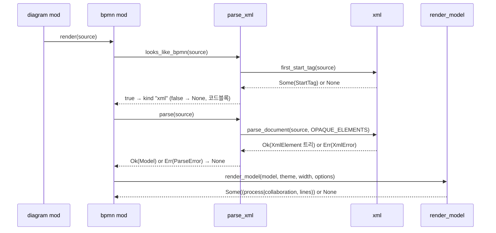

# Design — bpmn-xml

## 정의
BPMN 도구가 내보낸 BPMN 2.0 XML을 새 크레이트 없이 읽어 `bpmn::Model`로 만들기 위해, 문자 단위 XML
토크나이저·트리 빌더(`bpmn::xml`)와 BPMN 의미 트리 → `Model` 빌더(`bpmn::parse_xml`)를 만들고,
`bpmn-model`이 스텁으로 남긴 `bpmn::kind_of`/`bpmn::render`를 실제 갈래 `"xml"`로 채우는 첫 BPMN 입력
문법 계층이다. `render_model` 이후 경로(검증·변환·배치)는 한 줄도 바꾸지 않는다.

## Boundary Commitments

### In-Scope (This Spec Owns)
- **XML 표면 문법**: `bpmn::xml::{XmlElement, XmlError, parse_document, first_start_tag}` — 요소·속성(홑/겹따옴표)·
  텍스트·주석·CDATA·`<?…?>`·`<!DOCTYPE`·엔티티 5종 + 숫자 문자 참조·요소 접두사 제거·불투명 구획·깊이 상한.
  BPMN 이름은 하나도 모른다
- **BPMN 의미 트리 → 모델**: `bpmn::parse_xml::{parse, looks_like_bpmn, ParseError}` — 협업·참여자·프로세스·레인
  집합·흐름 노드·아티팩트·흐름·default·경계 부착·제목·미리 거를 흐름·합성 id. 어휘는
  `bpmn::vocabulary`의 `from_xml_name`만 호출
- **배선**: `bpmn::kind_of → Some("xml")`, `bpmn::render`의 `"xml"` 팔, `diagram::language_of_source`의 검사
  순서(BPMN을 PlantUML 앞으로)
- **강건성·회귀 테스트**: `diagram::mod::robustness`의 BPMN 배열 확장, bpmn.io 형식 fixture(테스트 문자열),
  mermaid·PlantUML 바이트 동일

### Out-of-Scope
- **BPMNDI(`bpmndi:*`·`dc:*`·`di:*`) 전부 — 영구 제외(사용자 결정 2026-09-26)**: 불투명 구획으로 건너뛰며
  좌표·`isHorizontal`을 읽지 않는다. 방향은 `Orientation::default()` + `DiagramOptions.direction`
- **`bpmn-yaml`·`bizprocess-bpmn`**: 갈래 `"yaml"` 등은 후속 스펙이 `kind_of`·`render`에 더한다. 이 스펙은
  YAML·마크다운 본문에 `Some("xml")`을 돌려주지 않을 책임만
- **`bpmn::{model, vocabulary, validate, lower}`·`render_model`·`ir`·`layout`**: 변경 없음. 검증 규칙 추가 없음
- **범용 XML**: DTD·외부 엔티티·네임스페이스 URI 해석·인코딩 선언(입력은 이미 `&str`)·스키마 검증
- **펼친 서브프로세스 내부·조건식 표시·`documentation`·실행 속성·풀을 끝으로 하는 메시지 흐름 렌더링**:
  미지원(무시 또는 흐름 생략)
- **진단 UI**: `XmlError`·`ParseError`는 `Debug`/`Display`까지, 화면에는 코드블록 폴백만
- **`examples/` 문서**: 추가하지 않음 — fixture는 `#[cfg(test)]` 문자열 리터럴

### Allowed Dependencies
- 외부: 없음(신규 크레이트 없음, `Cargo.toml` 의존성 4개 그대로, Rust 2024 edition)
- 내부 의존 방향: `bpmn::xml`(표준 라이브러리만) ← `bpmn::parse_xml`(`xml`·`model`·`vocabulary` 사용) ←
  `bpmn::mod`(`parse_xml`·`render_model`) ← `diagram::mod`. `xml`이 `model`·`vocabulary`를 import하거나
  BPMN 로컬 이름 리터럴을 가지면 설계 위반; `parse_xml`이 `validate`·`lower`·`layout`을 부르면 위반
  (검증은 `render_model` 몫); `model`·`vocabulary`·`validate`·`lower`가 `xml`·`parse_xml`을 알면 위반

### Revalidation Triggers
- `plantuml::kind_of`가 포괄 판별(`Some("class")` 기본값)을 버리면 `language_of_source` 순서 결정 재검토
- (해소됨, 2026-09-26) `validate`가 참여자 끝 메시지 흐름을 받아들이게 바뀌어 참여자 끝은
  더는 미리 거르지 않는다(`bpmn-message-flow-participant-endpoint`) — 레인 끝은 여전히
  범위 밖이라 계속 거른다. `validate`가 레인 끝까지 받아들이게 바뀌면 그 규칙도 마저 제거
- `Model`에 `parent`(펼친 서브프로세스)·`groups`가 들어오면 `subProcess` 자식 무시 규칙 재검토
- 실물 내보내기 파일이 research.md의 표면 형태와 다르면(속성이 접두사로 쓰임 등) 속성 이름 규칙 재검토
- `Graph::set_label`의 `\n` 분리 관례가 바뀌면 `&#10;` 다중 줄 라벨(2.2) 재검토

## Architecture

### Boundary Map


### Technology Stack
| Layer | Choice | Role |
|-------|--------|------|
| 토크나이저·모델 빌더·배선 | Rust 1.96, 표준 라이브러리만 | 문자 단위 렉싱, 트리, 모델 채우기 |

### Key Decisions
- **두 단계(문법 → 의미)**: `xml`은 트리만, `parse_xml`이 BPMN을 안다 — 이유: 각각 독립 테스트, 토크나이저가
  다른 XML 입력에도 재사용 가능. 대안 비교는 research.md.
- **스니핑 = 첫 시작 태그 하나만 렉싱**(1.1, 1.4, 1.5): 로컬 이름 `definitions`이면 `xmlns*` 속성 중 하나가
  `omg.org/spec/BPMN`를 담거나 `xmlns*` 속성이 하나도 없어야 하고, `process`·`collaboration`은 무조건 —
  이유: 실제 도구 출력(항상 네임스페이스 선언)과 손으로 쓴 조각(선언 없음)을 다 받고 WSDL(다른 선언)은 거른다.
- **`language_of_source` 순서 = 확장자 → `@start` → mermaid → BPMN → PlantUML**(1.3, 1.6): 이유: PlantUML
  `kind_of`는 점수 0이면 `Some("class")`를 돌려주는 포괄 판별기라 그 뒤에 두면 XML을 영영 못 본다.
- **구조 엄격·어휘 관대**(2.7, 6.1~6.4): 잘림·불일치·미종결·깊이 64 초과 → `Err`; 모르는 엔티티·잘못된 문자
  참조 → 원문 유지 — 이유: 기계가 쓴 파일의 구조 오류는 손상이라 숨기지 않고, 이름 한 칸 문제로 문서를
  버리지 않는다. **사람이 확인할 결정(tasks 게이트)**.
- **불투명 구획은 `parse_xml`이 이름을 주고 `xml`이 균형만 센다**(2.5, 2.6): `["BPMNDiagram", "extensionElements"]`
  — 이유: BPMN 이름은 `parse_xml` 소유, 주석·CDATA 안 가짜 태그에 깨지지 않으려면 같은 렉서로 세야 한다.
- **요소 접두사 제거, 속성 이름은 쓴 그대로**(2.1): BPMN 스키마는 속성이 항상 비한정 — 이유: vendor
  속성(`camunda:name`)과 충돌 방지, 스니핑에 `xmlns:*` 이름 필요. `xmlns`·`xmlns:*`는 속성으로 그대로 남는다.
- **텍스트 = 직접 텍스트 + CDATA 이어붙여 양끝 공백 제거, 엔티티는 CDATA 밖에서만 디코딩**(2.2~2.4, 2.8).
- **미리 거를 흐름 = 끝이 "문서에 있지만 노드가 되지 않은 id"**(5.5a, 5.7, 5.8) — 갱신
  (`bpmn-message-flow-participant-endpoint`, 2026-09-26): 참여자(블랙박스 풀 포함) 끝은
  이제 `bpmn::Model`이 직접 받아들이므로 더는 거르지 않고 `sourceRef`/`targetRef` 그대로
  `Flow`에 둔다(5.5). 계속 거르는 건 `dataInput`·`property`·**레인**(레인은 `MessageFlow`의
  끝점이 될 수 없다) 등 정말 범위 밖인 id뿐 — 이유: 그런 범위 밖 항목과 진짜 끊긴 참조를
  구분해 `validate`(1.4)를 무력화하지 않는다.
- **경계 이벤트 `container` = 호스트의 것**(4.3) — 이유: `validate` 1.7과 BPMN 의미(테두리 위) 일치.
- **참여자가 안 가리키는 `process`**(3.4, 3.5): `laneSet` 있으면 프로세스 id·이름으로 참여자 합성, 없으면
  `container = None` — 이유: 레인은 풀 없이 그려질 곳이 없고, 협업 없는 단일 프로세스는 평면이 도구 화면과 같다.
- **`subProcess`·`adHocSubProcess`·`transaction` → `Subprocess`, 자식 무시**(4.5) — 이유: `Model`이 접힌 것만 담는다.
- **`dataObjectReference`/`dataStoreReference`만 노드, 정의 요소는 "노드 아닌 id"**(4.8).
- **`kind_of`는 갈래 `"xml"`, 캡션 종류는 `render_model`의 것**(3.1, 3.4, 7.4).
- **id 없는 노드·흐름은 `@bpmn-xml:{n}`**(문서 순서) — 이유: 빈 id 둘이면 `DuplicateId`로 문서 전체가 떨어진다.
- **이벤트 트리거**(4.2): `*EventDefinition` 자식 중 `EventTrigger::from_xml_name`이 해석되는 것 0개 → `None`,
  1개 → 그것, 2개 이상 → `parallelMultiple="true"`면 `ParallelMultiple` 아니면 `Multiple`.

## System Flows

- `Err`는 어디서 나든 `None`으로 강등돼 원문 코드블록(5.8, 6.1~6.5, 6.7). 노드 없는 모델은 `render_model`이
  `None`(6.5의 `<definitions/>`)

## Components and Interfaces

### bpmn::xml — XML 토크나이저·트리 빌더 (신규)
- Intent: BPMN 문서에 충분한 최소 XML 하위집합을 요소 트리로. BPMN 이름·의미 없음
- Requirements: 1.1(첫 태그), 2.1~2.8, 6.1~6.5
```rust
/// 요소 하나. 이름은 접두사를 벗긴 로컬 이름, 속성 이름은 쓴 그대로(`xmlns:bpmn`·`xsi:type` 포함).
#[derive(Clone, Debug, Default, PartialEq, Eq)]
pub struct XmlElement {
    pub name: String,
    /// (이름, 디코딩된 값). 중복 이름은 첫 것만.
    pub attributes: Vec<(String, String)>,
    pub children: Vec<XmlElement>,
    /// 직접 텍스트 + CDATA를 문서 순서로 이어붙여 양끝 공백을 제거한 것(자식 요소의 텍스트는 제외).
    pub text: String,
}
impl XmlElement {
    pub fn attribute(&self, name: &str) -> Option<&str>;
    pub fn children_named<'a>(&'a self, name: &'a str) -> impl Iterator<Item = &'a XmlElement>;
    pub fn child_text(&self, name: &str) -> Option<&str>;   // 첫 자식의 text
}
/// 첫 시작 태그(프롤로그·주석·DOCTYPE 뒤). 속성 규칙은 XmlElement와 같다.
#[derive(Clone, Debug, PartialEq, Eq)]
pub struct StartTag { pub name: String, pub attributes: Vec<(String, String)> }
#[derive(Clone, Debug, PartialEq, Eq)]
pub enum XmlError {
    NoRootElement,                       // 요소가 하나도 없음(빈 문자열·공백·`<` 하나)
    UnexpectedEnd,                       // 태그·따옴표·주석·CDATA·선언이 열린 채 끝남; 요소가 안 닫힘
    MalformedTag(usize),                 // 바이트 오프셋: 이름 없는 태그, 값 없는 속성, `<` 뒤 이상 문자
    MismatchedClosingTag { expected: String, found: String, offset: usize },
    TooDeep(usize),                      // 중첩 깊이(64) 초과 지점
}
impl std::fmt::Display for XmlError {}
pub const MAX_DEPTH: usize = 64;
/// 프롤로그를 건너뛴 첫 시작 태그. 없거나 태그가 망가졌으면 None.
pub fn first_start_tag(source: &str) -> Option<StartTag>;
/// 루트 요소 트리. `opaque`에 든 로컬 이름의 요소는 시작·끝 태그 균형만 세어 건너뛰고 트리에 넣지 않는다
/// (주석·CDATA는 그 안에서도 정상 인식). 루트 닫힘 뒤 내용은 무시.
pub fn parse_document(source: &str, opaque: &[&str]) -> Result<XmlElement, XmlError>;
```
- 계약: 명시적 스택(재귀 없음). 자기 닫힘 `<a/>`와 `<a></a>` 동일(2.8). 엔티티 `&lt; &gt; &amp; &quot; &apos;
  &#N; &#xH;`만 디코딩, 그 외·잘못된 참조(`&#;`·`&#xD800;`·범위 초과)는 원문 유지(2.7). 접두사 제거는
  이름의 첫 `:`까지(`bpmn:process → process`). `<?…?>`·`<!--…-->`·`<!DOCTYPE …>`는 어디서든 건너뜀(2.3).
  요소 사이 공백만 있는 텍스트는 `text`에 남지 않는다(양끝 제거 결과 빈 문자열)

### bpmn::parse_xml — BPMN 의미 트리 → Model (신규)
- Intent: OMG Descriptive 하위집합의 요소를 `vocabulary` 토큰으로 `Model`에 채운다. 검증은 안 한다
- Requirements: 1.1, 1.4, 1.5, 3.1~3.7, 4.1~4.11, 5.1~5.8, 7.3
```rust
#[derive(Clone, Debug, PartialEq, Eq)]
pub enum ParseError {
    Xml(XmlError),
    /// 루트 로컬 이름이 definitions·process·collaboration이 아님.
    UnexpectedRoot(String),
}
impl std::fmt::Display for ParseError {}
/// 트리로 만들지 않는 구획(BPMNDI·vendor 확장).
pub const OPAQUE_ELEMENTS: &[&str] = &["BPMNDiagram", "extensionElements"];
/// 첫 시작 태그만 보고 BPMN XML인지 판정(design §Key Decisions 스니핑 규칙).
pub fn looks_like_bpmn(source: &str) -> bool;
/// 문서 → 검증 전 Model. orientation은 기본값.
pub fn parse(source: &str) -> Result<Model, ParseError>;
```
- 빌드 순서(모두 `XmlElement` 로컬 이름 기준):
  1. 루트 `definitions`(자식에서 `collaboration`·`process` 수집) 또는 루트 자체가 `process`/`collaboration`
  2. `collaboration/participant` → `Participant{id, name, lanes}`; `processRef` → 그 프로세스의 소속 = 참여자 id(3.1, 3.2)
  3. 참여자가 가리키지 않는 `process`: `laneSet` 있으면 합성 참여자(3.5), 없으면 소속 `None`(3.4)
  4. `laneSet/lane`(재귀 `childLaneSet/lane`) → `Lane` 트리; `flowNodeRef` 텍스트 → 노드 id → 레인 id(깊은 것이 덮음; 3.3, 3.6)
  5. `process` 직접 자식 → `Element`(표 아래); `boundaryEvent@attachedToRef` → `attached_to`; 전부 만든 뒤 경계
     이벤트 `container` := 호스트 `container`(4.3). 그 밖의 자식(`incoming`·`outgoing`·`ioSpecification`·
     `property`·`dataInput`·`dataOutput`·`dataObject`·`dataStore`·`group`·`category`·`documentation`·vendor) →
     노드 아님, `id`가 있으면 "노드 아닌 id"에 수집(4.10)
  6. 흐름: `sequenceFlow`(라벨 `@name`; `is_default` = 어떤 노드의 `@default`와 id 일치; 5.1~5.3),
     `collaboration/messageFlow`(5.4), `process/association`(5.6), 활동 자식 `dataInputAssociation`(`sourceRef`
     텍스트 → 활동)·`dataOutputAssociation`(활동 → `targetRef` 텍스트)(5.6)
  7. 끝이 "노드 아닌 id"이고 **참여자 id가 아닌**(레인·정의 요소·`dataInput`·`property` …) 흐름만 제거
     (5.5a, 5.7); 참여자 id는 그대로 `Flow`에 남겨 `bpmn::Model`이 받아들이게 한다(5.5,
     `bpmn-message-flow-participant-endpoint`). 문서에 없는 id는 유지(5.8)
  8. `title` = `collaboration@name` → 유일한 `process@name` → `definitions@name` → `""`(3.7); id 없는 노드·흐름 `@bpmn-xml:{n}`
- 요소 표(로컬 이름 → `ElementKind`; 이름 = `@name` 디코딩 후 `trim`, `textAnnotation`은 `text` 자식):

| 로컬 이름 | `ElementKind` | 요구사항 |
|---|---|---|
| `startEvent` / `intermediateCatchEvent`·`intermediateThrowEvent`·`boundaryEvent` / `endEvent` | `Event{Start / Intermediate / End, trigger}` | 4.1~4.3 |
| `TaskKind::from_xml_name` 성공(`task` … `receiveTask`) | `Task(kind)` | 4.4 |
| `subProcess`·`adHocSubProcess`·`transaction` | `Subprocess`(자식 무시) | 4.5 |
| `callActivity` | `CallActivity` | 4.6 |
| `GatewayKind::from_xml_name` 성공 | `Gateway(kind)` | 4.7 |
| `dataObjectReference` / `dataStoreReference` | `DataObject` / `DataStore` | 4.8 |
| `textAnnotation` | `TextAnnotation` | 4.9 |
| 그 외 | 노드 아님 | 4.10 |

### bpmn::mod — 갈래 배선 (기존 파일 수정)
- Intent: 스텁을 실제 갈래로
- Requirements: 1.1, 1.5, 3.1, 3.4, 6.5, 6.7, 7.4
```rust
/// 코드펜스 본문의 문법 갈래: BPMN XML이면 Some("xml"). (후속 스펙: "yaml" …)
pub fn kind_of(source: &str) -> Option<&'static str>;   // parse_xml::looks_like_bpmn(source).then_some("xml")
/// kind_of → 갈래별 파서 → render_model. 파서 실패는 None.
pub fn render(source: &str, theme: &Theme, width: usize, options: DiagramOptions) -> Option<(&'static str, Vec<Line>)>;
// match kind_of(source)? { "xml" => parse_xml::parse(source).ok()?, _ => return None } → render_model(&model, …)
pub mod parse_xml; pub mod xml;
```
- 계약: 돌려주는 종류 이름은 `render_model`의 `"process"`/`"collaboration"`(캡션), `"xml"`이 아니다.
  `#[cfg(test)] pub(crate) mod fixtures` — bpmn.io 형식 주문 처리 협업 문서 등 공용 XML 문자열 리터럴

### diagram::mod — 판별 순서 (기존 파일 수정)
- Intent: 확장자 없는 BPMN XML이 PlantUML로 잡히지 않게
- Requirements: 1.2, 1.3, 1.4, 1.6, 6.6, 7.1
```rust
pub fn language_of_source(path: Option<&str>, source: &str) -> Option<Language>;
// 순서: language_of_path → "@start" 접두 → mermaid::kind_of → bpmn::kind_of → plantuml::kind_of
```
- 계약: mermaid·PlantUML 소스에 대한 결과 불변(1.6) — BPMN 스니핑은 `<`로 시작하는 첫 요소를 요구하므로
  두 언어 소스에서 참이 될 수 없다

## Data Models
`XmlElement`·`StartTag`(위 인터페이스)가 전부. 불변식: `name`에 `:` 없음; `attributes` 이름 고유; `text`는 양끝
공백 없음; 트리 깊이 ≤ 64. `Model` 쪽 불변식은 `bpmn-model/design.md`(검증이 보장, 파서는 채우기만) — 이 스펙이
더하는 관례: 합성 id `@bpmn-xml:{n}`, 경계 이벤트 `container == 호스트.container`, 합성 참여자 id = 프로세스 id

## Error Handling
- **사용자 입력 오류**: 구조 오류 → `XmlError` → `ParseError::Xml` → `render` `None` → 코드블록(6.1~6.4);
  BPMN 아님 → `kind_of` `None`(1.4, 1.5); 노드 없음 → `render_model` `None`(6.5); 구조 규칙 위반 → `validate`
  거부 → `None`(5.8); 어휘 오류는 오류가 아니라 원문 유지(2.7)
- **외부 자원 오류**: 해당 없음(입력은 이미 메모리의 `&str`)
- **시스템 오류(패닉)**: 문자 경계는 `char_indices`·`str` 슬라이스만(바이트 인덱스 산술로 슬라이스하지 않음);
  재귀 없음 + 깊이 상한(6.4); `char::from_u32` 실패는 원문 유지; 폭 5종 × 모든 fixture 패닉 없음(6.6)
- **기능 강등**: 범위 밖 흐름(레인·`dataInput` 끝 — 참여자 끝은 이제 정상 렌더링, 5.5)은 그 흐름만 생략(5.5a, 5.7); 폭 초과는 기존 규약(반대 방향 →
  라벨 축소 → `None`); 마크다운의 나머지는 영향 없음(6.7)

## Testing Strategy
- **Depth**: Complex — 새 문법(토크나이저 상태기계) + 표준 매핑 규칙 + 언어 판별 통합 + 강건성. fixture는 전부
  `#[cfg(test)]` 안 `&str` 리터럴(`examples/` 파일 없음)
- **Unit(L6, `xml::tests`)**: 접두사 4종 동일 트리(2.1); 홑/겹따옴표·엔티티 5종·`&#10;`·`&#x2014;` 디코딩(2.2);
  선언·DOCTYPE·주석(안에 `<>`)·요소 사이 공백 무시(2.3); CDATA 안 `<` 텍스트 보존·엔티티 미디코딩(2.4);
  불투명 이름 지정 시 그 요소가 트리에 없고 안의 주석·CDATA·중첩 같은 이름에도 균형 유지(2.5, 2.6); `&nbsp;`·
  `&#;`·`&#xD800;`·`&#99999999999;` 원문 유지(2.7); 자기 닫힘 = 열고 닫음(2.8); 잘림 3종·불일치·따옴표/주석/
  CDATA/선언 미종결 → 해당 `XmlError` 변형(6.1~6.3); 깊이 65 → `TooDeep`, 64 → `Ok`(6.4); 빈·공백·`<` →
  `NoRootElement`/`UnexpectedEnd`(6.5); `first_start_tag`가 프롤로그 뒤 태그·속성을 돌려주고 태그 없으면 `None`
- **Unit(L6, `parse_xml::tests`)**: `looks_like_bpmn` — BPMN 네임스페이스 `definitions`·선언 없는 `definitions`·
  `process`·`collaboration` 참, WSDL `definitions`·`html`·`project`·YAML·평문·빈 문자열 거짓(1.1, 1.4, 1.5);
  참여자 2 + `processRef` → `participants` 순서·이름(3.1), `processRef` 없음 → 레인 없는 참여자(3.2);
  `laneSet/lane/childLaneSet/lane` + `flowNodeRef` → `Lane` 트리·`container` = 안쪽 레인(3.3), 미나열 → 참여자 id
  (3.6); 협업 없음 → 레인 없으면 `participants` 비고 `container None`(3.4), 레인 있으면 합성 참여자(3.5); 제목
  우선순위 3단 + 없음(3.7); 요소 표 전 행 → `ElementKind`(4.1, 4.4~4.9), 트리거 0/1/2/2+`parallelMultiple`(4.2),
  `boundaryEvent` → `attached_to`·`container` = 호스트(4.3), `subProcess` 자식 노드·흐름이 `elements`/`flows`에
  없음(4.5), `dataObject` 정의가 노드 아님(4.8), 밖 요소 무시(4.10), 이름 없음 → `""`(4.11); `sequenceFlow`
  라벨·`default` → `is_default`(활동·게이트웨이 둘 다)·`conditionExpression`만 → 라벨 없음(5.1~5.3);
  `messageFlow` → `Message`(5.4), 참여자 끝 → 그대로 유지(5.5), 레인 끝 → 제거(5.5a);
  `association`·`dataInputAssociation`(객체 → 활동)·
  `dataOutputAssociation`(활동 → 객체)(5.6), `property` 끝 → 제거(5.7); 문서에 없는 id 끝 → 유지(5.8);
  `bpmndi:BPMNDiagram` 있는/없는 문서 → 같은 `Model`(2.5); id 없는 흐름 → `@bpmn-xml:` 합성
- **Integration(L5, `bpmn::tests` + `fixtures`, `render` + `Line::text`)**: 주문 처리 협업 fixture(bpmn.io 형식:
  `<?xml`, `bpmn:` 접두사, `xmlns:*` 5개, `incoming`/`outgoing`, `&#10;` 이름, `conditionExpression`, `bpmndi`
  구획 포함) → `Some(("collaboration", _))`, 폭 100, 글자 11종 전부, `elements`·`flows` 수가 `bpmn/mod.rs`
  `order_processing_collaboration_model()`과 같음(7.3, 3.1, 4.3, 5.2, 5.4); 같은 fixture에서 `bpmndi` 구획 제거
  → 출력 바이트 동일(2.5); 접두사 없는 `definitions` 단일 `process` → `"process"`·띠 없음(3.4); `kind_of("<definitions></definitions>")
  == Some("xml")`이되 `render` → `None`(6.5); YAML 조각 → `kind_of None`(1.5); 마크다운 문서의 손상 `bpmn`
  펜스 → 코드블록 + 앞뒤 문단(6.7, `markdown` 테스트 — 기존 `bpmn_fence_without_a_parser…` 테스트를
  "노드 없는 definitions"·"손상 XML" 두 경우로 갱신)
- **Integration(L4, `diagram::mod` 테스트)**: `language_of_source(None, bpmn.io fixture) == Some(Bpmn)`(1.3),
  WSDL·HTML → `Bpmn` 아님(1.4), `robustness`의 PlantUML 배열 전부 + `@start` 없는 클래스 조각 → `Some(PlantUml)`
  유지(1.6); `robustness::odd_inputs_do_not_panic` BPMN 배열을 둘로 — `must_be_none`(빈·공백·`<`·`<definitions/>`·
  잘림 3종·불일치·미종결 4종·깊이 100·WSDL·YAML·평문·풀 넘는 시퀀스 흐름·중복 id) 전부 `None`, `may_render`
  (fixture들·`&nbsp;` 이름·id 없는 흐름·`Multiple` 이벤트·`subProcess` 안 노드) 패닉 없음, 폭 5종(6.1~6.6, 5.8)
- **Acceptance(L1)**: `cargo test` 전량(기준선 373개 무수정 통과 — `bpmn/mod.rs`의 "항상 None" 테스트와
  `markdown` "파서 없음" 테스트는 이 스펙이 의도적으로 갱신 — + 신규) + `cargo clippy --all-targets -- -D warnings`
  + `examples/*.md` 수정 전후 `dg -P --width 100` `diff` 무차이(7.1) + `Cargo.toml` 의존성 4개(7.2) + fixture를
  스크래치 디렉터리 `.bpmn` 파일로 써서 `dg <파일>`·`cat <파일> | dg -d` 둘 다 `◈ bpmn · collaboration` 캡션(7.4,
  1.2, 1.3) + `{text}` 육안 확인

## File Structure Plan
```
src/diagram/bpmn/xml.rs         # XmlElement · StartTag · XmlError · first_start_tag · parse_document · 단위 테스트 (신규)
src/diagram/bpmn/parse_xml.rs   # ParseError · OPAQUE_ELEMENTS · looks_like_bpmn · parse · 요소 표 · 단위 테스트 (신규)
src/diagram/bpmn/mod.rs         # pub mod xml/parse_xml · kind_of("xml") · render "xml" 팔 · cfg(test) fixtures · 통합 테스트 (수정)
src/diagram/mod.rs              # language_of_source 순서 · robustness BPMN 배열 확장 · 판별 테스트 (수정)
src/markdown/mod.rs             # bpmn 펜스 폴백 테스트 갱신(노드 없음·손상 XML) (테스트만 수정)
```
