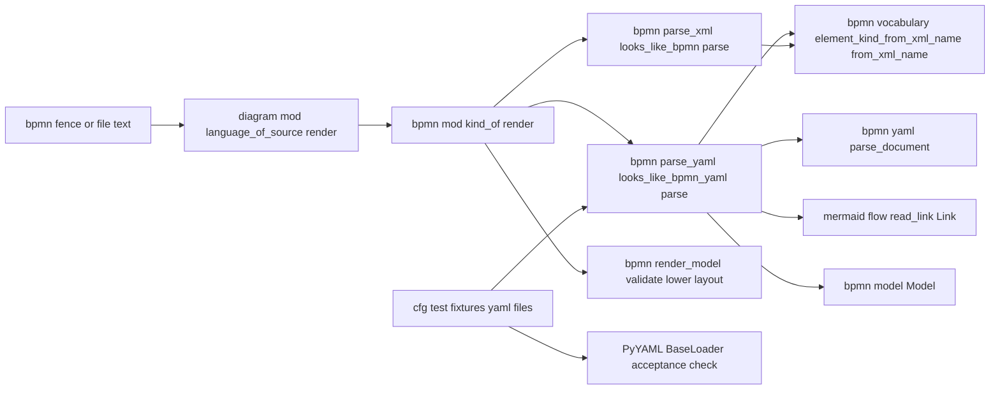
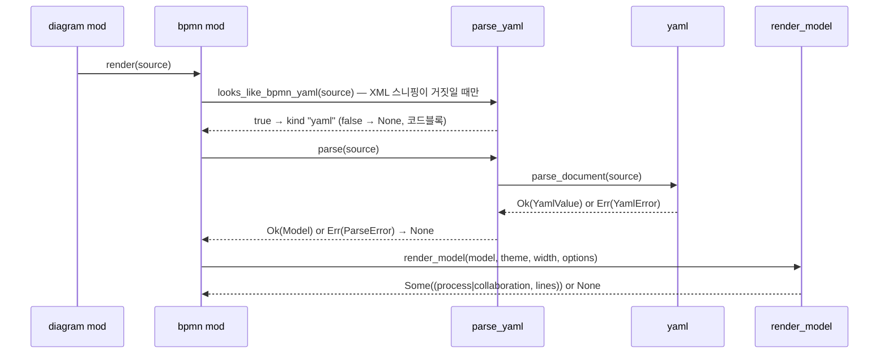

# Design — bpmn-yaml

## 정의
손으로 쓰는 BPMN 코드펜스를 XML보다 짧게 만들기 위해, YAML 블록 스타일 하위집합을 새 크레이트 없이 읽는 줄
기반 리더·트리 빌더(`bpmn::yaml`)와 그 트리를 `bpmn-xml`이 검증한 `bpmn::Model`로 옮기는 스키마 빌더
(`bpmn::parse_yaml`)를 만들고, `bpmn::kind_of`/`bpmn::render`에 갈래 `"yaml"`을 더하는 두 번째 BPMN 입력 문법
계층이다. XML과 같은 2단 구조(문법 ↔ 의미)를 그대로 따르고, `render_model` 이후 경로는 한 줄도 바꾸지 않는다.

## Boundary Commitments

### In-Scope (This Spec Owns)
- **YAML 표면 문법**: `bpmn::yaml::{YamlValue, YamlError, UnsupportedFeature, MAX_DEPTH, parse_document}` — 블록
  매핑·블록 시퀀스·평문/홑/겹따옴표 스칼라·주석·임의 폭 들여쓰기·빈 값·선두 `---`·거부 목록·깊이 상한. BPMN
  이름은 하나도 모른다
- **스키마 → 모델**: `bpmn::parse_yaml::{ParseError, TOP_LEVEL_KEYS, looks_like_bpmn_yaml, parse}` — 최상위 키,
  참여자·레인 중첩 → 소속, 노드 두 표기, 종류·트리거 토큰, 경계 부착, `default`, 흐름 한 줄 표기 → `FlowKind`,
  합성 id. 어휘는 `bpmn::vocabulary`만 호출
- **공유 이음새(SSoT)**: `bpmn::vocabulary::element_kind_from_xml_name`(노드 종류 표 승격, `parse_xml`도 이것을
  쓰도록 동작 불변 리팩터), `mermaid::flow::{Link, read_link}`의 `pub(crate)` 승격(가시성만)
- **배선**: `bpmn::kind_of → Some("yaml")` 갈래, `bpmn::render`의 `"yaml"` 팔, 테스트 전용 YAML fixture 파일
- **회귀·동일성·외부 검증 테스트**: mermaid·PlantUML·XML fixture 바이트 동일, YAML fixture ≡ XML fixture 렌더링,
  PyYAML 유효성 확인

### Out-of-Scope
- **완전한 YAML**: 앵커/별칭·태그·다중 문서·흐름 컬렉션·블록 스칼라·복합 키·여러 줄 평문 스칼라·암묵 타입 변환
  — 거부(`Unsupported`/`BadIndentation`) 또는 문자열 유지(사용자 결정 2026-09-25)
- **`bpmn::{model, vocabulary(기존 세 표), validate, lower}`·`render_model`·`ir`·`layout`·`diagram::mod` 코드**:
  변경 없음(`diagram::mod`는 테스트만 추가). 새 검증 규칙 없음
- **`bpmn::xml`·`bpmn::parse_xml`의 동작**: `element_kind_of`가 승격된 표를 부르는 것 외 변경 없음, 결과 동일
- **`mermaid::flow`의 동작**: `read_link` 의미 변경 없음 — 새 화살 꼴이 필요해도 여기서 추가하지 않고 오류
- **판별 확장자**: `.yaml`·`.yml` → `language_of_path` 변경 없음(1.5)
- **어휘 별칭·노드 안 흐름·흐름 사슬·흐름 id·펼친 서브프로세스·조건식·진단 UI**: 미지원(오류 또는 범위 밖)
- **`examples/` 문서**: 추가하지 않음 — fixture는 `src/diagram/bpmn/fixtures/*.yaml`(`include_str!`, `#[cfg(test)]`)
- **`bizprocess-bpmn`**: 갈래 `"bizprocess"`는 후속 스펙이 더한다. 이 스펙은 `## L1 …` 본문에 `Some("yaml")`을
  돌려주지 않을 책임만

### Allowed Dependencies
- 외부: 없음(신규 크레이트 없음, `Cargo.toml` 의존성 4개 그대로, Rust 2024 edition). PyYAML(`python3`)은 수용
  단계의 수동 확인 도구이며 빌드·테스트 의존성이 아니다
- 내부 의존 방향: `bpmn::yaml`(표준 라이브러리만) ← `bpmn::parse_yaml`(`yaml`·`model`·`vocabulary`·
  `mermaid::flow::{Link, read_link}`·`ir::{LineKind, Marker}` 사용) ← `bpmn::mod`(`parse_xml`·`parse_yaml`·
  `render_model`) ← `diagram::mod`. `yaml`이 `model`·`vocabulary`·`mermaid`를 import하거나 BPMN 로컬 이름·스키마
  키 리터럴을 가지면 설계 위반; `parse_yaml`이 `validate`·`lower`·`layout`·`parse_xml`·`xml`을 부르면 위반;
  `mermaid::*`가 `bpmn`을 알면 위반; `model`·`vocabulary`·`validate`·`lower`가 `yaml`·`parse_yaml`을 알면 위반

### Revalidation Triggers
- `mermaid::flow::read_link`의 화살 해석(몸통·머리·꼬리·라벨 두 형태)이 바뀌면 흐름 표(§Key Decisions) 재검토
- `vocabulary`에 짧은 별칭 열이 들어오면 `UnknownKind`/`UnknownTrigger` 규칙과 4.8 재검토(별칭은 표에만, 파서에
  두지 않음)
- `validate`가 레인 끝 메시지 흐름을 받아들이게 바뀌면 5.9의 레인 끝 예시 재검토
- `Model`에 `parent`(펼친 서브프로세스)·`groups`가 들어오면 노드 매핑에 `nodes:` 중첩 허용 여부 결정
- `plantuml::kind_of`가 포괄 판별을 버리거나 `language_of_source` 순서가 바뀌면 1.4·1.6 재검토
- 스키마 최상위 키가 늘면 `TOP_LEVEL_KEYS`(스니핑 SSoT)만 갱신

## Architecture

### Boundary Map


### Technology Stack
| Layer | Choice | Role |
|-------|--------|------|
| 리더·스키마 빌더·배선 | Rust 1.96, 표준 라이브러리만 | 줄 렉싱, 트리, 모델 채우기 |
| 외부 유효성 확인(수용 단계만) | `python3` + PyYAML 6.0.3 `yaml.BaseLoader` | 긍정 fixture가 유효한 YAML임을 기계 검증(7.5) |

### Key Decisions
- **두 단계(문법 → 의미)**: `yaml`은 트리만, `parse_yaml`이 스키마를 안다 — 이유: `bpmn-xml`과 동형, 각각 독립
  테스트. 대안 비교는 research.md
- **스니핑 = 열 0 내용 줄이 전부 `TOP_LEVEL_KEYS`의 `키:` 줄 + 구조 키(`participants`·`nodes`·`flows`) 하나 이상**
  (1.1, 1.3, 1.4): 주석·빈 줄·선두 `---`는 건너뜀, 문서 파싱 없음 — 이유: 최상위가 닫힌 집합이라 가장 엄격한
  규칙이 공짜. `kind_of`는 XML 스니핑 먼저, 그다음 YAML(1.2)
- **구조도 어휘도 엄격**(2.8~2.10, 3.9, 4.3, 4.5~4.9, 5.6~5.8): 문법 오류·모르는 키·모르는 토큰·세 꼴 밖 화살 전부
  `Err` → 코드블록. 스칼라 본문(이름)만 무검사 — 이유: 사람이 쓰는 문법에서 오타를 조용히 넘기면 틀린 그림이
  맞아 보인다. **사람이 확인할 결정(tasks 게이트)**
- **소속은 중첩에서 파생**(3.1~3.5): 참여자 직속 `nodes:` → 참여자 id, 레인 안 → 그 레인 id, 최상위 `nodes:` →
  `None`; 경계 이벤트는 호스트의 `container`(4.6) — 이유: XML도 `flowNodeRef`에서 파생, 소속 오타 구조적 차단
- **압축형은 종류 + 이름만**(4.1, 4.2): 스칼라 값을 첫 공백에서 나눠 앞 = 종류 토큰, 뒤(trim) = 이름. 확장형은
  매핑(`kind` 필수, `name`·`trigger`·`attached_to`·`default` 선택)(4.3) — 이유: 두 표기의 경계가 한 줄 규칙
- **종류·트리거 토큰 = BPMN XML 로컬 이름 정확 일치**(4.4, 4.5, 4.8): `vocabulary::element_kind_from_xml_name`·
  `EventTrigger::from_xml_name` — 이유: 두 파서가 같은 표. 노드 종류 표는 `parse_xml`의 `match`에서 `vocabulary`로
  승격하고 `parse_xml`은 동작 불변(7.2)
- **`trigger`는 이벤트에만, `attached_to`는 `boundaryEvent`에만·필수**(4.5, 4.6): 그 외 조합은 `FieldNotAllowed`/
  `MissingKey` — 이유: XML 스키마의 제약과 같음
- **`default: <대상 노드 id>`**(4.7): 그 노드 → 대상 시퀀스 흐름의 `is_default = true`, 없으면 `DefaultFlowMissing`
  — 이유: 흐름에 id가 없고, 같은 두 끝의 시퀀스 흐름 둘은 BPMN상 무의미
- **흐름 항목 = `id 공백 화살 공백 id`, 화살은 `read_link` 그대로**(5.1~5.8): 첫 공백 토큰 → `read_link` → 다음
  공백 토큰 → 남은 글 있으면 `MalformedFlow`. 라벨은 `read_link`가 준 것(`mermaid::text::label` 정리 포함) — 이유:
  SSoT, 라벨 두 형태 공짜. 가시성 승격은 이 스펙 안(research.md)
- **`Link` → `FlowKind` 표**(5.1~5.6):

| `kind` | `head` | `tail` | 끝 종류 | `FlowKind` | 요구사항 |
|---|---|---|---|---|---|
| `Solid` | `Arrow` | `None` | — | `Sequence { is_default: false }` | 5.1, 5.2 |
| `Dashed` | `Arrow` | `None` | 양끝이 `DataObject`·`DataStore` 아님 | `Message` | 5.3, 5.10 |
| `Dashed` | `Arrow` | `None` | 한쪽이 `DataObject`·`DataStore` 노드 | `DataAssociation` | 5.4 |
| `Dashed` | `None` | `None` | — | `Association` | 5.5 |
| 그 외(`Heavy`, `Cross`/`Circle`, 꼬리 있음) | | | | `UnsupportedFlow` | 5.6 |

- **미리 거르는 흐름 없음, 합성 id `@bpmn-yaml:{n}`**(5.8~5.10): YAML에는 "노드 아닌 id" 항목이 없다 — 레인 끝은
  `validate`가 거부, 참여자 끝은 `Model`이 받아들임
- **`orientation` 정확 일치, 명령줄이 덮음**(3.7, 3.8): `horizontal`/`vertical` → `Orientation`, 그 외
  `UnknownOrientation`; 덮어쓰기는 기존 `apply_to_graph`
- **암묵 타입 변환 없음**(2.5): 모든 스칼라는 `String`, 빈 값은 `""` — 이유: `Model`은 문자열만 필요, `007`이 7이
  되면 id가 깨진다. 외부 검증은 같은 규약의 `yaml.BaseLoader`로
- **주석 = 줄 시작 또는 공백 뒤의 `#`, 따옴표 밖**(2.3, 2.4): YAML §6.6 그대로(`a#b`는 스칼라)
- **긍정 fixture는 파일**(7.4, 7.5): `src/diagram/bpmn/fixtures/*.yaml`을 `include_str!`로 테스트에 넣고 같은
  바이트를 PyYAML이 읽는다 — 이유: 문자열 리터럴은 외부 도구가 못 읽음. `examples/`에는 두지 않음

## System Flows

- `Err`는 어디서 나든 `None` → 원문 코드블록(2.8~2.10, 3.9, 4.x 오류, 5.6~5.9, 6.1~6.3). 노드 없는 모델
  (`participants:`만 있고 `nodes:` 없음)은 `render_model`이 `None`

## Components and Interfaces

### bpmn::yaml — 줄 기반 리더·트리 빌더 (신규)
- Intent: BPMN 문서에 충분한 YAML 블록 스타일 하위집합을 값 트리로. 스키마·BPMN 이름 없음
- Requirements: 2.1~2.10, 6.1, 6.2
```rust
#[derive(Clone, Debug, PartialEq, Eq)]
pub enum YamlValue {
    Scalar(String),
    Seq(Vec<YamlValue>),
    /// 선언 순서 보존. 같은 매핑의 키 중복은 오류.
    Map(Vec<(String, YamlValue)>),
}
impl YamlValue {
    pub fn get(&self, key: &str) -> Option<&YamlValue>;    // Map이 아니면 None
    pub fn as_scalar(&self) -> Option<&str>;
    pub fn as_seq(&self) -> Option<&[YamlValue]>;
    pub fn as_map(&self) -> Option<&[(String, YamlValue)]>;
}
#[derive(Clone, Copy, Debug, PartialEq, Eq)]
pub enum UnsupportedFeature { Anchor, Alias, Tag, FlowCollection, BlockScalar, ComplexKey, MultipleDocuments }
/// `line`은 1부터 세는 원문 줄 번호.
#[derive(Clone, Debug, PartialEq, Eq)]
pub enum YamlError {
    Empty,                                   // 내용 줄이 없음(빈 문자열·공백·주석만·`---`만)
    TabIndentation { line: usize },
    BadIndentation { line: usize },          // 열린 어떤 수준과도 맞지 않는 들여쓰기, 여러 줄 평문 스칼라
    MalformedLine { line: usize },           // `키:`도 `- `도 아닌 줄, 닫는 따옴표 뒤 남은 글
    MixedCollection { line: usize },         // 같은 수준에 `- 항목`과 `키: 값` 혼재
    UnterminatedQuote { line: usize },
    DuplicateKey { line: usize, key: String },
    Unsupported { line: usize, feature: UnsupportedFeature },
    TooDeep { line: usize },
}
impl std::fmt::Display for YamlError {}
pub const MAX_DEPTH: usize = 64;
/// 문서 → 값 트리. 첫 내용 줄의 `---`는 무시, 그 밖의 `---`/`...`는 MultipleDocuments.
pub fn parse_document(source: &str) -> Result<YamlValue, YamlError>;
```
- 계약: 줄 단위 — 따옴표 밖의 `#`(줄 시작 또는 공백 뒤)부터 주석 제거, 줄 끝 공백 제거, 빈 줄 건너뜀(2.3).
  들여쓰기 = 선두 공백 수, 선두에 탭이 있으면 `TabIndentation`(2.9). `- ` 또는 줄 끝 `-` → 시퀀스 항목, 항목 뒤
  내용은 그 열에서 시작하는 새 노드(`- 키: 값`은 `키` 열의 매핑, 이어지는 같은 열 `키:` 줄이 그 매핑을 늘림);
  `키: 값`/`키:` → 매핑 항목(2.1). 값이 없고 다음 내용 줄이 더 깊으면 그 블록이 값, 아니면 `Scalar("")`(2.6).
  스칼라: 평문은 trim, 홑따옴표는 `''` → `'`, 겹따옴표는 `\"`·`\\`·`\n`·`\t`만 해석하고 그 외 `\x`는 원문 유지;
  타입 변환 없음(2.2, 2.4, 2.5). 평문이 `&`·`*`·`!`·`[`·`{`·`|`·`>`·`? `로 시작하면 해당 `Unsupported`(2.8).
  깊이 > 64 → `TooDeep`(2.10). 열린 수준으로 돌아가지 않는 내어쓰기·매핑 값 다음 줄의 더 깊은 평문 →
  `BadIndentation`. 트리 생성은 명시적 스택(재귀 없음). `source.lines()`·`char_indices` 슬라이스만 사용

### bpmn::vocabulary — 노드 종류 표 승격 (기존 파일 확장)
- Intent: 로컬 이름 → `ElementKind`를 두 파서가 같이 보는 한 표로
- Requirements: 4.4, 7.2
```rust
/// 로컬 요소명 → 종류. 이벤트는 `trigger: None`으로 돌려주고 호출자가 채운다.
/// `boundaryEvent`는 `Intermediate`. 태스크·게이트웨이는 기존 `TaskKind`/`GatewayKind` 표를 거친다.
pub fn element_kind_from_xml_name(token: &str) -> Option<ElementKind>;
// ELEMENT_KIND_TABLE: startEvent · intermediateCatchEvent · intermediateThrowEvent · boundaryEvent · endEvent ·
//   subProcess · adHocSubProcess · transaction · callActivity · dataObjectReference · dataStoreReference · textAnnotation
```
- 계약: 대소문자 그대로 정확 일치만. `parse_xml::element_kind_of(local_name, elem)`는 이 함수의 결과에
  `event_trigger_of(elem)`만 얹는다 — 기존 `parse_xml` 테스트 무수정, XML fixture 출력 바이트 동일(7.2)

### mermaid::flow — `Link`·`read_link` 가시성 (기존 파일 수정, 가시성만)
- Intent: 화살 읽기 규칙의 단일 출처를 `bpmn::parse_yaml`이 재사용
- Requirements: 5.1~5.6, 7.7
```rust
pub(crate) struct Link { pub(crate) label: String, pub(crate) kind: LineKind, pub(crate) head: Marker, pub(crate) tail: Marker }
pub(crate) fn read_link(chars: &[char], cursor: &mut usize) -> Option<Link>;
```
- 계약: 시그니처·본문·mermaid 테스트 변경 없음. 별도 리팩터 스펙을 두지 않는 판단은 research.md

### bpmn::parse_yaml — 스키마 트리 → Model (신규)
- Intent: `YamlValue`를 스키마대로 걸어 `vocabulary` 토큰으로 `Model`을 채운다. 검증은 안 한다
- Requirements: 1.1, 1.3, 3.1~3.9, 4.1~4.10, 5.1~5.10, 7.4
```rust
#[derive(Clone, Debug, PartialEq, Eq)]
pub enum ParseError {
    Yaml(YamlError),
    /// 값의 모양이 스키마와 다름. path는 `participants[1].lanes[0].nodes[2]` 꼴, expected는 "매핑"·"시퀀스"·"스칼라"·"단일 키 매핑"·"문자열 항목".
    UnexpectedShape { path: String, expected: &'static str },
    UnknownKey { path: String, key: String },
    MissingKey { path: String, key: &'static str },            // 확장형의 kind, boundaryEvent의 attached_to
    FieldNotAllowed { path: String, key: &'static str },       // 이벤트 아닌 노드의 trigger, boundaryEvent 아닌 노드의 attached_to
    UnknownKind { path: String, token: String },
    UnknownTrigger { path: String, token: String },
    UnknownOrientation(String),
    DefaultFlowMissing { node: String, target: String },
    MalformedFlow(String),                                     // 항목 원문: 화살 없음·공백 없음·남는 글
    UnsupportedFlow(String),                                   // 세 꼴 밖 화살
}
impl std::fmt::Display for ParseError {}
/// 스니핑·최상위 검사의 단일 출처.
pub const TOP_LEVEL_KEYS: &[&str] = &["title", "orientation", "participants", "nodes", "flows"];
/// 열 0 내용 줄(주석·빈 줄·선두 `---` 제외)이 전부 TOP_LEVEL_KEYS의 `키:` 줄이고 participants·nodes·flows 중 하나 이상이 있으면 참. 문서를 파싱하지 않는다.
pub fn looks_like_bpmn_yaml(source: &str) -> bool;
/// 문서 → 검증 전 Model.
pub fn parse(source: &str) -> Result<Model, ParseError>;
```
- 빌드 순서:
  1. 루트는 `Map`, 키 ⊂ `TOP_LEVEL_KEYS`(아니면 `UnknownKey`/`UnexpectedShape`)(3.9)
  2. `title` 스칼라 trim(3.6); `orientation` → `Orientation`(3.7)
  3. `participants` 시퀀스 → 항목마다 단일 키 매핑(키 = id, 아니면 `UnexpectedShape "단일 키 매핑"`)(4.9): 값이
     스칼라면 `Participant { id, name: 값, lanes: [] }`(3.2); 매핑이면 키 ⊂ {`name`, `lanes`, `nodes`}, `lanes` 시퀀스
     → `Lane { id, name, sub_lanes }` 재귀(같은 모양, 키 ⊂ {`name`, `lanes`, `nodes`})(3.3), `nodes` → 소속 = 그
     참여자 id 또는 그 레인 id(3.1, 3.4)
  4. 최상위 `nodes` → 소속 `None`(3.5)
  5. 노드 항목(단일 키 매핑, 키 = id): 스칼라 값 → 첫 공백 전 = 종류 토큰, 뒤 trim = 이름(4.1, 4.2); 매핑 값 → 키 ⊂
     {`kind`, `name`, `trigger`, `attached_to`, `default`}, `kind` 없으면 `MissingKey`(4.3). 종류 =
     `element_kind_from_xml_name`(없으면 `UnknownKind`)(4.4, 4.8); `trigger`는 `Event`에만
     (`EventTrigger::from_xml_name`, 없으면 `UnknownTrigger`)(4.5); `attached_to`는 토큰 `boundaryEvent`에만 허용·
     필수(4.6); `default` → (노드 id, 대상 id) 수집(4.7). 전부 만든 뒤 경계 이벤트 `container` := 호스트 `container`
  6. `flows` 시퀀스 → 항목은 스칼라(아니면 `UnexpectedShape "문자열 항목"`)(5.8): 첫 공백 토큰 = source,
     `read_link`(없으면 `MalformedFlow`), 다음 공백 토큰 = target, 남은 글 → `MalformedFlow`(5.7); `Link` → §Key
     Decisions 표(5.1~5.6); id `@bpmn-yaml:{n}`
  7. `default` 쌍마다 첫 `Sequence` 흐름(source = 노드, target = 대상)의 `is_default = true`, 없으면
     `DefaultFlowMissing`(4.7)
  8. `Model { title, orientation, participants, elements, flows }` — 흐름 미리 거르기 없음(5.9, 5.10)

### bpmn::mod — 갈래 배선 (기존 파일 수정)
- Intent: `"yaml"` 갈래 추가, YAML fixture 노출
- Requirements: 1.1, 1.2, 1.3, 3.1, 3.5, 6.3, 6.5, 7.4
```rust
pub fn kind_of(source: &str) -> Option<&'static str>;
// if parse_xml::looks_like_bpmn(source) { Some("xml") } else if parse_yaml::looks_like_bpmn_yaml(source) { Some("yaml") } else { None }
pub fn render(source: &str, theme: &Theme, width: usize, options: DiagramOptions) -> Option<(&'static str, Vec<Line>)>;
// match kind_of(source)? { "xml" => parse_xml::parse(source).ok()?, "yaml" => parse_yaml::parse(source).ok()?, _ => return None }
pub mod parse_yaml; pub mod yaml;
#[cfg(test)] pub(crate) mod fixtures {
    pub const ORDER_PROCESSING_YAML: &str = include_str!("fixtures/order_processing.yaml");   // 7.4 — XML fixture와 같은 노드·흐름 순서
    // 긍정 fixture 파일 전부(2.1 폭 2/4/혼합, 2.2·2.4·2.5 따옴표·타입, 3.3~3.5 구조)를 같은 방식으로 상수화
}
```
- 계약: 캡션 종류는 `render_model`의 `"process"`/`"collaboration"`. XML 스니핑이 먼저이므로 XML 문서의 결과 불변(1.2)

### diagram::mod · markdown::mod — 테스트만 (기존 파일, 코드 변경 없음)
- Intent: 판별·강건성·펜스 폴백을 YAML 입력으로 못박기
- Requirements: 1.4, 1.5, 1.6, 6.1~6.5, 7.1
- `language_of_source(None, YAML fixture) == Some(Bpmn)`(1.4), `language_of_path("x.yaml") == None`(1.5),
  `robustness` BPMN 두 배열에 YAML 항목 추가(6.1~6.4), `markdown` 테스트에 YAML 펜스 성공·실패 두 경우(6.5)

## Data Models
`YamlValue`·`Link`(위 인터페이스)가 전부. `YamlValue` 불변식: `Map` 키 고유·선언 순서, 트리 깊이 ≤ 64, 스칼라는 항상
문자열. `Model` 쪽 불변식은 `bpmn-model/design.md`(검증이 보장, 파서는 채우기만) — 이 스펙이 더하는 관례: 합성
id `@bpmn-yaml:{n}`, 경계 이벤트 `container == 호스트.container`, 노드 `container` = 품은 컨테이너의 id

## Error Handling
- **사용자 입력 오류**: YAML 문법 오류 → `YamlError` → `ParseError::Yaml` → `render` `None` → 코드블록(2.8~2.10);
  스키마 오류 → `ParseError` → `None`(3.9, 4.3~4.9, 5.6~5.8); BPMN 아님 → `kind_of` `None`(1.3); 노드 없음 →
  `render_model` `None`; 구조 규칙 위반 → `validate` 거부 → `None`(4.10, 5.9). 두 오류 타입은 `Display`까지(진단 UI
  스펙 대비, 화면 노출 없음)
- **외부 자원 오류**: 해당 없음(입력은 메모리의 `&str`)
- **시스템 오류(패닉)**: 줄·문자 경계는 `lines()`·`char_indices`·`str` 슬라이스만; 재귀 없음 + 깊이 상한(2.10);
  `read_link`는 mermaid에서 이미 임의 입력에 패닉 없음이 확인됨; 폭 5종 × 모든 fixture·오류 입력 패닉 없음(6.4)
- **기능 강등**: 폭 초과는 기존 규약(반대 방향 → 라벨 축소 → `None`); 마크다운의 나머지는 영향 없음(6.5);
  명령줄 방향 옵션이 `orientation`을 덮음(3.8)

## Testing Strategy
- **Depth**: Complex — 새 문법(줄 리더 상태기계) + 스키마 매핑 규칙 + 언어 판별 통합 + 강건성 + 외부 도구 동일성.
  긍정 fixture는 `src/diagram/bpmn/fixtures/*.yaml`(`include_str!`), 부정 입력은 `#[cfg(test)]` 문자열 리터럴
- **Unit(L6, `yaml::tests`)**: 폭 2/4/혼합 fixture 세 개가 같은 트리(2.1); 평문·홑(`''`)·겹(`\"`·`\\`·`\n`) 스칼라
  디코딩, 그 외 `\x` 원문(2.2); 주석·주석 줄·빈 줄·줄 끝 공백 유무가 같은 트리, `a#b` 유지(2.3); 따옴표 안
  `#`·`:`·`-` 유지(2.4); `true`·`007`·`1.0`·`null`·`~` 문자열(2.5); 빈 값 → 블록 또는 `""`(2.6); 선두 `---` 무시(2.7);
  `&a`·`*a`·`!!str`·`[a]`·`{k: v}`·`|`·`>`·`? `·둘째 `---`·`...` → 해당 `Unsupported`(2.8); 탭·어긋난 내어쓰기·중복
  키·혼재·미종결 따옴표·`키:` 없는 줄 → 해당 변형(2.9); 깊이 65 → `TooDeep`, 64 → `Ok`(2.10); `- 키: 값` 뒤 같은 열
  `키:`가 같은 매핑, `-` 단독 + 다음 줄 블록; 빈·공백·주석만·`---`만 → `Empty`(6.2)
- **Unit(L6, `vocabulary::tests`)**: 표 12행 전부 + `task`·`userTask`·`exclusiveGateway` → 기대 `ElementKind`,
  `boundaryEvent` → `Intermediate`, `StartEvent`·`foo` → `None`(4.4)
- **Unit(L6, `parse_yaml::tests`)**: `looks_like_bpmn_yaml` — fixture·`nodes:`+`flows:`만·주석/`---` 선두 참;
  `process:\n  id: p1`·`title:`만·`## L1`·평문·빈 문자열·XML·`class A`·`flowchart LR` 거짓(1.1, 1.3); 참여자 2 +
  `nodes` → 순서·이름·소속(3.1); 스칼라 참여자 → 레인 없음·노드 없음(3.2); `lanes/lanes/nodes` → `sub_lanes`·소속
  = 안쪽 레인(3.3); 참여자의 `lanes`+`nodes` → 풀 직속(3.4); 최상위 `nodes` → 참여자 없음·소속 `None`(3.5); 제목
  있음/없음(3.6); `horizontal`/`vertical`/없음/`Horizontal` → 변형·`UnknownOrientation`(3.7); 스키마 밖 키 네 자리
  (최상위·참여자·레인·노드) → `UnknownKey`(3.9); 압축형 이름 있음/없음(4.1, 4.2); 확장형 전 필드·`kind` 없음(4.3);
  종류 표 전 행(4.4); 트리거 12종·비이벤트 `trigger` → `FieldNotAllowed`(4.5); `boundaryEvent` + `attached_to` →
  `attached_to`·`container` = 호스트(다른 레인에 적어도), 없으면 `MissingKey`, 비경계에 있으면
  `FieldNotAllowed`(4.6); `default` → 해당 흐름만 `is_default`, 대상 흐름 없음 → `DefaultFlowMissing`(4.7);
  `UserTask`·`user`·`message` → `UnknownKind`/`UnknownTrigger`(4.8); `- startEvent`·두 키 항목 →
  `UnexpectedShape`(4.9); `-->`·`-- 예 -->`·`-->|예|`·`-.->` 노드 끝·`-.->` 데이터 끝(양방향)·`-.-` → 표대로(5.1~5.5);
  `==>`·`<-->`·`o--o`·`--x`·`---` → `UnsupportedFlow`(5.6); 화살 없음·`a-->b`·`a --> b --> c`·`a --> b 뒤글` →
  `MalformedFlow`(5.7); 매핑 항목 → `UnexpectedShape`(5.8); 없는 id·레인 id·참여자 id 끝 → 그대로 유지(5.9, 5.10);
  합성 id 둘이 서로 다름
- **Integration(L5, `bpmn::tests` + `fixtures`, `render` + `Line::text`)**: YAML fixture → `Some(("collaboration", _))`,
  폭 100, `elements`·`flows` 수가 `parse_xml::parse(XML fixture)`와 같고 렌더링 텍스트가 XML fixture 렌더링과 줄 단위
  동일, 글자 10종 전부(7.4, 3.1, 4.6, 4.7, 5.3); `kind_of(XML fixture) == Some("xml")`·`kind_of(YAML fixture) ==
  Some("yaml")`·`kind_of("process:\n  id: p1\n") == None`(1.1~1.3, 기존 테스트 무수정); 최상위 `nodes`만 → `"process"`·
  참여자 없음(3.5); `orientation: vertical` → 풀 제목이 같은 줄, `DiagramOptions.direction`이 덮음(3.7, 3.8); 스키마
  오류 fixture(`nmae:`) → `None`(6.3); 참여자 있고 노드 없음 → `None`
- **Integration(L4, `diagram::mod`·`markdown` 테스트)**: `language_of_source(None, YAML fixture) == Some(Bpmn)`(1.4),
  `language_of_path("x.yaml")`·`("x.yml")` → `None`(1.5), 기존 robustness PlantUML·mermaid 배열 + `class A` +
  `title: 문서\n본문` 평문 → 이전과 같은 언어(1.6); `robustness` `bpmn_must_be_none`에 줄 중간·블록 중간 잘림·주석만·
  `---`만·앵커·탭·모르는 종류·`a-->b`·`==>`·`default` 대상 없음·레인 끝 흐름 추가, `bpmn_may_render`에 YAML
  fixture 전부 추가, 폭 5종(6.1~6.4); 마크다운의 YAML 펜스 성공(`◈ bpmn · collaboration`) + 실패(`╭─ bpmn `) 두 경우와
  앞뒤 문단 유지(6.5)
- **Acceptance(L1)**: `cargo test` 전량(기준선 434개 무수정 통과 + 신규) + `cargo clippy --all-targets -- -D warnings`
  + `examples/*.md` 수정 전후 `dg -P --width 100` `diff` 무차이(7.1) + XML fixture 렌더링 수정 전후 동일(7.2, 통합
  테스트로) + `Cargo.toml` 의존성 4개(7.3) + 스크래치 디렉터리의 Python 스크립트가 `yaml.BaseLoader`로
  `src/diagram/bpmn/fixtures/*.yaml` 전부를 오류 없이 읽고 `order_processing.yaml`의 최상위 키 순서·참여자 2·레인
  [0, 2]·노드 12·흐름 10을 단정(7.5) + `order_processing.yaml`을 스크래치 디렉터리에 복사해 `dg <파일>`·`cat <파일> |
  dg -d` 둘 다 `◈ bpmn · collaboration` 캡션(7.6, 1.4, 1.5) + mermaid 흐름도 테스트 무수정 통과(7.7) + `{text}` 육안 확인

## File Structure Plan
```
src/diagram/bpmn/yaml.rs                         # YamlValue · UnsupportedFeature · YamlError · MAX_DEPTH · parse_document · 단위 테스트 (신규)
src/diagram/bpmn/parse_yaml.rs                   # ParseError · TOP_LEVEL_KEYS · looks_like_bpmn_yaml · parse · 빌드 순서 · 단위 테스트 (신규)
src/diagram/bpmn/fixtures/order_processing.yaml  # 7.4 fixture — XML fixture와 같은 노드·흐름 순서 (신규, 테스트 전용)
src/diagram/bpmn/fixtures/*.yaml                 # 폭 2/4/혼합 · 따옴표/타입 · 구조 변형 긍정 fixture (신규, 테스트 전용)
src/diagram/bpmn/vocabulary.rs                   # element_kind_from_xml_name + ELEMENT_KIND_TABLE · 단위 테스트 (기존 파일 확장)
src/diagram/bpmn/parse_xml.rs                    # element_kind_of가 vocabulary 표를 호출(동작 불변) (기존 파일, 함수 하나 수정)
src/diagram/mermaid/flow.rs                      # Link · read_link pub(crate) 승격(가시성만) (기존 파일 수정)
src/diagram/bpmn/mod.rs                          # pub mod yaml/parse_yaml · kind_of "yaml" · render "yaml" 팔 · cfg(test) fixtures 상수 · 통합 테스트 (수정)
src/diagram/mod.rs                               # 판별·robustness 테스트 추가 (테스트만 수정)
src/markdown/mod.rs                              # bpmn YAML 펜스 성공·실패 테스트 (테스트만 수정)
```
