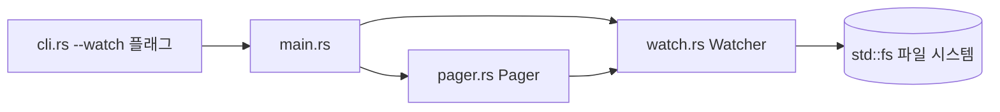
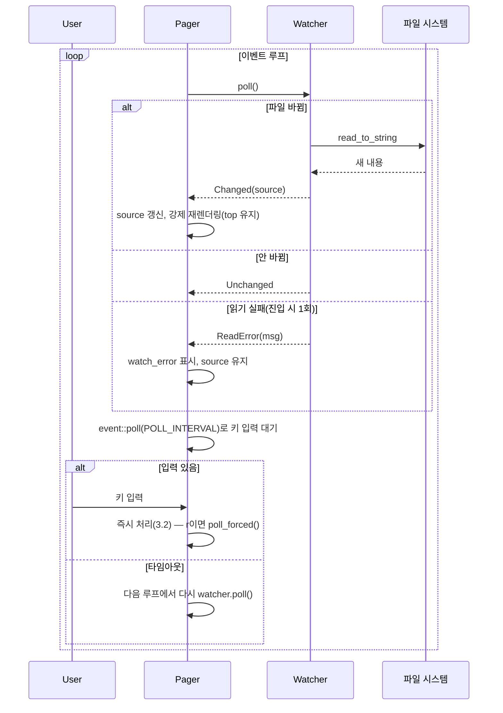

# Design — dg-watch-mode

## 정의
파일을 편집하며 dg로 미리보기를 확인하는 사용자를 위해, 파일 mtime을 폴링해 변경을 감지하고
페이저·print 모드 양쪽에서 자동으로 다시 렌더링하는 기능이다.

## Boundary Commitments

### In-Scope (This Spec Owns)
- **신규 모듈 `watch.rs`**: 파일 mtime 폴링 기반 변경 감지(`Watcher`, `PollResult`, `POLL_INTERVAL`)
- **CLI 플래그**: `--watch`/`-W`(`cli.rs`)
- **`main.rs`**: `--watch`+표준입력 조합의 조기 오류 처리, `render` 클로저를 소스 인자를 받는
  형태로 변경, print 모드 감시 루프
- **`pager.rs`**: `Pager`가 현재 소스 텍스트와 `Option<Watcher>`를 보유, 이벤트 루프에 타임아웃
  기반 폴링 추가, 상태 표시줄에 감시 상태 표시, `r` 키 수동 갱신

### Out-of-Scope
- **OS 파일시스템 이벤트 기반 감지**(inotify/FSEvents/`notify` 크레이트): 신규 의존성이라 배제,
  폴링만 사용
- **표준입력 감시·여러 파일 동시 감시**: 요구사항 범위 밖
- **print 모드에서 화면 지우기(clear)**: `-P`는 파이프·리다이렉트로도 쓰이므로(README) 임의로
  ANSI clear를 넣지 않고, 변경마다 이어서 출력만 한다
- **다이어그램 언어(`diagram_language`) 재판별**: 최초 판별을 그대로 쓴다(파일 확장자·내용 기반
  판별이 감시 중 바뀔 일은 없다고 가정)

### Allowed Dependencies
- 외부: 없음(신규 크레이트 없음, `std::fs`/`std::time`/`std::thread`만 사용)
- 내부 의존 방향: `watch` → `pager`/`main`(bin). `watch.rs`는 `pager.rs`와 같은 `#[cfg(feature =
  "cli")]` 게이트 뒤 lib 모듈로 둔다(라이브러리로만 쓸 때는 clap·crossterm과 함께 빠짐, README의
  기존 계약 유지)

### Revalidation Triggers
- `Cargo.toml`의 `cli` feature 구성(`pager` 모듈 게이팅 방식)이 바뀌면 `watch.rs` 위치 재검토
- 요구사항의 "1초 이내" 반영 기준이 바뀌면 `POLL_INTERVAL` 재조정
- `Pager`의 `render` 클로저 시그니처를 건드리는 다른 스펙이 생기면 이 설계의 인자화 결정과 충돌
  여부 확인

## Architecture

### Boundary Map


### Technology Stack
| Layer | Choice | Role |
|-------|--------|------|
| 변경 감지 | `std::fs::metadata().modified()` 폴링 | mtime 비교로 변경 여부 판단, 신규 의존성 없음 |
| 대기 | 페이저: `crossterm::event::poll(timeout)` / print: `std::thread::sleep` | 감시 중에도 키 입력에 즉시 반응하면서 주기적으로 파일을 확인 |

### Key Decisions
- **파일 변경 감지는 mtime 폴링만 쓴다** — 이유: `notify` 등 OS 이벤트 크레이트는 "의존성 4개,
  단일 바이너리 ~1.2MB" 원칙과 충돌한다. 폴링 주기 300ms면 요구사항 2.1(1초 이내)을 넉넉히
  만족한다. 대안 비교는 research.md.
- **오류는 상태 전이 시 1회만 보고한다** — 이유: 파일이 계속 없는 동안 매 tick 오류를 쏟아내면
  print 모드 stderr가 스팸이 되고 페이저 상태줄도 계속 다시 그려진다. `Watcher`가 내부 오류
  플래그로 전이를 추적해 진입 시 1회만 `ReadError`를 돌려주고, 회복 시 다시 `Changed`를 돌려준다.
- **`render` 클로저가 `source: &str`를 인자로 받도록 바꾼다**(기존엔 캡처) — 이유: 감시 모드에서
  최신 내용을 반영하려면 소스가 가변이어야 하는데, 인자로 넘기면 소스를 소유·갱신하는 지점이
  `Pager::source`(페이저) 또는 print 루프의 지역 변수(단일 지점) 하나로 좁혀진다. 대안(공유
  셀)은 research.md.
- **감시 폴링 주기 상수(`watch::POLL_INTERVAL`)를 페이저·print 양쪽이 공유한다** — SSoT, 두 곳에
  매직 넘버를 복제하지 않는다.
- **같은 스레드에서 폴링한다**(백그라운드 스레드+채널 대신) — 이유: 페이저는 이미
  `crossterm::event::poll(timeout)`로 타임아웃 대기가 가능해 감시 폴링과 자연스럽게 한 루프에
  들어간다. print 모드도 단순 sleep 루프면 충분해 스레드 동기화 비용이 불필요하다.

## System Flows


- 스크롤 위치(`top`)는 `Changed` 처리에서 건드리지 않고, 문서가 짧아졌을 때만 기존 `clamp()`가
  줄인다 — 3.1의 "유지되지 않으면 끝으로 조정" 계약과 동일한 기존 로직 재사용.
- `r` 키(3.5)는 `handle_key` 안에서 `watcher.poll_forced()`를 직접 호출해 이 루프를 기다리지
  않고 즉시 적용한다.

## Components and Interfaces

### watch — Watcher
- Intent: 파일 경로 하나를 mtime으로 폴링해 변경·오류·무변화를 판정
- Requirements: 2.1, 2.2, 2.3, 5.1, 5.2, 5.3
```rust
pub const POLL_INTERVAL: std::time::Duration; // 300ms

pub struct Watcher { /* private: path, last_modified, in_error */ }

pub enum PollResult {
    /// 변화 없음, 또는 이미 알린 오류가 계속되는 중(재보고 억제)
    Unchanged,
    /// 파일이 바뀌어 다시 읽었다
    Changed(String),
    /// 읽기 실패 상태로 막 들어갔다(전이 1회만)
    ReadError(String),
}

impl Watcher {
    /// `path`의 현재 mtime을 기준선으로 감시를 시작한다. 시작 시점에 메타데이터를 못 읽어도
    /// 패닉하지 않는다(다음 poll에서 오류로 보고됨).
    pub fn new(path: impl Into<std::path::PathBuf>) -> Watcher;
    /// mtime이 바뀌었을 때만 다시 읽는다.
    pub fn poll(&mut self) -> PollResult;
    /// mtime과 무관하게 즉시 다시 읽는다(수동 갱신, 3.5). 오류 보고 규칙은 `poll`과 동일.
    pub fn poll_forced(&mut self) -> PollResult;
}
```
- 계약: `Changed`/`ReadError`는 상태가 실제로 바뀔 때만 나온다 — 호출자는 `Unchanged`를 "이번
  틱은 할 일 없음"으로 취급해 화면을 다시 그리지 않으면 2.2가 자연히 충족된다.

### pager — Pager (기존 컴포넌트 확장)
- Intent: 현재 소스와 감시 상태를 보유하며, 감시 중이면 폴링·즉시 키 반응·수동 갱신·상태 표시를
  더한다
- Requirements: 1.2, 3.1, 3.2, 3.3, 3.4, 3.5, 5.1, 5.2, 6.1
```rust
// F의 시그니처가 바뀐다: Fn(usize, usize) -> Document → Fn(&str, usize, usize) -> Document
pub fn new<F: Fn(&str, usize, usize) -> Document>(
    title: &str,
    theme: &Theme,
    max_width: usize,
    source: String,
    render: F,
    watcher: Option<watch::Watcher>,
) -> Pager<'_, F>;
```
- 계약: `watcher`가 `None`이면 이벤트 대기는 기존과 동일한 블로킹 `event::read()`를 그대로 쓴다
  (6.1 — 비감시 경로는 코드 경로 자체가 그대로라 회귀 없음). `watcher`가 `Some`이면 루프마다
  `watcher.poll()`을 먼저 확인해 `Changed`면 `source`를 갱신하고 폭 비교와 무관하게 재렌더링을
  강제하며(`top`은 건드리지 않음, 3.1), `ReadError`면 `watch_error: Option<String>`에 메시지를
  저장해 상태 표시줄에 반영(5.1)한다. 이후 `event::poll(watch::POLL_INTERVAL)`로 대기해 타임아웃
  안에도 키 입력엔 즉시 반응한다(3.2). `handle_key`에 `KeyCode::Char('r')` 분기를 추가해
  `watcher.poll_forced()`를 즉시 적용한다(3.5). 상태 표시줄은 `watcher.is_some()`일 때
  `watch_error`가 없으면 "감시 중", 있으면 "감시 불가: {msg}"를 덧붙인다(3.4, 5.1).

### main (bin) — 실행 진입점 (기존 컴포넌트 확장)
- Intent: `--watch` 플래그를 읽어 대상 파일을 검증하고, 페이저에는 `Watcher`를 건네고 print
  모드에는 자체 감시 루프를 돈다
- Requirements: 1.1, 1.2, 1.3, 4.1, 4.2, 6.1
- 계약: `cli.watch`가 켜져 있는데 파일 경로가 없거나 `-`(표준입력)이면, `read_input`을 호출하기
  전에 오류를 돌려주고 종료한다(1.3 — 표준입력을 읽으려 시도하지 않음). `render` 클로저는
  `source: &str`를 받도록 바뀌어 캡처된 고정 문자열 대신 매 호출 시점의 소스를 그린다. 페이저
  경로는 `Pager::new`에 초기 소스와 `Some(Watcher::new(path))`(비감시 시 `None`)를 넘긴다. print
  경로는 `cli.watch`가 꺼져 있으면 기존과 동일한 단일 렌더링(1.1, 6.1)을, 켜져 있으면
  `watch::POLL_INTERVAL` 간격으로 `Watcher::poll()`을 반복해 `Changed`마다 다시 출력하고
  `ReadError`는 stderr에 한 번만 남긴다(4.1). 종료는 `Ctrl-C`(기본 SIGINT 종료, 별도 처리 없음,
  4.2)로만 한다.

## Data Models
신규 영속 상태 없음. `Watcher`의 `last_modified: Option<SystemTime>`·`in_error: bool`은 프로세스
생존 동안만 유지되는 내부 상태이고, 파일 내용 자체(`String`)는 기존 `Document` 렌더링 파이프라인이
쓰는 형태를 그대로 따른다 — 위 인터페이스 명세로 충분하다.

## Error Handling
- **사용자 입력 오류**: `--watch` + 표준입력(1.3) → `read_input` 호출 전 조기 반환, 표준입력을
  건드리지 않음
- **외부 자원 오류**(파일 삭제·읽기 실패): `Watcher::poll`/`poll_forced`가 `Result`를 전부 매치해
  `ReadError(String)`로 감싼다 — 호출자는 마지막 성공 콘텐츠를 계속 보여주며 패닉하지 않는다
  (5.1, 5.3)
- **시스템 오류(패닉)**: `fs::metadata`/`fs::read_to_string`에 `unwrap`/`expect` 금지, 전부
  `match`/`?`로 처리(5.3)
- **기능 강등**: 감시가 계속 실패해도(경로가 영구히 사라짐 등) 마지막 렌더링을 유지한 채 종료하지
  않음 — 사용자가 직접 `q`(페이저)/`Ctrl-C`(print)로 끝낼 때까지 유지(5.1)

## Testing Strategy
- **Depth**: Standard — 신규 폴링 상태기계 + 기존 두 진입 경로(페이저·print) 수정. 외부 서비스
  통합은 없지만 실제 파일시스템 타이밍이 섞여 있어 Trivial은 아니다.
- **Unit(L6)**: `watch::Watcher`를 임시 파일로 직접 테스트 — 최초 상태, 변경 후 `Changed`, 미변경
  `Unchanged`, 파일 삭제 후 `ReadError`(1회만) → 이어지는 폴은 `Unchanged`, 파일 복구 후 다시
  `Changed`, `poll_forced`가 mtime과 무관하게 항상 다시 읽음 (2.1, 2.2, 5.1, 5.2, 5.3)
- **Integration(L4~L5)**: 기존 `pager.rs` 테스트 패턴(필드 직접 설정)으로 `Pager`에 `Watcher`
  대신 테스트용 `PollResult` 시퀀스를 주입해 `source`/`document`/`watch_error`/상태 표시줄이
  갱신되는지, `top`이 유지되는지, `r` 키가 강제 갱신을 트리거하는지 확인 (3.1, 3.2, 3.4, 3.5, 5.1, 5.2)
- **E2E(L2)**: 없음 — 페이저 전체 이벤트 루프는 실제 터미널이 필요해 자동화 대상이 아니다. 아래
  Acceptance의 실물 확인으로 대체한다.
- **Acceptance(L1)**: 실제 릴리스 바이너리로 임시 마크다운 파일을 `dg -P --watch`로 감시하며
  파일을 수정해 1초 이내 재출력을 확인, `--watch`+표준입력 조합이 즉시 오류로 끝나는지 확인,
  `--watch` 없는 기존 `cargo test` 스위트 전량 통과로 회귀(6.1) 확인. 페이저 감시 모드의 스크롤
  유지·`r`·상태 표시줄은 통합 테스트로 이미 커버되므로 육안 확인은 보조적으로만 수행.

## File Structure Plan
```
src/watch.rs     # 신규: Watcher, PollResult, POLL_INTERVAL (cli 피처)
src/lib.rs       # #[cfg(feature = "cli")] pub mod watch; 추가
src/cli.rs       # --watch/-W 플래그 추가
src/main.rs      # render 클로저가 source: &str를 받도록 변경, watch+표준입력 조기 오류,
                 # print 모드 감시 루프 추가
src/pager.rs     # Pager가 source·Option<Watcher>·watch_error 보유, 이벤트 루프 타임아웃 폴링·
                 # r 키 추가, 상태 표시줄에 감시 상태 표시
```
