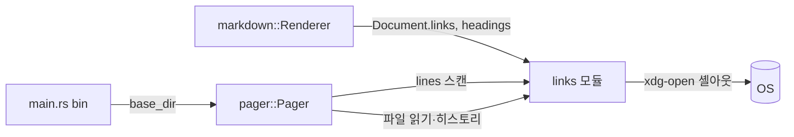

# Design — markdown-link-navigation

## 정의
마크다운 문서를 보는 사용자를 위해, 문서 안 링크를 따라 헤딩 점프·브라우저 열기·다른 파일
이동(히스토리 포함)을 할 수 있게 하는 `links` 모듈과 `pager`/`main`의 배선이다.

## Boundary Commitments

### In-Scope (This Spec Owns)
- 신규 모듈 `src/links.rs`: 링크 목적지 분류, 화면 표시 줄에서 링크 위치 인식, 헤딩 슬러그
  생성, 뒤로/앞으로 히스토리, 외부 URL 셸아웃
- `markdown/mod.rs`: 렌더링 중 발견한 링크 목적지·헤딩 슬러그를 `Document`에 함께 담기
- `pager.rs`: 링크 포커스 이동(키보드)·클릭 판정, 확정 시 종류별 동작 실행, 히스토리 키
- `main.rs`: 초기 파일 경로(`base_dir`)를 페이저에 전달

### Out-of-Scope
- 디렉터리 브라우징/파일 선택 UI — 여전히 배제
- 코드펜스 신택스 하이라이팅 — 별도 라운드
- 이미지(`Tag::Image`) 링크 따라가기 — 요구사항에 없음, `theme.image`는 밑줄을 안 써서 이번
  링크 인식 메커니즘에 애초에 안 걸림(부수적으로 자연히 제외됨)
- 완벽한 다중 링크 겹침 해소 — 인용 부호 없는 두 앵커 링크가 글자 하나도 안 띄우고 바로
  붙어 있는 극단적인 경우(`[a](#x)[b](#y)`)는 하나의 런으로 합쳐질 수 있음(Error Handling 참조)

### Allowed Dependencies
- 외부: 없음(브라우저 열기는 `std::process::Command`로 `xdg-open`/`open`/`cmd /c start` 셸아웃)
- 내부 의존 방향: `markdown`(링크·헤딩 메타데이터 생성) → `links`(분류·위치 인식·히스토리,
  markdown/line에만 의존) → `pager`(UI 배선) → `main`(bin)

### Revalidation Triggers
- `style.rs`의 `link` 역할이 `.underline()`을 더 이상 안 쓰게 되면(현재 링크 전용 마커) 링크
  위치 인식 메커니즘 전체 재검토 필요
- `Line`/`Span`에 위치 메타데이터를 직접 담는 방향으로 바뀌면(예: 다른 스펙이 필요로 해서)
  이 스펙의 "스타일로 스캔" 방식과 통합 검토 필요

## Architecture

### Boundary Map


### Key Decisions
- **링크의 화면 위치는 렌더링 후 최종 표시 줄(`self.lines`)에서 밑줄(`underline`) 스타일
  구간을 스캔해 알아낸다** — 이유: `style.rs` 전체에서 `.underline()`은 `link` 역할 하나뿐이다
  (`grep` 확인). `Style::merge`는 `underline` 플래그를 OR로만 합치므로, 링크가 굵게·기울임과
  섞여도(`**[text](url)**`) 밑줄만은 항상 남는다 — 다른 스타일 속성과 달리 100% 신뢰 가능한
  마커다. `Theme::none()`도 `enabled=false`만 다르고 `Style` 값 자체(밑줄 포함)는 그대로라
  `--style none`에서도 동일하게 동작한다. 이 방식은 줄바꿈(`wrap.rs`)이 끝난 **뒤**의 최종
  줄에 대해 스캔하므로, 다이어그램 원문이 펼쳐져 줄 번호가 밀리는 경우(`o` 토글)도 자동으로
  올바르게 처리된다 — `Line`/`Span`에 새 메타데이터 필드를 추가하거나 `wrap.rs`를 건드릴
  필요가 없다.
- **스캔한 밑줄 구간은 `Document.links`(렌더링 이벤트 순서대로 쌓은 목적지 문자열 목록)와
  순서대로 짝짓는다** — 이유: 파싱 순서 = 렌더 순서 = 줄바꿈 순서(줄바꿈은 순서를 안 바꾸고
  끊기만 함)이므로, 화면에 나온 n번째 밑줄 구간은 항상 n번째로 파싱된 링크와 같다. 각주
  (`[^1]`)·이미지는 `theme.link_url`/`theme.image`를 쓰고 밑줄이 없어 스캔에 안 걸린다(자연히
  제외).
- **헤딩 슬러그는 원래 문서 줄 번호로 저장하고, 페이저가 다이어그램 펼침 여부에 따른 줄 밀림을
  보정한다** — 이유: 헤딩은 밑줄 마커가 없어(스타일이 6단계로 다양) 링크와 같은 방식으로
  스캔할 수 없다. 대신 렌더링 시점에 `(슬러그, 원본 줄 번호)`를 기록해 두고, 페이저의
  `rebuild_lines()`가 이미 원본 줄→최종 줄 대응을 계산하는 루프이므로 그 자리에서 헤딩 위치도
  같이 보정한다(기존 `ShownBlock` 계산과 같은 루프, 새 순회 추가 없음).
- **히스토리는 렌더된 내용이 아니라 `(경로, 스크롤 위치)`만 저장하고 되돌아갈 때 파일을 다시
  읽는다** — 이유: 렌더된 `String`/`Document`를 통째로 캐시하면 메모리도 더 쓰고, "뒤로 가면
  그 사이의 파일 수정이 반영 안 되는" 오래된 스냅샷 문제가 생긴다. dg는 이미 watch 모드로
  "항상 디스크의 최신 상태를 보여준다"는 원칙이 있어, 히스토리도 같은 철학을 따른다.
- **뒤로/앞으로 키는 `[`/`]`** — 이유: 기존 키 배치와 안 겹치고(`q`/`j`/`k`/`Ctrl-d,u,f,b`/
  `Space`/`PageUp,Down`/`g`/`G`/`/`/`n`/`N`/`o`/`r`), 대괄호는 "이전/다음 한 덩어리"를 표시하는
  기호로 흔히 쓰인다.
- **링크 포커스 이동은 화면에 보이는(현재 뷰포트) 링크로만 순환한다** — 이유: 화면 밖 링크까지
  추적하려면 스크롤과 포커스를 동기화하는 별도 상태기계가 필요해진다. 화면에 보이는 것만
  다루면 "Tab으로 다음 링크, 안 보이면 스크롤해서 찾기"라는 간단한 모델로 충분하고, 대부분의
  문서에서 실용적이다.
- **Enter는 링크가 포커스됐을 때만 "따라가기"로 동작하고, 그렇지 않으면 기존처럼 한 줄
  스크롤한다** — 이유: `Enter`가 이미 `j`와 같은 "한 줄 아래로" 키라, 무조건 링크 이동으로
  바꾸면 회귀(5.1)가 생긴다. 포커스 유무로 분기하면 기존 동작을 건드리지 않는다.

## Components and Interfaces

### links — 링크 목적지 분류
- Intent: `dest_url` 문자열을 앵커/외부/파일로 분류한다
- Requirements: 2.1, 3.1, 4.1
```rust
pub enum LinkKind {
    /// `#slug` — '#' 뗀 슬러그.
    Anchor(String),
    /// 스킴이 있는 절대 URL(`http://`, `https://`, `mailto:` 등) — OS 핸들러로.
    External(String),
    /// 그 외(상대/절대 파일 경로).
    File(String),
}

/// `dest_url`을 분류한다. 스킴 판정은 RFC 3986의 `scheme ":"` 형태(영문자로 시작, 이후
/// 영숫자/`+`/`-`/`.`, `:` 이전에 `/`가 오면 스킴이 아니라 경로로 봄 — Windows 드라이브 문자
/// `C:\`와 스킴을 구분하기 위함)를 최소한으로 흉내 낸다.
pub fn classify(dest_url: &str) -> LinkKind;
```
- 계약: 패닉 없음(빈 문자열도 `File(String::new())`로 안전하게 분류됨).

### links — 화면 위치 인식
- Intent: 최종 표시 줄에서 링크 위치를 찾아 `Document.links`와 순서대로 짝짓는다
- Requirements: 1.1, 1.2, 1.3, 1.4
```rust
pub struct LinkPosition {
    pub line: usize,
    pub col_start: usize,
    pub col_end: usize,
    /// `Document.links`의 인덱스.
    pub link_index: usize,
}

/// `lines`에서 밑줄(`Style::underline`) 구간을 순서대로 찾아 `link_index`(0부터)를 매긴다.
pub fn locate_links(lines: &[Line]) -> Vec<LinkPosition>;
```
- 계약: `lines`에 있는 밑줄 구간 개수가 `Document.links.len()`과 다를 수 있음(극단적으로
  붙은 앵커 링크가 한 구간으로 합쳐지는 경우, Out-of-Scope 참조) — 이 경우 초과분 링크는
  단순히 못 찾은 것으로 취급하고 패닉하지 않는다(`link_index`가 `Document.links` 범위를
  넘지 않도록 `min`으로 자름).

### links — 헤딩 슬러그
- Intent: GitHub 스타일 헤딩 슬러그를 생성하고 중복을 처리한다
- Requirements: 2.2, 2.3
```rust
#[derive(Default)]
pub struct Slugger {
    seen: std::collections::HashMap<String, u32>,
}
impl Slugger {
    /// 소문자화, 공백→하이픈, 영숫자·하이픈 외 제거. 같은 슬러그가 다시 나오면 `-1`/`-2`.
    pub fn slug(&mut self, heading_text: &str) -> String;
}
```

### links — 뒤로/앞으로 히스토리
- Intent: 방문한 (경로, 스크롤 위치)를 관리한다
- Requirements: 4.5, 4.6, 4.7, 4.8
```rust
pub struct HistoryEntry {
    pub path: std::path::PathBuf,
    pub top: usize,
}

#[derive(Default)]
pub struct History {
    back: Vec<HistoryEntry>,
    forward: Vec<HistoryEntry>,
}
impl History {
    /// 새 파일로 이동하기 직전에 현재 위치를 쌓는다. forward 기록은 버린다(4.8).
    pub fn record(&mut self, current: HistoryEntry);
    /// 뒤로 갈 수 있으면 `current`를 forward에 쌓고 이전 항목을 돌려준다.
    pub fn go_back(&mut self, current: HistoryEntry) -> Option<HistoryEntry>;
    /// 앞으로 갈 수 있으면 `current`를 back에 쌓고 다음 항목을 돌려준다.
    pub fn go_forward(&mut self, current: HistoryEntry) -> Option<HistoryEntry>;
}
```
- 계약: `back`/`forward`가 비어 있으면 `None`(4.7 — 아무 일도 없음).

### links — 외부 URL 열기 · 경로 해석
- Intent: OS 기본 브라우저 셸아웃, 상대 경로 해석
- Requirements: 3.1, 3.2, 4.1
```rust
/// OS 기본 핸들러로 `url`을 연다(`xdg-open`(Linux)/`open`(macOS)/`cmd /c start`(Windows)).
/// 프로세스 실행 자체의 성공/실패만 본다(브라우저 안에서 실제로 열렸는지는 확인 불가).
pub fn open_external(url: &str) -> std::io::Result<()>;

/// `base_dir` 기준으로 상대 경로를 절대 경로로 편다.
pub fn resolve_file_path(base_dir: &std::path::Path, relative: &str) -> std::path::PathBuf;
```

### markdown — Document 확장 (기존 구조체 수정)
- Intent: 렌더링 중 발견한 링크 목적지·헤딩 슬러그를 결과물에 함께 담는다
- Requirements: 1.1, 2.1, 2.2, 2.3
```rust
pub struct Document {
    pub lines: Vec<Line>,
    pub diagrams: Vec<DiagramBlock>,
    /// 링크 목적지(등장 순서, `links::locate_links`가 화면 위치와 짝짓는 데 씀).
    pub links: Vec<String>,
    /// (슬러그, 원본 줄 번호) — 페이저가 다이어그램 펼침에 따른 줄 밀림을 보정해서 씀.
    pub headings: Vec<(String, usize)>,
}
```
- 계약: `Tag::Link` 시작 시 `dest_url`을 `links`에 그대로 push(가공 없음 — 분류는 소비하는
  쪽인 `links::classify`가 함). `TagEnd::Heading` 시 `self.lines.len()`(그 헤딩의 렌더된
  첫 줄이 될 위치) 직전에 `Slugger::slug`로 슬러그를 만들어 `headings`에 push.

### pager — Pager 확장 (기존 컴포넌트 확장)
- Intent: 링크 포커스·클릭·확정, 헤딩 점프, 파일 이동·히스토리를 UI 이벤트에 배선한다
- Requirements: 1.1~1.5, 2.1, 2.4, 3.1, 3.2, 4.1~4.8, 5.1, 5.2
- 계약: `rebuild_lines()` 끝에서 `links::locate_links(&self.lines)`로
  `self.link_positions`를 갱신하고, `self.document.headings`를 원본→최종 줄 매핑(다이어그램
  펼침 오프셋)으로 보정해 `self.heading_lines`에 저장한다. `Tab`/`Shift-Tab`(`KeyCode::Tab`/
  `KeyCode::BackTab`)은 `self.link_positions`에서 현재 뷰포트(`top..top+page`) 안의 다음/이전
  항목으로 `self.focused_link`를 옮기고 강제 재그리기 표시를 한다(1.2, 1.3, 1.4 — 항목 없으면
  무동작). 그리기 시(`draw`) 포커스된 링크 구간은 역상(`reverse`)을 덧씌운다. `Enter`는
  `self.focused_link.is_some()`이면 그 링크를 따라가고 포커스를 지우며, 아니면 기존과 동일하게
  한 줄 스크롤한다(5.1). 마우스 왼쪽 클릭은 먼저 클릭 좌표가 `link_positions` 범위 안인지
  검사해 있으면 그 링크를 따라가고, 없으면 기존 `toggle_block_at`으로 넘어간다(5.1). "링크를
  따라간다"는 `links::classify(dest)`로 분기한다: `Anchor(slug)` → `self.heading_lines`에서
  찾아 `self.top`을 그 줄로(2.1, 못 찾으면 2.4 상태 메시지); `External(url)` →
  `links::open_external`(3.1, 실패 시 3.2 상태 메시지); `File(path)` → `self.base_dir`가
  `None`이면 4.2 상태 메시지, 있으면 `links::resolve_file_path`로 절대 경로를 만들어
  `fs::read_to_string` 시도 — 성공하면 `self.history.record(...)`(4.8은 `record`가 forward를
  비우는 것으로 보장), `self.source`/`self.title`/`self.base_dir`/`self.current_path` 갱신,
  `self.top = 0`, 감시 중이면 `Watcher`도 새 경로로 재생성(4.4), `rerender()`; 실패하면 4.3
  상태 메시지. `[`/`]` 키는 `self.history.go_back`/`go_forward`로 같은 파일 전환 경로를 탄다
  (4.5, 4.6, 4.7).

### main (bin) — 초기 경로 전달 (기존 컴포넌트 확장)
- Intent: 페이저에 초기 파일의 디렉터리를 넘겨 상대 링크 해석 기준을 준다
- Requirements: 4.1, 4.2
- 계약: `cli.file`이 `Some(path)`(`-` 아님)이면 `Path::new(path).parent()`를 `base_dir`로
  넘기고, `None`/`Some("-")`(표준입력)이면 `base_dir: None`을 넘긴다.

## Data Models
`links::LinkKind`/`LinkPosition`/`Slugger`/`HistoryEntry`/`History`는 전부 위 인터페이스로
설명된 게 전부다 — 영속 저장 없음(히스토리는 프로세스 생존 동안만).

## Error Handling
- **사용자 입력 오류**: 해당 없음
- **외부 자원 오류**(파일 없음/읽기 실패, 브라우저 실행 실패): `links`의 함수들은 전부
  `Result`/`Option`으로 감싸 돌려주고, `pager`가 상태 표시줄 메시지(`self.message`, 기존
  검색 메시지와 같은 필드 재사용)로 알린다 — 화면은 그대로 유지(4.3, 3.2)
- **시스템 오류(패닉)**: 스타일 스캔은 범위를 `Document.links.len()`으로 자르고, 히스토리는
  빈 스택에서 `None`을 돌려주는 것으로 패닉 없이 처리
- **기능 강등**: 표준입력 입력에서는 파일 이동 기능 자체가 조용히 비활성화됨(4.2) — 에러가
  아니라 애초에 그 경로가 없다는 안내

## Testing Strategy
- **Depth**: Complex — 신규 모듈 하나(순수 로직, 유닛 테스트 용이) + 기존 `Document`/`Pager`
  확장(여러 상호작용 경로: 키보드·마우스·히스토리·감시 모드 연동), 상태기계(포커스·히스토리)가
  있어 Trivial/Standard보다 깊은 커버리지가 필요
- **Unit(L6)**: `classify()`를 앵커/외부(http·https·mailto)/상대경로/빈 문자열로,
  `Slugger::slug()`를 중복 제목 포함 여러 헤딩으로, `locate_links()`를 밑줄 구간이 있는/없는
  `Line` 픽스처로, `History::record/go_back/go_forward`를 빈 상태·여러 항목·`record` 후
  forward 소실로 각각 확인 (1.1, 2.1~2.3, 4.5~4.8)
- **Integration(L4~L5)**: `Pager`에 필드를 직접 설정하는 기존 테스트 패턴으로 Tab 포커스
  이동+Enter, 클릭 좌표 판정, 앵커 점프(성공/실패), 파일 이동(성공/실패/표준입력 제한/감시
  전환), 뒤로·앞으로 흐름을 확인 (1.2~1.5, 2.1, 2.4, 4.1~4.4)
- **E2E**: 없음(실제 브라우저 실행·터미널 전체 흐름은 자동화 대상 아님)
- **Acceptance(L1)**: `cargo test` 전체 통과(5.2) + 실제 파일 두 개(서로 링크로 연결)와
  앵커·외부 링크가 섞인 문서를 릴리스 바이너리로 열어 Tab/클릭/`[`/`]`을 육안 확인(가능한
  범위, 실제 터미널 없는 이 세션에선 로직 단위까지만 자동 검증하고 나머지는 수동 기록)

## File Structure Plan
```
src/links.rs     # 신규: LinkKind/classify, LinkPosition/locate_links, Slugger,
                 # HistoryEntry/History, open_external, resolve_file_path (cli 피처)
src/lib.rs       # #[cfg(feature = "cli")] pub mod links; 추가
src/markdown/mod.rs  # Document에 links/headings 필드 추가, Tag::Link/TagEnd::Heading에서 채움
src/pager.rs     # link_positions/focused_link/heading_lines/base_dir/current_path/history
                 # 필드, Tab/Shift-Tab/Enter 분기, 클릭 판정 확장, [/] 키, follow_link 로직
src/main.rs      # base_dir 계산 후 Pager::new에 전달
```
