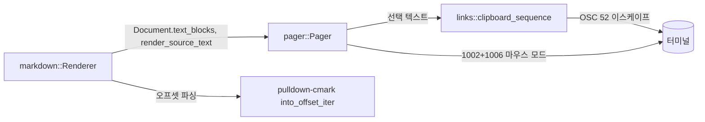
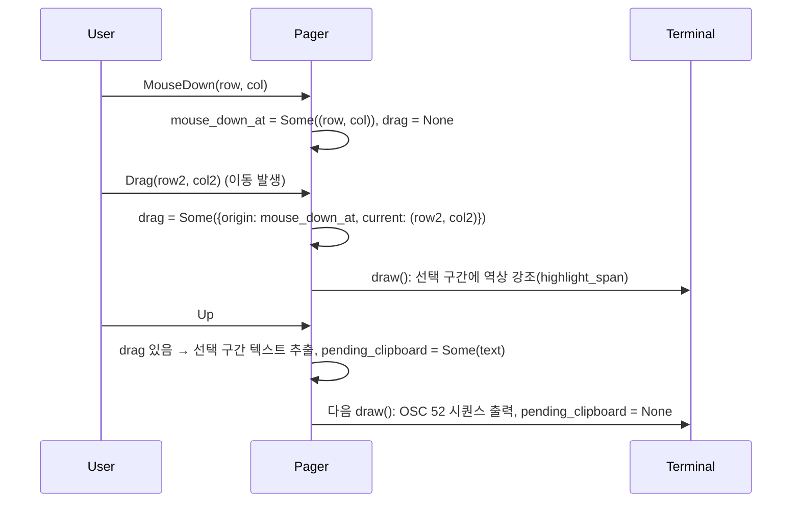
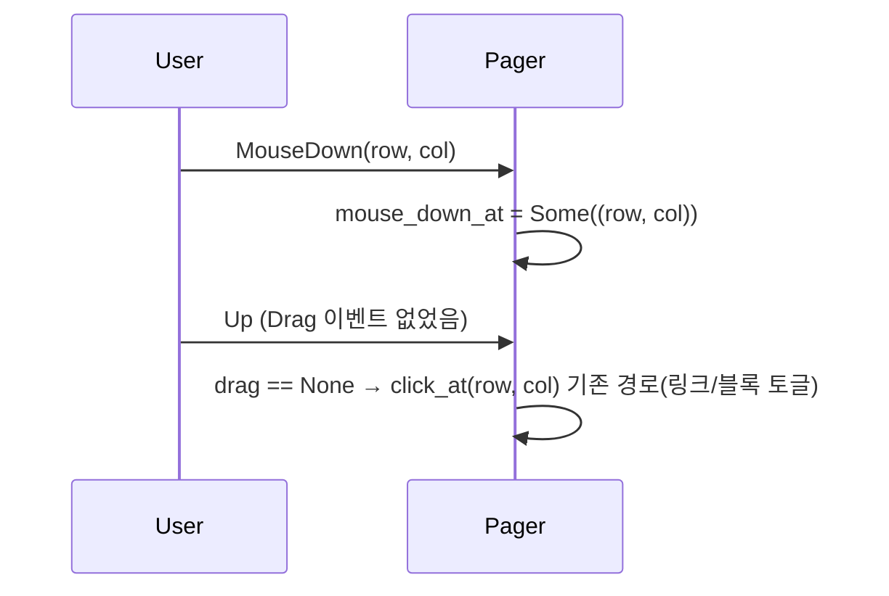

# Design — markdown-source-view

## 정의
마크다운 문서를 보는 사용자를 위해, 렌더된 화면과 마크다운 문법이 색으로 구분된 원문 화면을
문서 전체·블록 단위로 오가며 보고, 화면의 텍스트를 드래그해 선택·복사할 수 있게 하는 `markdown`
렌더러와 `pager`의 확장이다.

## Boundary Commitments

### In-Scope (This Spec Owns)
- `markdown/mod.rs`: 오프셋 기반 파싱(`into_offset_iter`)으로 전환해 블록별 원문 슬라이스를
  얻고, 마크다운 문법 요소를 원문 위에 색으로 표시하는 `render_source_text()`를 추가한다.
  `Document`에 문단·헤딩 등 비다이어그램 블록의 위치·원문(`text_blocks`)을 채운다.
- `pager.rs`: 전역 원문 토글 키, 기존 `o`/클릭 블록 토글을 텍스트 블록까지 확장, 마우스
  드래그 선택 강조와 클릭 액션의 구분, 선택 완료 시 클립보드 복사.
- `links.rs`: 텍스트를 시스템 클립보드로 보내는 OSC 52 시퀀스 생성(순수 함수, 신규 프로세스·
  신규 의존성 없음).

### Out-of-Scope
- 코드펜스 내부 프로그래밍 언어 신택스 하이라이팅 — 로드맵의 별도 항목(`markdown-syntax-
  highlighting`)이 소유.
- `--print`(비대화형) 모드 — 원문 토글은 대화형 페이저 전용 개념이라 손대지 않음.
- dg 자체 클립보드 기록·다중 선택 관리 — 시스템 클립보드 한 슬롯에 위임, dg는 쓰기만 한다.
- 사각형(블록) 드래그 선택 — 스트림(읽기 순서) 선택만 지원.

### Allowed Dependencies
- 외부: 없음(신규 Cargo 의존성 없음 — base64 인코딩은 손으로 짠 순수 함수로 처리, 클립보드
  전달은 OSC 52 이스케이프 시퀀스를 표준출력에 쓰는 것뿐이라 프로세스 실행조차 불필요)
- 내부 의존 방향: `markdown`(오프셋 파싱·원문 하이라이팅) → `links`(OSC 52 시퀀스 생성,
  markdown/line에만 의존) → `pager`(UI 배선) → `main`(bin, 변경 없음)

### Revalidation Triggers
- `pulldown-cmark`가 `into_offset_iter()`의 오프셋 의미(바이트 범위)를 바꾸면 블록 원문 슬라이스·
  하이라이팅 구간 계산 전체 재검토 필요
- 터미널 마우스 프로토콜을 X10(1000)에서 button-event(1002)로 바꾸는 게 실제로 크로스텀·주요
  터미널에서 드래그 이벤트를 안정적으로 주는지는 Testing Strategy의 실물 검증에서 확인 필요
  (안 되면 이 스펙의 드래그/클릭 구분 메커니즘 자체를 재설계해야 함)
- OSC 52가 막힌 환경(일부 SSH 멀티플렉서·보안 정책)에서 "복사 안 됨"이 사용자에게 원인 불명으로
  보일 수 있음 — 향후 상태 표시줄 안내 추가가 필요해지면 재검토

## Architecture

### Boundary Map


### Key Decisions
- **파서를 `Parser::new_ext(...).into_offset_iter()`로 바꾼다** — 이유: 이벤트마다 원본
  바이트 범위(`Range<usize>`)가 따라와, (a) 블록별 원문을 `source[range]`로 그대로 슬라이스
  할 수 있고(코드블록처럼 Text 이벤트를 이어붙여 재구성할 필요 없음 — 재구성은 굵게·링크 등
  인라인 마크업 문자를 잃어버려 "원문 그대로"를 보장 못 함), (b) 같은 오프셋으로 헤딩·강조·
  링크·인용·목록 마커의 위치를 알아내 원문 위에 색만 입힐 수 있다. 렌더링 로직 자체(`handle`)는
  그대로 두고 오프셋을 부가 정보로만 쓴다 — 기존 227개+ 테스트의 렌더 결과에 영향 없음.
- **`Document.diagrams`/`DiagramBlock`는 건드리지 않고, 비다이어그램 블록을 위한 새 필드
  `text_blocks: Vec<TextBlock>`를 나란히 추가한다** — 이유: 둘을 하나의 enum으로 합치는 방안도
  검토했으나(제네릭 `Vec<SourceBlock>`), 그러면 이미 안정적으로 테스트된 `Document.diagrams`
  필드와 그걸 쓰는 `pager.rs`/`main.rs`의 모든 호출부를 바꿔야 해 블라스트 반경이 불필요하게
  커진다. 대신 페이저 쪽에서 `ShownBlock`이 두 목록 중 어느 쪽을 가리키는지 태그(`BlockRef`)로만
  구분하게 해, "화면 이 줄엔 어떤 블록이 있고 토글하면 뭘 보여줄지 판단"이라는 실제 일반화가
  필요한 지점만 하나로 합친다 — 인터페이스는 일반화하되 기존 계약은 보존(design-synthesis 원칙).
- **다이어그램 블록은 기존처럼 원문을 "덧붙여" 보여주고(캡션 아래 원문 + 그 아래 그린 그림),
  텍스트 블록은 원문으로 "바꿔" 보여준다(그 구간의 렌더 결과를 원문으로 대체)** — 이유: 문단
  하나를 렌더된 모습과 원문 모습으로 동시에 두 번 보여주는 건 중복이라 오히려 읽기 불편하다.
  다이어그램은 그림과 원문을 나란히 비교하는 값어치가 있어 기존 동작(회귀 없음, 2.3)을 그대로
  둔다. 두 동작이 다른 건 같은 메커니즘의 손상이 아니라 `BlockKind`별로 자연스러운 차이다.
- **전역 원문 토글은 "문서 전체를 텍스트 블록 하나로 취급"으로 구현한다** — 이유: 텍스트 블록
  하이라이팅 함수(`render_source_text`)를 문서 전체 원문에 그대로 적용하면 되므로 별도의 렌더
  경로가 필요 없다. `Pager.viewing_source: bool`가 켜지면 `self.lines`를 `render_source_text`
  결과로 통째로 교체하고, 꺼지면 기존 `rebuild_lines()` 경로로 되돌아간다 — 그 사이 블록별
  `text_expanded`/다이어그램 `expanded` 상태는 건드리지 않아 왕복 후 그대로 유지된다(1.5).
- **마우스 프로토콜을 X10(1000, 클릭만)에서 button-event(1002, 버튼 누른 채 이동도 보고)로
  바꾼다** — 이유: 드래그를 구분하려면 이동 이벤트가 와야 한다. SGR 확장(1006)은 그대로 유지.
  휠 이벤트는 두 모드 모두에서 동일하게 보고돼 기존 스크롤 동작에 영향 없다.
- **드래그/클릭 구분은 순수 상태 기계로 한다**: `MouseDown` 시점엔 아무것도 안 하고 좌표만
  기억, 그 뒤 `Drag` 이벤트가 한 번이라도 오면 그 시점부터 선택 진행 중으로 전환, `Up`에서
  선택 진행 중이 아니었으면(순수 클릭) 기존 `click_at` 경로 그대로, 선택 진행 중이었으면
  드래그 구간 텍스트를 계산해 클립보드로 보낸다 — 이유: 클릭 액션(4.2)과 드래그 선택(4.1)을
  같은 왼쪽 버튼 제스처로 나누는 유일한 신뢰 가능한 신호는 "이동이 있었는가"뿐이다.
- **선택 강조는 dg가 직접 그리고(기존 `Line::highlight_span` 재사용), 실제 클립보드 전달은
  OSC 52 이스케이프 시퀀스로 한다** — 이유: 마우스 캡처가 켜진 채로는 터미널이 자체적으로
  선택을 그려주지 않으므로(Architecture 노트 참조) dg가 시각 강조를 대신 그린다. 진짜 복사는
  터미널이 지원하면 OSC 52로 시스템 클립보드에 실제로 들어간다(대부분 최신 터미널 지원) —
  안 되면 그 시퀀스는 조용히 무시돼 강조 표시만 남는다(4.5, 별도 감지 로직 불필요).
- **OSC 52 시퀀스 생성과 base64 인코딩은 손으로 짠 순수 함수로 한다** — 이유: 알고리즘이
  짧고 고정적이라(RFC 4648 표준 base64, 패딩 포함) 새 의존성을 들일 값어치가 없다 — 기존
  `open_external`이 `opener` 크레이트 대신 `std::process::Command`를 쓴 선례와 같은 판단.

## System Flows

### 드래그 선택 → 클립보드 복사 (4.1, 4.3)


### 클릭(이동 없음) → 기존 액션 유지 (4.2)


## Components and Interfaces

### markdown — 오프셋 기반 블록 원문 수집
- Intent: 렌더링 중 비다이어그램 블록의 위치·원문을 `Document`에 채운다
- Requirements: 2.1, 2.3, 2.4
```rust
pub struct TextBlock {
    /// 그 블록의 렌더된 첫 줄 번호.
    pub start: usize,
    /// 마지막 줄 다음 번호.
    pub end: usize,
    /// 원본 바이트 범위로 슬라이스한 마크다운 원문 그대로(가공 없음).
    pub source: String,
}

pub struct Document {
    pub lines: Vec<Line>,
    pub diagrams: Vec<DiagramBlock>,      // 변경 없음
    pub text_blocks: Vec<TextBlock>,      // 신규
    pub links: Vec<String>,
    pub headings: Vec<(String, usize)>,
}
```
- 계약: `Paragraph`/`Heading`/`BlockQuote`/`List`/`Table`/`FootnoteDefinition`/비다이어그램
  `CodeBlock`/`HtmlBlock`의 시작~끝 이벤트 쌍마다 하나씩 기록한다. 중첩된 경우(리스트 항목 안
  문단 등) 가장 바깥쪽 블록 하나로만 묶는다(깊이 카운터로 시작/끝 판정, 안쪽 태그는 기록하지
  않음) — 블록 구간이 겹치지 않는다는 `pager.rs`의 기존 전제(다이어그램과 동일)를 유지한다.
  다이어그램으로 인식된 코드펜스는 기존처럼 `diagrams`에만 들어가고 `text_blocks`에는 안
  들어간다(중복 없음).

### markdown — 원문 문법 하이라이팅
- Intent: 마크다운 원문 텍스트에 문법 요소별로 기존 테마 색을 입혀 줄 단위로 렌더링한다
- Requirements: 3.1, 3.2, 3.3
```rust
/// `source`(마크다운 원문 일부 또는 전체)를 오프셋 파싱해, 헤딩(`#`)·강조(`**`/`*`)·
/// 링크(`[텍스트](url)`)·인용(`>`)·목록 마커(`-`/`1.`)·코드펜스 구분 기호(```)에 기존 테마
/// 색(`heading[..]`/`emphasis`/`strong`/`link`/`quote`/`bullet`/`code_border`)을 입힌다.
/// 그 외 문자(코드펜스 안쪽 내용 포함)는 `Style::PLAIN`. `width`로 줄바꿈한다.
pub fn render_source_text(source: &str, theme: &Theme, width: usize) -> Vec<Line>;
```
- 계약: 입력 문자 그대로 보존(치환·삭제 없음) — 색만 덧씌운다. `--style none`(`theme.enabled
  == false`)에서도 같은 함수가 호출되지만 `Style::ansi()`가 색을 안 내므로 문법 마커 문자
  자체(원문에 이미 있는 `#`/`**`/`>` 등)로 구분이 유지된다(3.2). 패닉 없음(빈 문자열도 빈
  벡터가 아니라 최소 한 줄 처리).

### pager — 블록 토글 일반화
- Intent: 기존 다이어그램 전용 블록 토글을 텍스트 블록까지 확장한다
- Requirements: 2.1, 2.2, 2.3, 2.4
```rust
enum BlockRef {
    Diagram(usize), // document.diagrams 인덱스
    Text(usize),    // document.text_blocks 인덱스
}
struct ShownBlock {
    start: usize,
    end: usize,
    block: BlockRef,
}
```
- 계약: `rebuild_lines()`가 `document.diagrams`와 `document.text_blocks`를 줄 번호 순서로
  병합해 `shown_blocks`를 만든다(겹치지 않는다는 전제는 위 markdown 계약이 보장). 기존
  `o` 키·클릭의 "화면에 보이는 첫 블록 찾기" 로직은 `BlockRef` 종류를 가리지 않고 동일하게
  동작한다(2.1). 펼침 상태는 종류별로 별도 `Vec<bool>`(`expanded`는 기존 그대로 다이어그램용,
  신규 `text_expanded`는 텍스트 블록용)로 관리해 서로 간섭하지 않는다. 다이어그램은 펼치면
  원문을 캡션 아래 "덧붙이고"(기존 동작, 2.3 회귀 없음), 텍스트 블록은 펼치면 그 구간의 렌더
  줄을 `render_source_text(block.source, ...)` 결과로 "대체"한다(2.1, 2.2). 토글 가능한 블록이
  없는 위치는 `shown_blocks`에 아무 항목도 없어 자연히 무동작(2.4).

### pager — 전역 원문 토글
- Intent: 문서 전체를 원문 화면으로 전환한다
- Requirements: 1.1~1.5
```rust
// Pager에 추가되는 필드
viewing_source: bool,
```
- 계약: 새 키(`s`)를 누르면 `viewing_source`를 뒤집고 다시 그린다. 켜져 있으면
  `self.lines`는 `markdown::render_source_text(&self.source, self.theme, self.rendered_columns)`
  결과이고, 기존 `rebuild_lines()`가 만드는 블록·헤딩·링크 기반 줄은 쓰이지 않는다(1.1). 끌 때
  스크롤 위치(`top`)는 그대로 유지되고 기존 경로로 되돌아간다(1.2). 감시 모드 갱신 시에도 같은
  분기를 타 원문이 최신으로 유지된다(1.4). `expanded`/`text_expanded`는 이 토글이 건드리지
  않아 왕복 후에도 그대로다(1.5). 원문 화면 안에서도 스크롤/검색 키는 `self.lines`를 그대로
  쓰는 기존 로직이라 자동으로 동작한다(1.3).

### pager — 드래그 선택 · 클립보드
- Intent: 마우스 드래그로 화면 텍스트를 선택해 시각 강조하고 클립보드로 복사한다. 이동 없는
  클릭은 기존 액션 그대로 실행한다
- Requirements: 4.1~4.5
```rust
struct DragSelection {
    origin: (usize, usize),  // (절대 줄 번호, 열)
    current: (usize, usize),
}
// Pager에 추가되는 필드
mouse_down_at: Option<(usize, usize)>,
drag: Option<DragSelection>,
pending_clipboard: Option<String>,
```
- 계약: `MouseEventKind::Down(Left)`는 `mouse_down_at`만 기록하고 `drag`를 지운다(새 제스처
  시작). `Drag(Left)`가 오면 `drag`가 없으면 `mouse_down_at`을 origin으로 새로 만들고,
  있으면 `current`만 갱신한다. `Up(Left)`에서 `drag`가 `None`이면 기존 `click_at` 그대로
  실행(4.2, 회귀 없음), `Some`이면 origin~current를 스트림 순서(윗줄→아랫줄, 같은 줄이면
  왼쪽→오른쪽)로 정규화해 그 구간의 텍스트를 각 줄에서 뽑아 개행으로 이어 붙이고
  `pending_clipboard`에 저장한다(4.1, 4.3 — `viewing_source` 여부와 무관하게 `self.lines`
  기준이라 원문 화면에서도 동일 경로). `draw()`는 매 프레임 `drag`가 있으면 그 구간의 각 줄에
  `Line::highlight_span`으로 역상을 덧씌우고, `pending_clipboard`가 있으면
  `links::clipboard_sequence(text)`를 출력한 뒤 비운다. 휠 스크롤(`ScrollUp`/`ScrollDown`)은
  `drag` 상태를 건드리지 않는다(4.4). 새 키 입력이 오면 `drag`를 지워 강조를 치운다.

### links — 클립보드 시퀀스
- Intent: 텍스트를 OSC 52 이스케이프 시퀀스로 인코딩한다(순수 함수, I/O 없음)
- Requirements: 4.1, 4.5
```rust
/// `text`를 base64로 인코딩해 OSC 52(클립보드) 이스케이프 시퀀스 문자열을 만든다. 실제
/// 출력은 호출자(`pager::draw`)가 기존 출력 스트림에 그대로 쓴다 — 이 함수는 문자열만
/// 만들고 어떤 I/O도 하지 않는다(항상 성공, `Result` 불필요).
pub fn clipboard_sequence(text: &str) -> String;
```
- 계약: 지원 안 하는 터미널은 이 시퀀스를 그냥 무시하므로 별도 감지·폴백 로직이 없다(4.5).
  빈 문자열도 안전하게 처리(빈 시퀀스를 만들되 패닉 없음).

## Data Models
`TextBlock`/`DragSelection`은 위 인터페이스로 설명된 게 전부다. 영속 저장 없음(선택·클립보드
상태는 프로세스 생존 동안만, `HistoryEntry`와 달리 파일이 아니라 화면 좌표 기준).

## Error Handling
- **사용자 입력 오류**: 해당 없음
- **외부 자원 오류**: 클립보드 미지원 터미널은 OSC 52가 조용히 무시됨(4.5) — dg 쪽에서 감지·
  에러 처리 안 함(감지할 표준 방법이 없음)
- **시스템 오류(패닉)**: `render_source_text`/오프셋 슬라이스는 빈 입력·유니코드 경계를
  `char_indices` 기준으로만 다뤄 패닉 없음(기존 `highlight_span`과 동일한 안전 패턴 재사용).
  블록 시작/끝 짝이 안 맞는 극단적 파서 이벤트 순서는 발생하지 않음(pulldown-cmark이 항상
  짝을 보장). 드래그 좌표가 화면 밖(빈 줄 뒤 등)을 가리켜도 범위를 `self.lines.len()`으로
  자르므로 패닉 없음(5.2)
- **기능 강등**: `--print` 모드는 이 스펙의 토글·선택 기능 자체가 없음(Out-of-Scope) — 기존
  1회 렌더 출력만 그대로

## Testing Strategy
- **Depth**: Complex — 신규 상태기계 두 개(드래그/클릭 구분, 전역/블록 원문 토글 병행), 기존
  블록 토글 메커니즘 일반화(회귀 위험), 오프셋 기반 파싱 전환(기존 렌더 227+ 테스트 영향 범위)
- **Unit(L6)**: `render_source_text()`를 헤딩·강조·링크·인용·목록·코드펜스가 섞인 원문으로(색
  구간이 문자 그대로 보존되는지), 오프셋 기반 `text_blocks` 수집을 중첩 리스트 포함 문서로,
  `clipboard_sequence()`를 짧은/빈/유니코드 텍스트로, 드래그 좌표 정규화·구간 텍스트 추출을
  단일 줄/여러 줄 케이스로 각각 확인 (2.1~2.4, 3.1~3.3, 4.1, 4.5)
- **Integration(L4~L5)**: `Pager`에 필드를 직접 설정하는 기존 테스트 패턴으로 전역 토글 왕복+
  블록 상태 유지(1.5), `o`/클릭의 블록 종류 무관 토글(다이어그램·텍스트 섞은 문서), Down→Drag→
  Up 흐름에서 클립보드 준비까지, Down→Up(이동 없음)에서 기존 `click_at` 그대로, 감시 모드 중
  전역 원문 갱신(1.4) 확인 (1.1~1.4, 2.1~2.3, 4.2~4.4). 이 스펙 이전부터 있던 스크롤·검색·
  링크 이동·기존 다이어그램 토글 테스트가 수정 없이 그대로 통과하는 것 자체가 회귀 없음의
  근거다(5.1)
- **E2E**: 없음(실제 터미널 마우스 프로토콜·클립보드는 자동화 대상 아님)
- **Acceptance(L1)**: `cargo test` 전체 통과(5.2) + 실제 파일로 전역/블록 토글·하이라이팅 육안
  확인, 실제 터미널에서 1002 모드로 드래그가 `Drag` 이벤트를 실제로 주는지와 OSC 52 클립보드
  복사가 실제로 되는지는 이 세션에 TTY가 없어 로직 단위까지만 자동 검증하고 나머지는 수동 기록
  (markdown-link-navigation 스펙과 같은 제약)

## File Structure Plan
```
src/markdown/mod.rs  # Parser::new_ext(...).into_offset_iter()로 전환, Document.text_blocks
                      # 추가, TextBlock 정의, 블록 오프셋 수집(깊이 카운터), render_source_text()
src/links.rs          # clipboard_sequence()/base64 인코딩 추가 (cli 피처)
src/pager.rs           # viewing_source, text_expanded, mouse_down_at, drag, pending_clipboard
                       # 필드; ShownBlock/BlockRef로 블록 토글 일반화; 's' 키; 마우스 모드를
                       # 1002+1006으로 전환; Down/Drag/Up 상태 기계; draw()에 선택 강조·클립보드
                       # 출력
src/line.rs            # highlight_span의 열→바이트 변환 로직을 slice_cols()와 공유(내부 헬퍼
                       # 추출) — 신규 함수 아님, 기존 코드 재사용을 위한 소규모 리팩터
```
