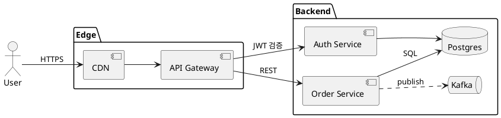
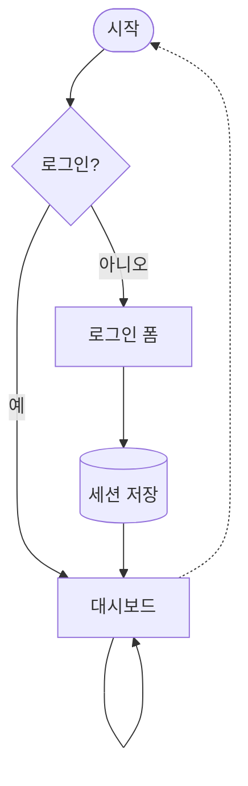
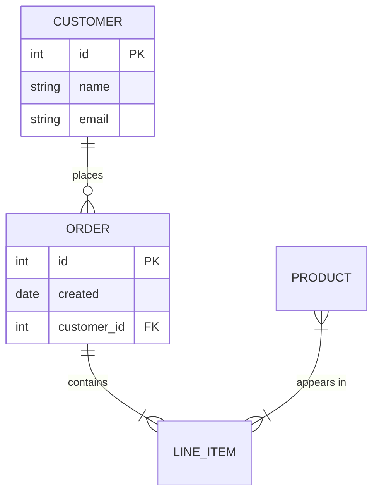
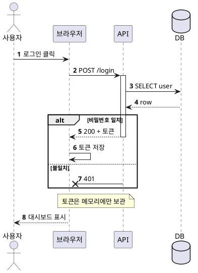
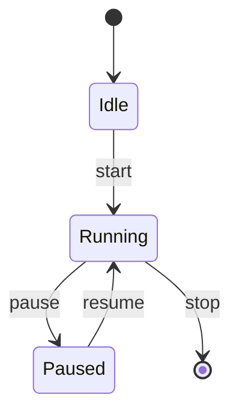

# dg 예제 문서

**dg**는 마크다운과 *다이어그램*을 터미널에 그린다. 인라인 `code`, ~~취소~~, [링크](https://example.com)도 있다.

## 아키텍처 (PlantUML 컴포넌트)



## 흐름도 (mermaid)



## 클래스 (mermaid)

```mermaid
classDiagram
  direction TB
  class Animal {
    +String name
    +int age
    +speak() void
  }
  class Dog {
    +fetch() void
  }
  class Cat
  <<interface>> Pet
  Animal <|-- Dog
  Animal <|-- Cat
  Pet <|.. Dog
  Dog "1" *-- "*" Toy : owns
```

## ERD (mermaid)



## 시퀀스 (PlantUML)



## 상태도 (mermaid)



## 표

| 항목 | 설명 | 상태 |
|------|:----:|-----:|
| 파서 | mermaid, PlantUML | 완료 |
| 배치기 | Sugiyama LR/TB | 완료 |

> 인용문은 이렇게 보인다.
> 두 줄도 된다.

- 목록 하나
- 목록 둘
  1. 번호 하나
  2. 번호 둘
- [x] 완료한 일
- [ ] 남은 일

```rust
fn main() {
    println!("hello");
}
```
