# dg 예제 문서

**dg**는 마크다운과 *다이어그램*을 터미널에 그린다. 인라인 `code`, ~~취소~~, [링크](https://example.com)도 있다.

아래 다이어그램은 전부 dg 자신의 실제 소스·커밋·스펙 데이터를 그린 것이다 — 가짜 예제 대신
"dg가 dg를 그리면" 어떻게 보이는지 보여 준다.

## 설계 요약

- **입력**: 마크다운 파일 또는 표준입력. `-d`를 주거나 확장자가 `.mmd`/`.mermaid`/`.puml`/`.plantuml`/`.pu`/`.iuml`이면
  파일 전체를 다이어그램 원문으로 취급한다.
- **언어 판별**: 코드펜스 이름(` ```mermaid `/` ```plantuml `)이 있으면 그것을, 없으면(단일 다이어그램 파일)
  본문 첫 지시어로 mermaid를, `@start...`/휴리스틱 점수로 PlantUML을 고른다(`diagram::language_of_source`).
- **종류 판별 → 파서 → 배치기**: 각 언어의 `kind_of`가 종류 이름을 정하고, `render`가 그 이름 하나로 전용
  파서(`mermaid::*`/`plantuml::*`)와 배치기(`layout::*`)를 잇는다. 새 종류를 추가할 때 손대는 곳은 이 두
  함수의 매치 갈래 하나씩뿐이다.
- **공통 배치기로 중복 제거(SSoT)**: 그래프형 5종(flowchart·state·er·class + PlantUML class·component·relation)은
  하나의 `ir::Graph`와 `layout::graph`를 공유하고, 수치 차트형 4종(pie·xychart·quadrant·gantt)은 하나의
  `layout::chart`(축 눈금·막대 비례·수치 포맷팅)를 공유한다. 각 언어별 파서는 문법만 담당하고 그리는 규칙은
  절대 복제하지 않는다.
- **실패 계약**: 어떤 렌더러든 결과가 표시 폭을 넘거나 그릴 수 없으면 예외 없이 `None`을 돌려주고, 호출부
  (`markdown::emit_code_block`)가 자동으로 일반 코드블록(원문 그대로)으로 대체한다. 폭이 부족하면 라벨 폭을
  단계적으로 줄여 가며 다시 시도한 뒤에야 포기한다.
- **패닉 금지**: `release` 프로필이 `panic = "abort"`라 패닉은 바로 크래시다. 그래서 모든 파서·배치기는
  `diagram::robustness` 테스트에서 잘리거나 순환 참조가 있거나 극단적인 값을 가진 입력을 여러 폭·테마
  조합으로 반복 렌더링해 통과해야 한다.
- **출력 단위**: 모든 렌더러는 `Canvas`(문자 격자) 또는 직접 `Line`/`Span` 목록을 만들고, 최종적으로
  `Vec<Line>`을 돌려준다. 터미널에는 ANSI로, 라이브러리로 쓸 때는 `to_text`로 색 없이도 뽑을 수 있다.
- **CLI 옵션**: `-w`(폭), `-s`(테마: dark/light/none/auto), `-P`(페이저 없이 즉시 출력), `-d`/`-l`(다이어그램
  모드·언어 강제), `--er-notation`(까치발/글자/둘 다), `--direction`(그래프 배치 방향 강제, 안 맞으면 반대
  방향으로 재시도).
- **인터랙티브 페이저**: 스크롤·검색(`/`)에 더해, 다이어그램마다 원문을 펼치고 접을 수 있다(`o` 키 또는
  캡션 줄 클릭) — 아래 "상태도" 절이 이 모드 전이를 그대로 그린 것이다.

## 지원 다이어그램 한눈에

| 언어 | 종류 | 이 문서의 예시 |
|------|------|----------------|
| mermaid | `flowchart`/`graph` | 흐름도 |
| mermaid | `sequenceDiagram` | (PlantUML 쪽 예시로 대신함) |
| mermaid | `classDiagram` | 클래스 |
| mermaid | `erDiagram` | ERD |
| mermaid | `stateDiagram(-v2)` | 상태도 |
| mermaid | `gitGraph` | Git 그래프 |
| mermaid | `block-beta` | 블록 다이어그램 |
| mermaid | `pie` | 파이 차트 |
| mermaid | `xychart-beta`/`xychart` | XY 차트 |
| mermaid | `quadrantChart` | 사분면 차트 |
| mermaid | `gantt` | 간트 차트 |
| PlantUML | 시퀀스 | 시퀀스 |
| PlantUML | 클래스/ER | (mermaid 쪽 예시로 대신함) |
| PlantUML | 컴포넌트·배치·유스케이스 | 아키텍처 |
| PlantUML | `@startgantt` | 간트 차트 |

## 아키텍처 (PlantUML 컴포넌트)

dg의 실제 렌더링 경로다: 진입점이 페이저 또는 즉시 출력(`-P`)으로 갈리고, 어느 쪽이든 마크다운
렌더러를 거쳐 코드펜스를 만나면 언어별 파서 → 배치기 → 문자 격자 → 줄/색 순으로 흘러간다.

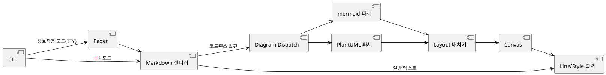

## 흐름도 (mermaid)

dg가 코드펜스 하나를 만났을 때 실제로 따라가는 판단 순서다(`diagram::render_body`/
`emit_code_block`의 로직 그대로): 언어·종류 판별에 실패하거나 배치 결과가 폭을 넘으면 매번
같은 곳(일반 코드블록)으로 떨어진다.

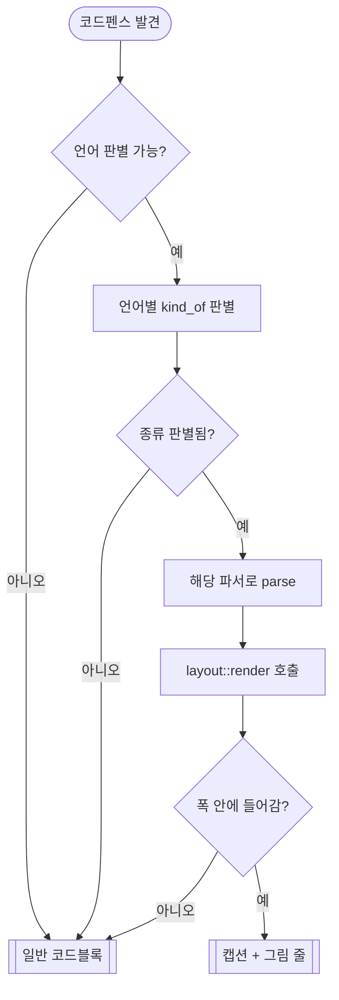

## 클래스 (mermaid)

dg의 그래프형 다이어그램(flowchart·state·er·class와 PlantUML class·component)이 공통으로 쓰는
중간 표현 `diagram::ir`의 실제 구조체들이다.

```mermaid
classDiagram
  direction LR
  class Graph {
    +Vec~Node~ nodes
    +Vec~Edge~ edges
    +Vec~Group~ groups
    +Direction direction
    +String title
  }
  class Node {
    +String id
    +Vec~String~ sections
    +Shape shape
    +usize group
  }
  class Edge {
    +usize from
    +usize to
    +String label
    +LineKind kind
    +Marker tail
    +Marker head
  }
  class Group {
    +String id
    +String title
    +usize parent
  }
  <<enumeration>> Shape
  <<enumeration>> Marker
  <<enumeration>> LineKind
  Graph "1" *-- "*" Node : nodes
  Graph "1" *-- "*" Edge : edges
  Graph "1" *-- "*" Group : groups
  Node --> Shape
  Edge --> Marker
  Edge --> LineKind
```

## ERD (mermaid)

같은 `ir::Graph` 구조를, 이번엔 dg가 실제로 지원하는 엔터티-관계 표기로 그린 것이다 — 다이어그램
기능으로 다이어그램 자신의 자료구조를 설명하는 셈이다.

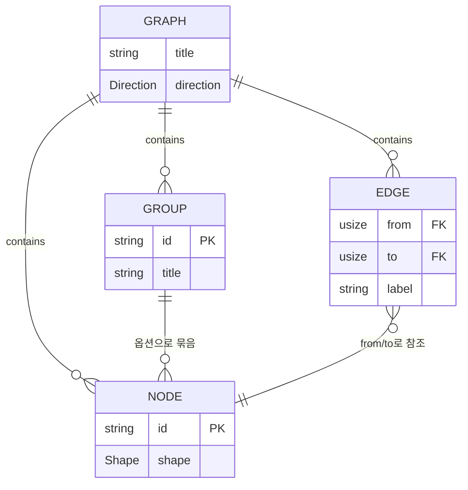

## 시퀀스 (PlantUML)

마크다운 문서 하나가 화면에 그려지기까지, dg 내부에서 실제로 오가는 호출 순서다(성공/실패 두
경로 모두). 참여자 7개짜리라 이 문서를 볼 땐 조금 넓게(`dg -w 130` 이상) 봐야 다이어그램으로 뜬다 —
좁으면 dg가 원래 하는 대로 일반 코드블록으로 물러난다.

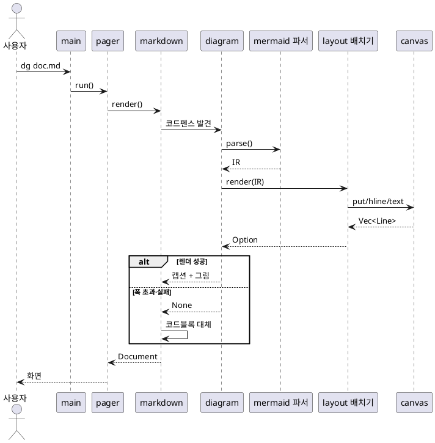

## 상태도 (mermaid)

인터랙티브 페이저(`pager.rs`)의 실제 모드 전이다: 평소엔 보기 모드이고, 그 안에서 다이어그램마다
원문을 펼치고(`o` 키 또는 클릭) 접을 수 있으며, `/`로 검색 입력 모드에 들어간다.

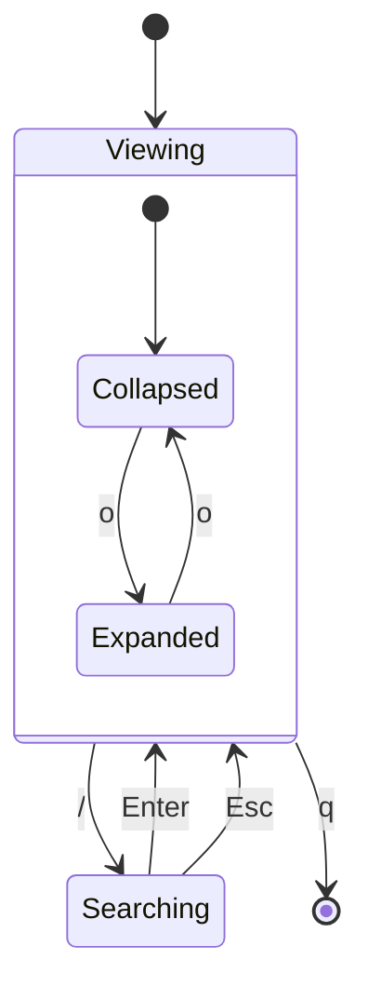

## Git 그래프 (mermaid)

dg 저장소 자신의 실제 커밋 로그(`git log --oneline -8 --reverse`)를 그대로 그린 것이다.

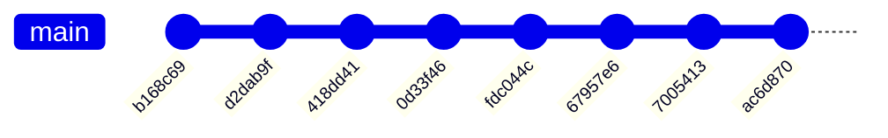

## 블록 다이어그램 (mermaid)

dg 자신의 모듈 구조다: 진입점(`main.rs`)이 인자 파싱(`cli.rs`)과 페이저(`pager.rs`)를 쓰고,
페이저가 마크다운 렌더러를 거쳐 mermaid/PlantUML 파서 → 배치기 → 문자 격자(`canvas.rs`) →
줄·색(`line.rs`/`style.rs`) 순서로 흘러간다.

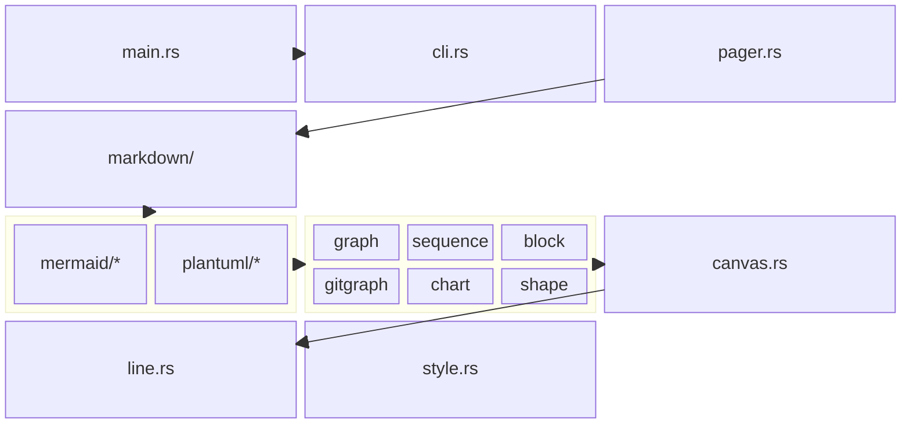

## 파이 차트 (mermaid)

dg 소스 코드를 영역별로 나눈 실제 줄 수(`wc -l`)를 합 기준 가로 막대(길이=몫)로 그린 것이다.

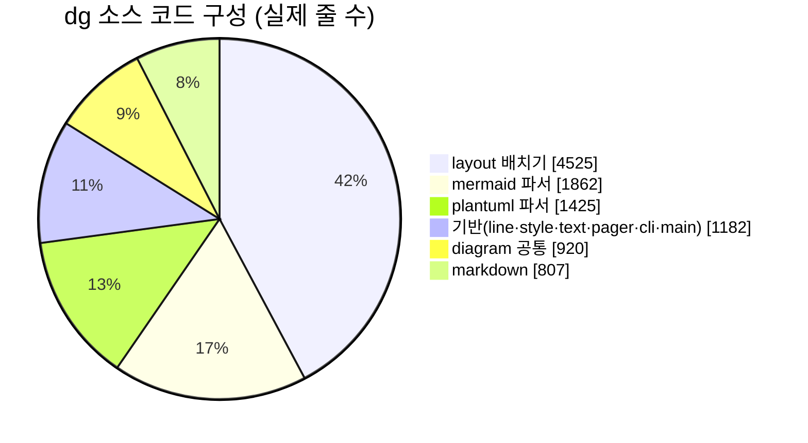

## XY 차트 (mermaid)

이번 세션에서 스펙별로 실제로 늘어난 테스트 개수(머지 전후 `cargo test --lib` 통과 수 차이)다.

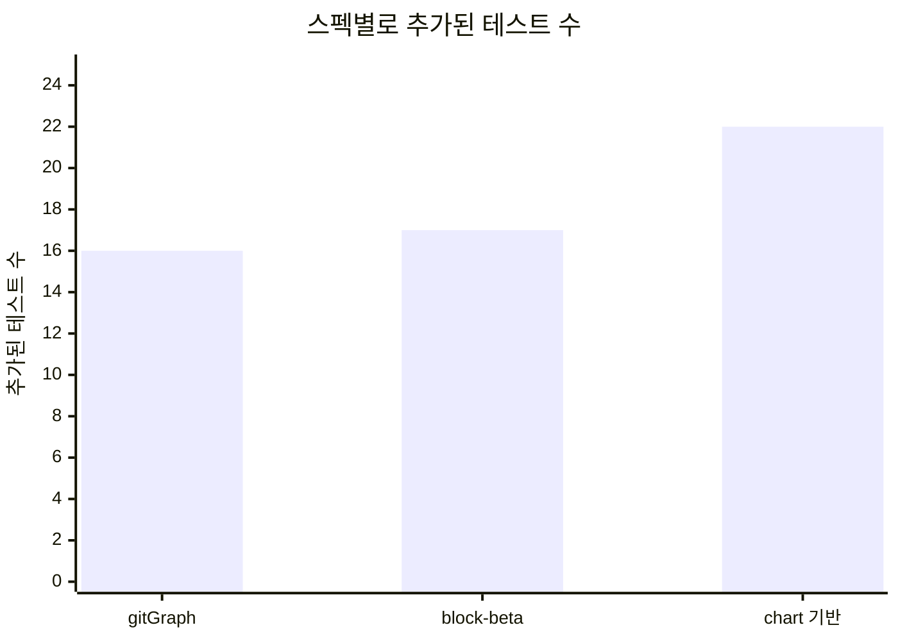

## 사분면 차트 (mermaid)

7개 다이어그램 스펙을 실제 `requirements.md`의 인수 조건 개수(x)와
`tasks.md`의 고난도(`high`) 작업 비중(y)으로 좌표를 잡았다 — 둘 다 이 저장소 안 스펙 문서에서 직접 센 값이다.

```mermaid
quadrantChart
  title 다이어그램 스펙 7개의 규모·난이도
  x-axis 요구사항 적음 --> 요구사항 많음
  y-axis 단순 --> 고난도 작업 비중 높음
  quadrant-1 크고 어려움
  quadrant-2 작지만 까다로움
  quadrant-3 작고 단순
  quadrant-4 크지만 무난함
  "gitGraph": [0.14, 0.42]
  "block-beta": [0.43, 1.0]
  "chart 기반": [0.57, 0.38]
  "pie": [0.0, 0.0]
  "xychart": [0.29, 0.38]
  "quadrant": [0.0, 0.50]
  "gantt": [1.0, 0.82]
```

## 간트 차트 (mermaid + PlantUML)

`roadmap.md`의 실제 의존 순서를 그대로 쓰고, 기간은 각 스펙 `tasks.md`의 하위 작업 개수를 "일수"로 삼았다.

```mermaid
gantt
  title dg 다이어그램 로드맵 (작업 개수 = 일수)
  dateFormat YYYY-MM-DD
  section 완료
  block-beta      :done, bb, 2026-09-16, 9d
  gitGraph        :done, gg, 2026-09-16, 7d
  chart 기반       :done, cf, 2026-09-16, 8d
  section 남음
  pie             :pie1, after cf, 6d
  xychart         :xy1, after pie1, 8d
  quadrantChart   :qc1, after xy1, 6d
  gantt(PlantUML 포함) :ga1, after cf, 11d
```

같은 로드맵을 PlantUML `@startgantt`로 표현하면(의존은 `->`로):

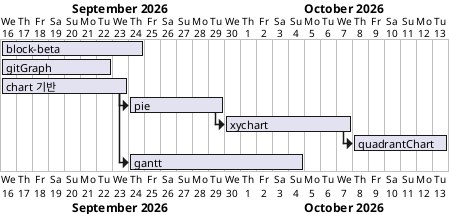

## 표

| 항목 | 설명 | 상태 |
|------|:----:|-----:|
| 파서 | mermaid, PlantUML | 완료 |
| 배치기 | Sugiyama LR/TB | 완료 |

> 인용문은 이렇게 보인다.
> 두 줄도 된다.

- 목록 하나
- 목록 둘
  1. 번호 하나
  2. 번호 둘
- [x] 완료한 일
- [ ] 남은 일

```rust
fn main() {
    println!("hello");
}
```
```mermaid
graph TD
    diagram_canvas_rs_He0a65774["canvas — 15 fn, 2 struct, 0 trait"]
    diagram_layout_shape_rs_Hb6b2de51["shape — 6 fn"]
    diagram_mermaid_class_rs_H72d56c82["class — 9 fn"]
    diagram_mermaid_sequence_rs_H3f0d0563["sequence — 5 fn"]
    diagram_mermaid_state_rs_H2d61ea31["state — 4 fn"]
    diagram_plantuml_component_rs_H0e2ebd8a["component — 6 fn"]
    diagram_plantuml_relation_rs_H5cad021b["relation — 4 fn, 1 struct, 0 trait"]
    diagram_plantuml_sequence_rs_H642ad80f["sequence — 5 fn, 1 struct, 0 trait"]
    diagram_plantuml_text_rs_H495e030d["text — 8 fn"]
    examples_lib_usage_rs_Ha355b5c9["lib_usage — 1 fn"]
    line_rs_Hc8ff652c["line — 17 fn, 3 struct, 0 trait"]
    markdown_table_rs_H348d2b01["table — 1 fn"]
    markdown_wrap_rs_H2f95d28f["wrap — 2 fn, 1 struct, 0 trait"]
    methodology_skills_multi_agent_sessions_scripts_session_py_H992745f8["session — 52 fn"]
    pager_rs_H4b0ff4c1["pager — 13 fn, 2 struct, 0 trait"]
    src_cli_rs_Hb2812f19["cli — 1 fn, 1 struct, 0 trait"]
    src_diagram_ir_rs_H56b46821["ir — 11 fn, 6 struct, 0 trait"]
    src_diagram_layout_block_rs_Ha4e63d31["block — 14 fn, 4 struct, 0 trait"]
    src_diagram_layout_chart_rs_He717f567["chart — 22 fn, 4 struct, 0 trait"]
    src_diagram_layout_gitgraph_rs_H9035d785["gitgraph — 4 fn, 2 struct, 0 trait"]
    src_diagram_layout_graph_rs_H4fec7bb7["graph — 79 fn, 5 struct, 0 trait"]
    src_diagram_layout_mod_rs_Hc27390de["mod — 0 fn"]
    src_diagram_layout_sequence_rs_H50ebd559["sequence — 12 fn, 3 struct, 0 trait"]
    src_diagram_mermaid_block_rs_H7e47890b["block — 10 fn, 4 struct, 0 trait"]
    src_diagram_mermaid_er_rs_H44b0851c["er — 5 fn"]
    src_diagram_mermaid_flow_rs_Hb01cc0be["flow — 8 fn, 2 struct, 0 trait"]
    src_diagram_mermaid_gitgraph_rs_H04fd618f["gitgraph — 4 fn, 1 struct, 0 trait"]
    src_diagram_mermaid_mod_rs_H865a6757["mod — 2 fn"]
    src_diagram_mermaid_text_rs_Hb575b48f["text — 6 fn"]
    src_diagram_mod_rs_H83fdbbae["mod — 6 fn"]
    src_diagram_options_rs_H647c5fd4["options — 9 fn, 1 struct, 0 trait"]
    src_diagram_plantuml_class_rs_H54a9b560["class — 8 fn"]
    src_diagram_plantuml_mod_rs_H98fa624c["mod — 2 fn"]
    src_lib_rs_Hb1a35a68["lib — 5 fn, 1 struct, 0 trait"]
    src_main_rs_H42cb6807["main — 7 fn"]
    src_markdown_mod_rs_He44c4910["mod — 21 fn, 5 struct, 0 trait"]
    style_rs_Hd51fafb9["style — 13 fn, 2 struct, 0 trait"]
    text_rs_H94e4f82b["text — 5 fn"]
    diagram_canvas_rs_He0a65774 -->|"1"| line_rs_Hc8ff652c
    diagram_canvas_rs_He0a65774 -->|"3"| text_rs_H94e4f82b
    diagram_layout_shape_rs_Hb6b2de51 -->|"2"| text_rs_H94e4f82b
    diagram_plantuml_component_rs_H0e2ebd8a -->|"2"| diagram_plantuml_relation_rs_H5cad021b
    diagram_plantuml_component_rs_H0e2ebd8a -->|"5"| diagram_plantuml_text_rs_H495e030d
    diagram_plantuml_sequence_rs_H642ad80f -->|"2"| diagram_plantuml_text_rs_H495e030d
    examples_lib_usage_rs_Ha355b5c9 -->|"1"| style_rs_Hd51fafb9
    line_rs_Hc8ff652c -->|"2"| text_rs_H94e4f82b
    markdown_table_rs_H348d2b01 -->|"3"| line_rs_Hc8ff652c
    markdown_table_rs_H348d2b01 -->|"1"| markdown_wrap_rs_H2f95d28f
    markdown_table_rs_H348d2b01 -->|"1"| text_rs_H94e4f82b
    markdown_wrap_rs_H2f95d28f -->|"2"| text_rs_H94e4f82b
    pager_rs_H4b0ff4c1 -->|"3"| line_rs_Hc8ff652c
    pager_rs_H4b0ff4c1 -->|"1"| src_markdown_mod_rs_He44c4910
    pager_rs_H4b0ff4c1 -->|"2"| text_rs_H94e4f82b
    src_diagram_layout_block_rs_Ha4e63d31 -->|"2"| diagram_layout_shape_rs_Hb6b2de51
    src_diagram_layout_block_rs_Ha4e63d31 -->|"5"| text_rs_H94e4f82b
    src_diagram_layout_chart_rs_He717f567 -->|"6"| line_rs_Hc8ff652c
    src_diagram_layout_chart_rs_He717f567 -->|"6"| text_rs_H94e4f82b
    src_diagram_layout_gitgraph_rs_H9035d785 -->|"2"| text_rs_H94e4f82b
    src_diagram_layout_graph_rs_H4fec7bb7 -->|"3"| diagram_layout_shape_rs_Hb6b2de51
    src_diagram_layout_graph_rs_H4fec7bb7 -->|"2"| line_rs_Hc8ff652c
    src_diagram_layout_graph_rs_H4fec7bb7 -->|"6"| text_rs_H94e4f82b
    src_diagram_layout_sequence_rs_H50ebd559 -->|"2"| diagram_layout_shape_rs_Hb6b2de51
    src_diagram_layout_sequence_rs_H50ebd559 -->|"5"| text_rs_H94e4f82b
    src_diagram_mermaid_block_rs_H7e47890b -->|"4"| src_diagram_mermaid_text_rs_Hb575b48f
    src_diagram_mermaid_er_rs_H44b0851c -->|"1"| src_diagram_ir_rs_H56b46821
    src_diagram_mermaid_er_rs_H44b0851c -->|"3"| src_diagram_mermaid_text_rs_Hb575b48f
    src_diagram_mermaid_flow_rs_Hb01cc0be -->|"5"| src_diagram_mermaid_text_rs_Hb575b48f
    src_diagram_mermaid_gitgraph_rs_H04fd618f -->|"3"| src_diagram_mermaid_text_rs_Hb575b48f
    src_diagram_mermaid_mod_rs_H865a6757 -->|"1"| diagram_mermaid_state_rs_H2d61ea31
    src_diagram_mermaid_mod_rs_H865a6757 -->|"1"| src_diagram_layout_block_rs_Ha4e63d31
    src_diagram_mermaid_mod_rs_H865a6757 -->|"1"| src_diagram_layout_gitgraph_rs_H9035d785
    src_diagram_mermaid_mod_rs_H865a6757 -->|"1"| src_diagram_layout_graph_rs_H4fec7bb7
    src_diagram_mermaid_mod_rs_H865a6757 -->|"1"| src_diagram_layout_sequence_rs_H50ebd559
    src_diagram_mermaid_mod_rs_H865a6757 -->|"1"| src_diagram_mermaid_block_rs_H7e47890b
    src_diagram_mermaid_mod_rs_H865a6757 -->|"1"| src_diagram_mermaid_er_rs_H44b0851c
    src_diagram_mermaid_mod_rs_H865a6757 -->|"1"| src_diagram_mermaid_flow_rs_Hb01cc0be
    src_diagram_mermaid_mod_rs_H865a6757 -->|"1"| src_diagram_mermaid_gitgraph_rs_H04fd618f
    src_diagram_mermaid_mod_rs_H865a6757 -->|"2"| src_diagram_mermaid_text_rs_Hb575b48f
    src_diagram_mermaid_mod_rs_H865a6757 -->|"1"| src_diagram_plantuml_class_rs_H54a9b560
    src_diagram_mod_rs_H83fdbbae -->|"1"| line_rs_Hc8ff652c
    src_diagram_mod_rs_H83fdbbae -->|"3"| src_diagram_mermaid_mod_rs_H865a6757
    src_diagram_mod_rs_H83fdbbae -->|"3"| src_diagram_plantuml_mod_rs_H98fa624c
    src_diagram_mod_rs_H83fdbbae -->|"1"| text_rs_H94e4f82b
    src_diagram_plantuml_class_rs_H54a9b560 -->|"2"| diagram_plantuml_relation_rs_H5cad021b
    src_diagram_plantuml_class_rs_H54a9b560 -->|"5"| diagram_plantuml_text_rs_H495e030d
    src_diagram_plantuml_class_rs_H54a9b560 -->|"1"| src_diagram_ir_rs_H56b46821
    src_diagram_plantuml_class_rs_H54a9b560 -->|"5"| src_diagram_mermaid_text_rs_Hb575b48f
    src_diagram_plantuml_mod_rs_H98fa624c -->|"1"| diagram_plantuml_component_rs_H0e2ebd8a
    src_diagram_plantuml_mod_rs_H98fa624c -->|"1"| diagram_plantuml_relation_rs_H5cad021b
    src_diagram_plantuml_mod_rs_H98fa624c -->|"1"| diagram_plantuml_sequence_rs_H642ad80f
    src_diagram_plantuml_mod_rs_H98fa624c -->|"1"| src_diagram_layout_graph_rs_H4fec7bb7
    src_diagram_plantuml_mod_rs_H98fa624c -->|"1"| src_diagram_layout_sequence_rs_H50ebd559
    src_diagram_plantuml_mod_rs_H98fa624c -->|"2"| src_diagram_mermaid_text_rs_Hb575b48f
    src_diagram_plantuml_mod_rs_H98fa624c -->|"1"| src_diagram_plantuml_class_rs_H54a9b560
    src_lib_rs_Hb1a35a68 -->|"3"| src_diagram_mod_rs_H83fdbbae
    src_lib_rs_Hb1a35a68 -->|"1"| src_markdown_mod_rs_He44c4910
    src_lib_rs_Hb1a35a68 -->|"1"| style_rs_Hd51fafb9
    src_main_rs_H42cb6807 -->|"2"| src_diagram_mod_rs_H83fdbbae
    src_main_rs_H42cb6807 -->|"2"| src_diagram_options_rs_H647c5fd4
    src_main_rs_H42cb6807 -->|"1"| src_markdown_mod_rs_He44c4910
    src_main_rs_H42cb6807 -->|"3"| style_rs_Hd51fafb9
    src_markdown_mod_rs_He44c4910 -->|"9"| line_rs_Hc8ff652c
    src_markdown_mod_rs_He44c4910 -->|"1"| markdown_table_rs_H348d2b01
    src_markdown_mod_rs_He44c4910 -->|"2"| markdown_wrap_rs_H2f95d28f
    src_markdown_mod_rs_He44c4910 -->|"2"| src_diagram_mod_rs_H83fdbbae
    src_markdown_mod_rs_He44c4910 -->|"2"| text_rs_H94e4f82b
%% analyzed 38 files, 580 atoms, 310 cross-module edges
```
