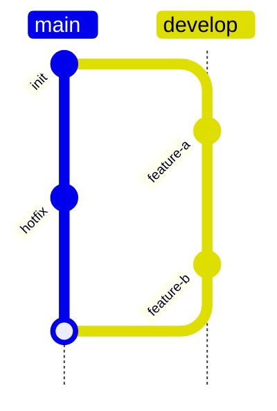
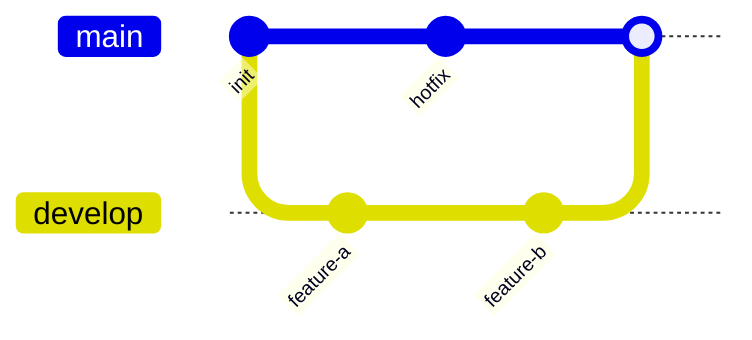

# gitGraph 세로 모드 검증 샘플

`gitgraph-vertical-mode` 스펙 검증용 샘플이다. 좁은 터미널에서는 브랜치가 많은 gitGraph가
가로로 길어져 잘리기 쉽다 — 세로 모드는 브랜치를 열로, 커밋을 위에서 아래로 배치해 좁은
화면에서도 스크롤만으로 읽을 수 있게 한다.

## 세로 모드 (`gitGraph TB:`)



## 같은 그래프를 가로 모드로 (`gitGraph LR:`, 기본값)



## 기대 결과

- 세로 모드: `main`/`develop` 이름이 맨 윗줄(머리글)에 나란히 나오고, 그 아래로 각 트랙이 세로
  줄(열)이 되어 커밋이 위→아래로 찍힌다. `merge`는 두 열 사이 가로선으로 이어진다.
- 가로 모드: 기존과 동일하게 `main`/`develop`이 왼쪽에, 커밋은 왼→오로 찍힌다.
- CLI `--direction tb`/`--direction lr`로 소스 헤더를 덮어쓸 수도 있다.

확인 명령:

```sh
dg -P examples/gitgraph-vertical.md
dg -P --direction tb examples/gitgraph-vertical.md   # 둘 다 세로로 강제
```
