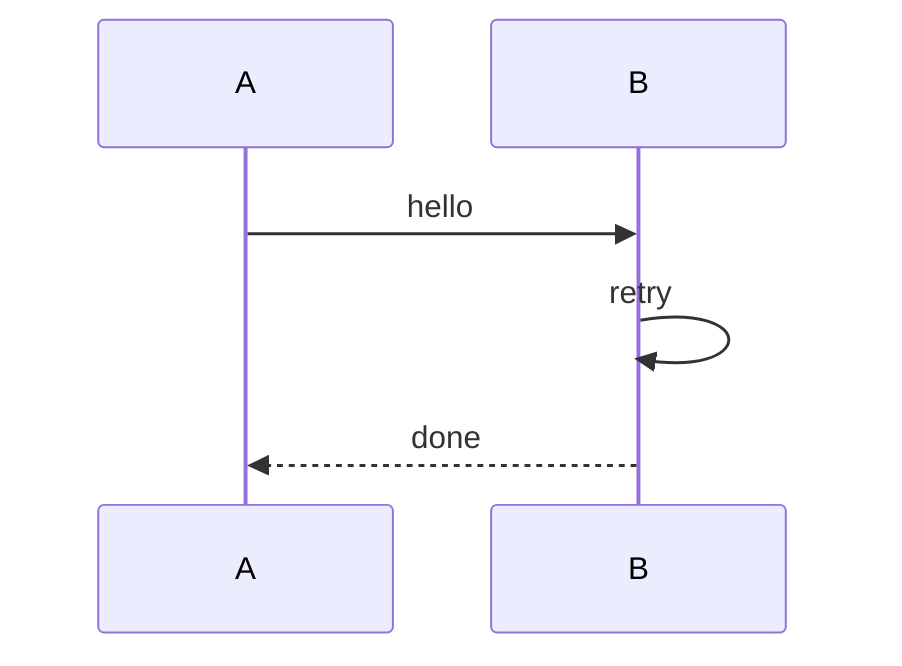

# 시퀀스 재귀(self-message) 검증 샘플

`sequence-self-message-clearance` 스펙 검증용 샘플이다. 참가자가 자기 자신에게 보내는
메시지(self-message, 예: `B->>B: retry`)를 렌더링할 때 화살촉은 도착 지점인 생명선에 바로
붙어야 하고(다른 메시지가 상대 생명선에 바로 닿는 것과 같은 관례), 대신 화살촉과 루프의
세로 연결선(모서리) 사이에 실선 한 칸(여백)이 있어야 모서리의 굽은 모양이 화살촉에
눌리지 않고 드러난다.

## 재귀 메시지 포함 시퀀스



## 기대 결과

`retry` self-message 루프의 마지막 줄이 `│◀─╯` 형태로 나와야 한다 — B의 생명선(`│`)에
화살촉(`◀`)이 바로 붙고, 화살촉과 모서리(`╯`) 사이에 실선(`─`) 한 칸이 있어 모서리가
화살촉에 눌려 `<|`처럼 붙어 보이던 이전 렌더링과 구분된다.

확인 명령:

```sh
dg -P examples/sequence-self-message.md
```
