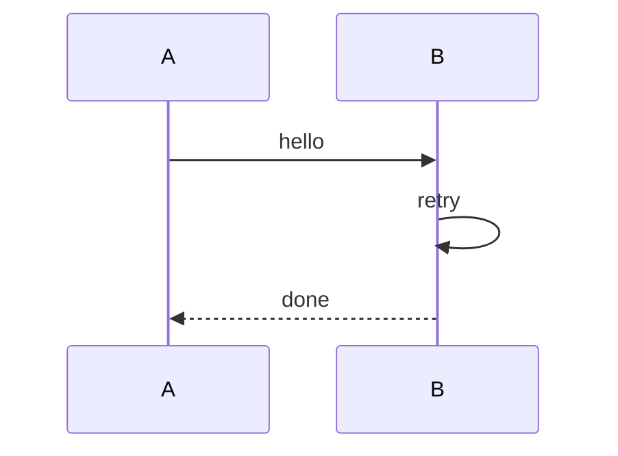

# 시퀀스 재귀(self-message) 검증 샘플

`sequence-self-message-clearance` 스펙 검증용 샘플이다. 참가자가 자기 자신에게 보내는
메시지(self-message, 예: `B->>B: retry`)를 렌더링할 때 화살촉이 생명선에 바로 붙지 않고,
사이에 실선 한 칸(여백)이 있어야 한다.

## 재귀 메시지 포함 시퀀스



## 기대 결과

`retry` self-message 루프의 마지막 줄이 `│─◀╯` 형태로 나와야 한다 — B의 생명선(`│`)과
화살촉(`◀`) 사이에 실선(`─`) 한 칸이 있어, 화살촉이 생명선에 바로 붙어 `<|`처럼 보이던
이전 렌더링과 구분된다.

확인 명령:

```sh
dg -P examples/sequence-self-message.md
```
