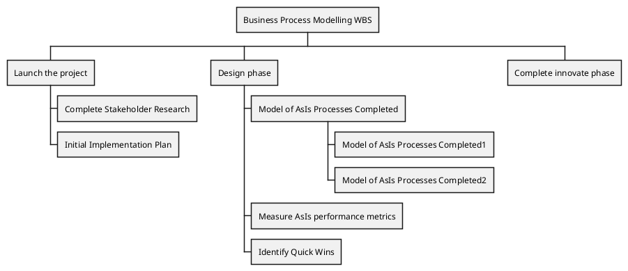
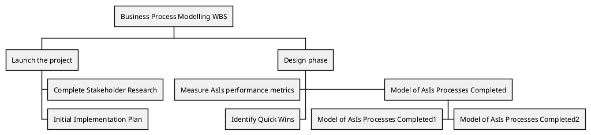
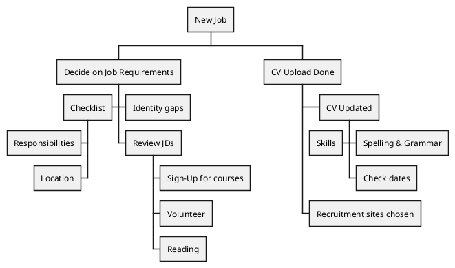
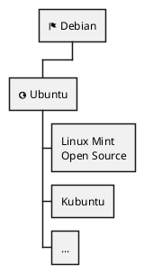

```plantuml
@startwbs
* Director
** Team Lead 1 
*** Engineer 1
*** Engineer 2
** Team Lead 2 
*** Engineer 3
*** Engineer 4
**_
*** Engineer 5 (reporting to Director) 
*** Engineer 6 (reporting to Director)
@endwbs

```

